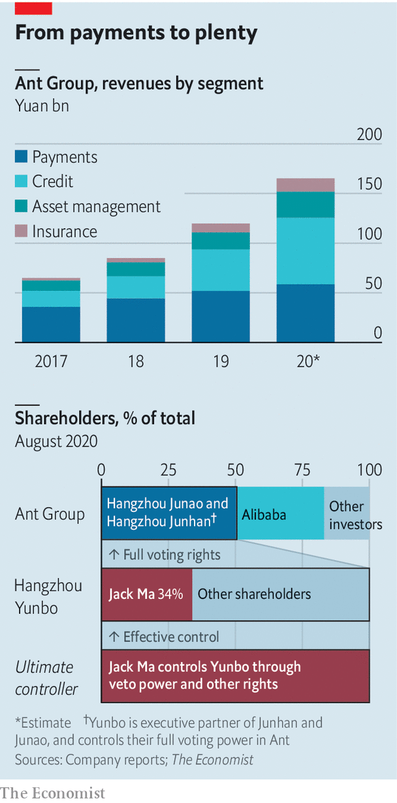

###### King of the hill

# Ant Group IPO filing shows its might 

##### Born a payment service, it is now a major conduit for credit 

 

> Aug 27th 2020 

 


ANTS ARE normally small but mighty. This one is big but sprightly. On August 25th Ant Group, a Chinese financial-technology company, filed for a joint listing in Hong Kong and Shanghai, targeting a valuation of more than $200bn. It began life as Alipay, a payment service on Alibaba’s e-commerce platforms. It then launched China’s go-to app for mobile payments and has since grown into a major conduit for loans and investments. One thing is unchanged: Jack Ma, Alibaba’s founder, still controls it.■

