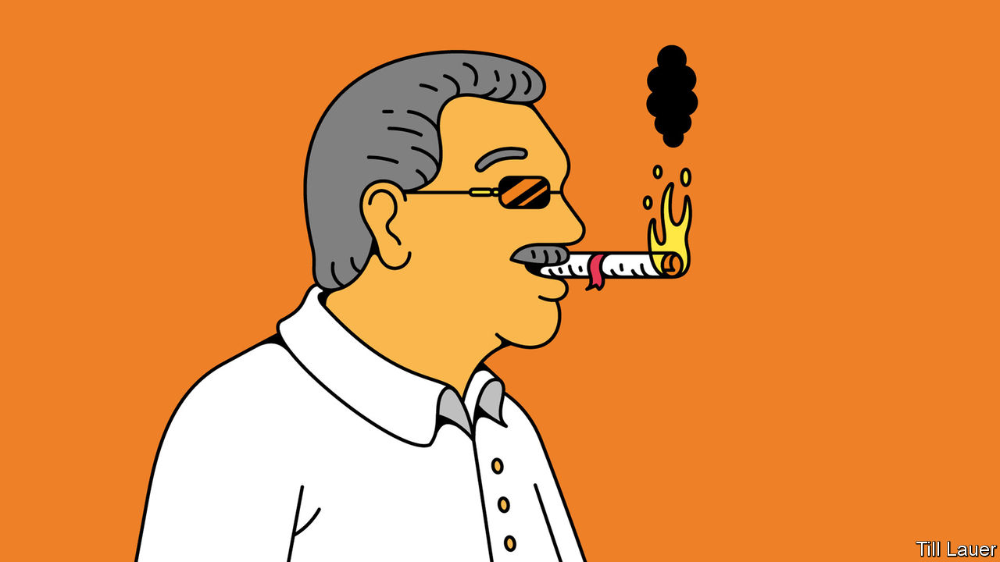

###### Banyan

# Sri Lanka’s president is amassing personal power 

##### Constitutional amendments make Gotabaya Rajapaksa’s authority almost absolute 

 

> Oct 31st 2020 

NEVER SAY Gotabaya Rajapaksa leaves things to chance. After decisively winning the presidential election last November, putting family in charge of important government departments, suspending Parliament and finally winning postponed elections in early August in a landslide for his Sri Lanka Podujana Peramuna (SLPP) and supporting parties, still the president insisted that “obstacles” to his authority remained. Changes to the constitution were the only solution. Parliament has granted his wish, creating a near-absolute presidency with the 20th amendment.

As so often in Sri Lanka’s turbulent history, the amendment in effect annuls its predecessor. The 19th amendment was a reaction to the overweening rule of Gotabaya’s brother, Mahinda Rajapaksa, president from 2005 until his surprise defeat in 2015. With Gotabaya, a former army officer, in charge of defence and intelligence, he had prosecuted the even more brutal end to an already bloody 26-year civil war. After the war’s end, triumphalism reigned and critics were intimidated. The amendment limited the president’s powers, expanded those of the prime minister, accountable to Parliament, and strengthened independent oversight of the police and the judiciary. More was promised by President Maithripala Sirisena and his prime minister, Ranil Wickremesinghe, including inter-ethnic reconciliation and devolved government. Yet so dysfunctional became their relationship that intelligence about impending terrorist attacks was ignored. Suicide-bombers struck on Easter Sunday last year, killing 269. Gotabaya’s message of security and competence, along with jabs at the Muslim and Tamil minorities designed to please the Sinhalese Buddhist majority, propelled him to the presidency.


Now the 20th amendment looks intended to cement Rajapaksa rule for years (even though Gotabaya remains bound to two terms). Sri Lankans with dual nationality may now sit in Parliament, or indeed be president. This paves the way for another brother, Basil Rajapaksa, the family’s political strategist, to enter Parliament. Mahinda, currently prime minister, is not in good health, and Basil is his obvious replacement—and eventually perhaps Gotabaya’s. Curiously, several SLPP MPs resented Basil’s grip on the party enough to complain about the provision. (Why not simply renounce American citizenship? A plan B is always advisable.)

As for the president, the amendment now allows him to dissolve Parliament early, hire and fire the prime minister and appoint judges as well as the heads of the election, anti-corruption and other supposedly independent commissions. Although Parliament can opine on these appointments, it cannot block them.

What will Gota’s absolutist presidency mean? He promises brisk, technocratic government and economic development. In dealing with the pandemic, he has indeed introduced sensible measures to help the poor. Yet personalised rule is more the Rajapaksa mark. Recently the president was indignant when, having ordered that one village should have access to another’s clay pit, a local official asked for written instructions—was his verbal command not enough? Meanwhile, he has named 66 ministers. Patronage networks are multiplying like the alimankada, wild-elephant pathways that criss-cross the island. Such networks, writes Asanga Welikala of Edinburgh Law School, undermine “critical separations between state, society, economy, and the private sphere”.

A Gotabaya presidency makes a return to the earlier hounding of critics possible. Out of public view, Mr Rajapaksa’s notorious irascibility—he flies off the handle and bears grudges—is returning. More probably, his martinet notions of a “disciplined society” risk dashing dreams of a plural, devolved Sri Lanka in which the Tamils who form a majority in the north and Muslims who make up a tenth of the population are as much a part of the polity as Sinhalese.

True, Mr Rajapaksa promises a whole new constitution in the coming year that “fulfils the people’s wishes” better. It is possible a new constitution could contain a kinder accommodation for Sri Lanka’s minorities. Yet for now, Mr Rajapaksa has made explicit the link he sees between an all-powerful state and the centrality of Buddhism, whose more chauvinist priests he courts. Of the 66 ministers only three are Tamils and just one is a Muslim (there is only one woman, too). The message is stark: in the ethno-nationalist state, everyone must know their station.

