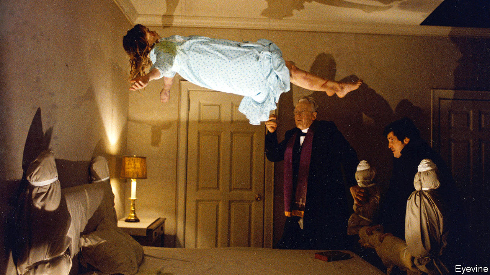

###### Bumps in the night

# Exorcism has a long and spooky history 

##### Demand surged after the release of “The Exorcist” in 1973 

 

> Oct 31st 2020 

The Penguin Book of Exorcisms. Edited by Joseph Laycock.Penguin Classics; 336 pages; $17.


WITH DISARMING banality, in April 2012 Father Michael Maginot, a Catholic priest in Indiana, wrote to his bishop about a recent event. During his weekly Bible class, he had “received a call…to perform an exorcism on a boy witnessed by many as walking backwards up a wall.”

The boy was the son of Latoya Ammons, the haunting of whose house and the apparently supernatural possession of whose offspring became the subject of intense media coverage and, later, a film. The priest’s request for permission to conduct the ritual makes suitably chilling reading for Halloween. Among other things, Ms Ammons’s children were said to break into a “demonic chant, where one would stop and the other would pick up where [the first] left off”.

In his commentary on this letter, Joseph Laycock of Texas State University—author of “Speak of the Devil” and “Vampires Today”—does not mention that the family’s doctor thought the whole thing was a hoax, nor that previous and subsequent tenants of Ms Ammons’s house did not experience paranormal activity. His anthology of writings about exorcism, including eyewitness accounts, is short on scepticism (though not wholly lacking in it). But the book shows in illuminating detail how the belief in demonic possession stretches back more than 2,500 years.

An early presumed victim was Princess Bentresh, the daughter of a potentate in what today is Turkey. Her resident demon was said, in a later inscription, to have fled at the sight of a statue of Khonsu, the Egyptian lunar god. Mr Laycock surmises that Bentresh may actually have been throwing a tantrum because the pharaoh Rameses II had married her sister rather than her.

Demons able to take possession of people feature in virtually all the world’s main religious traditions: bhuts in the Indian subcontinent, fox spirits in China and Japan, zar in parts of Africa and the Middle East. A hadith (a text recounting a saying of the Prophet) has Muhammad driving a demon from the body of a young boy. He “opened the boy’s mouth and blew into it three times, and he said, ‘In the name of God—I am the servant of God—Go away, O enemy of God!’”

Many Muslims are nevertheless sceptical of demonic possession, and the leaders of the more established Christian churches had until recently come to see exorcism as something between a superstition and an embarrassment. Yet today it is in greater demand in the Christian world than at any time since the febrile witch-hunting days of the 17th century. William Friedkin’s cult film of 1973, “The Exorcist” (see picture), prompted a huge uptick in America, while the global spread of Pentecostal and evangelical Christianity has propagated a rebranded version of exorcism as “deliverance ministry”.

Some believers will doubtless see this as the result of a rise in genuine demonic activity. Others may side with a character in one of the “Colloquies” of that dogged old sceptic, Erasmus, who argued that “many Things that have been printed and published, as true Relations, were only by Artifice and Imposture, Impositions upon credulous Persons.” ■

