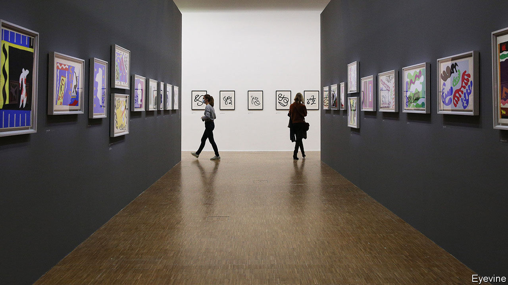

###### Windows of opportunity

# Matisse’s windows offer glimpses of another life 

##### A delayed show at the Centre Pompidou captures and alleviates the lockdown mood 

 

> Oct 31st 2020 

A  DOUBLE FRENCH window flung open to reveal a glimpse of headland and sea. The distant peach-pink glow over a Paris bridge, framed by the dark inky-blue walls of an apartment’s interior. The quiet contemplation of a violinist as he practises before a closed upper-floor window. One of the more unexpected sensations prompted by the Centre Pompidou’s major new exhibition, “Matisse, like a novel”, is that the artist inadvertently captures life in lockdown: the confined angular indoor spaces, the teasing promise of open windows, the glimpse of a brighter life beyond.

In 1908 Henri Matisse wrote of his own work: “What I dream of is an art of balance, of purity and serenity, devoid of troubling or depressing subject matter…a soothing, calming influence on the mind.” His association with decorative art, and his defiant use of vibrant colour, earned him a reputation as a painter of bonheur. The chance to see “Interior with aubergines” (1911), for example, a vast canvas that vibrates with floral motifs and fabrics and disrupts space and dimension, lent for the exhibition by the Museum of Grenoble, is indeed a sheer delight. As are the original, vivacious “Jazz” cut-outs (1943-46) or “Red interior, still life on a blue table” (1947), one of Matisse’s last works in oil, on loan from Dusseldorf.


Looking at his paintings at a time of pandemic, though, is a reminder of how much more there is to him. The Pompidou had to postpone the exhibition, which marks the 150th anniversary of Matisse’s birth, from May this year because of covid-19 (it finally opened last week). It has reduced the number of tickets sold each day to meet health rules, and closes early to conform with the nightly curfew in Paris. Over 230 works are on display, although none from Russia or private American collections. In a nod to the title of Louis Aragon’s work “Matisse, a novel”, exhibits are organised around the thoughts of nine writers on the painter, and the interplay between his art and the written word.

It is the windows, though, that seize the lockdown eye. Unlike the English-style vertical-sliding sash version, French double casement windows seem designed to be thrown wide open, to blur the interior and exterior worlds. Raised in northern France, Matisse was enchanted by the Mediterranean light, and brought it in to fuse inside and out. “Red interior, still life on a blue table” boldly blends both perspectives in a profusion of red and gold. “Interior with goldfish”, painted from his fourth-floor Paris studio on the Quai Saint-Michel in 1914, on the eve of war, speaks more of solitude. A translucent wash of light on the Ile de la Cité beckons through the window, framed by the sombre greys and Prussian blues of walls and furniture. Two goldfish swim in a bowl, confined.

Matisse’s windows are playful, childlike, enticing, deceptive, but also on occasion darker, a hint at the unknown that may lurk beyond the comfort of home. In “French window at Collioure” (1914), it is the shutters that Matisse has given colour, while a black wash obscures the view. Aurélie Verdier, the exhibition’s curator, stresses that Matisse “can also be read in the light of a certain anxiety”.

Art was his way to work through it. In 1916, as the first world war raged on, the painter said that he had begun “to use black as a colour of light and not as a colour of darkness”. As lockdowns tighten again, this ambiguity, and the uplifting moments of insouciance that the Matisse exhibition offers, are unusually powerful. ■

“Matisse, like a novel” will be at Centre Pompidou, Paris until February 22nd 2021. Image: “Celestial Jerusalem” © Succession H. Matisse

