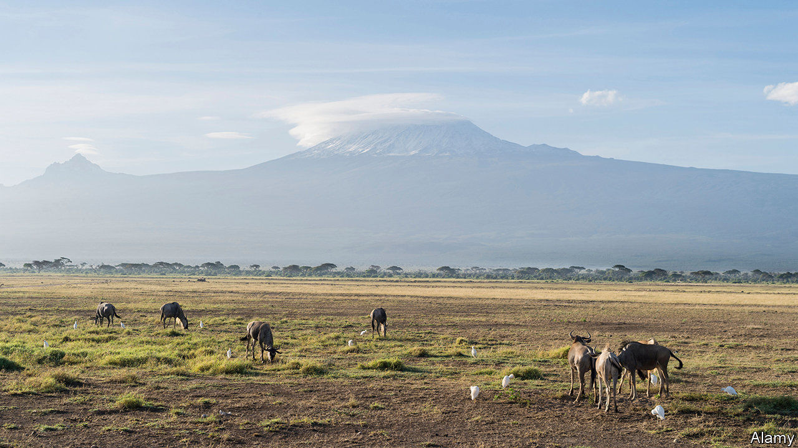

###### Kenyan fiction

# Sisters and suitors battle ogres in “The Perfect Nine” 

##### At 82, Ngugi wa Thiong’o has written a delightful novel in verse 

 

> Oct 31st 2020 

The Perfect Nine. By Ngugi wa Thiong’o. New Press; 240 pages; $23.99. Harvill Secker; £12.


AMONG THE most exciting new writing of the past few decades has been the reimagining of foundation myths by authors across the globe: Derek Walcott breathing fresh life into Homer in St Lucia; Murray Bail reinventing the princess-in-the-tower fable among Australia’s ever-varied eucalyptus forests; Gabriela Cabezón Cámara subversively turning a famous gaucho narrative from the macho Argentina of the 1870s into a gay feminist story, published in English earlier this year as “The Adventures of China Iron”.

Now comes Ngugi wa Thiong’o, an 82-year-old Kenyan novelist and playwright, with an experimental epic written in blank verse—originally in his native tongue and translated into English by the author himself. It tells of the very first Kikuyu and their passionate attachment to Mount Kenya, the home of their god, Ngai.

Early in their marriage, fleeing war and starvation, Gikuyu and Mumbi, his “partner in everything”, settle in the mountain’s foothills. They bring up a family of famously beautiful, self-reliant girls; the youngest, Warigia, is an ace with the bow and arrow, although disabled from birth and unable to walk. When 99 suitors turn up one day in search of brides, Gikuyu and Mumbi urge their daughters to test the men first and then choose, but above all to choose wisely.


Mr wa Thiong’o’s writing is rich with Kikuyu folklore and observations about this mountain of tropical forests and icy peaks, and his verse has a galloping intensity that gives the narrative momentum. The men are instructed that they must first build new homes, each named after one of the daughters. Then the suitors must bring back the cure for Warigia’s disability, which, they are told, is a single hair that can be found only on the tongue of an ogre.

The sisters take the men up the mountain, trying their courage and devotion. Some get eaten by crocodiles, others sink in the mud or are bitten by snakes. Many run away. And then on the upper slopes they encounter the ogres, among them the Ogre of Endless Tears and the Ogre that Shat Without Stopping, around whom the air “smelled of pure rot”. The posse:


Gifted, ingenious and brave, the older sisters have a generosity of spirit that is well conveyed in the book’s lolloping rhythms. But it is Warigia’s story—with its challenges, uncertainties and bittersweet ending—that gives this tale its deep humanity. Most writers lose their energy and inventiveness as they grow old. Not Mr wa Thiong’o. “The Perfect Nine” is one of the year’s great discoveries. ■

