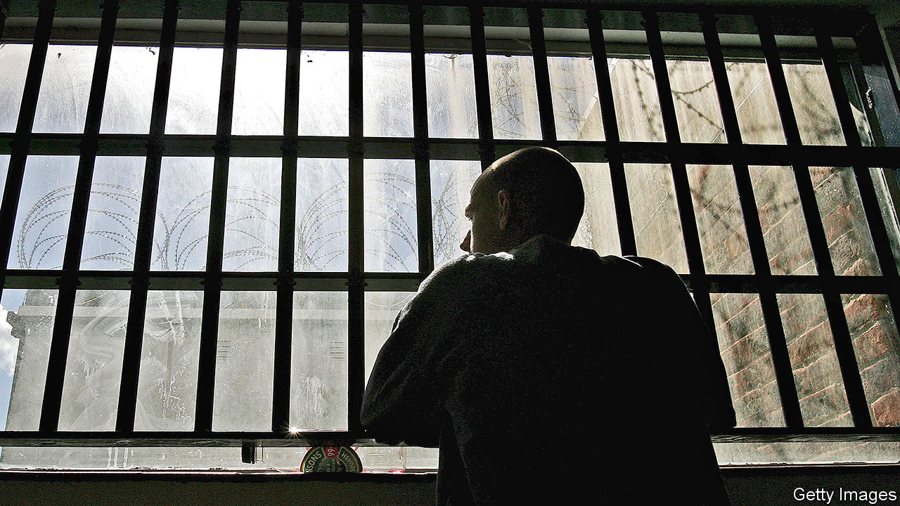

###### Criminal justice

# Prison visits in the pandemic 

##### The families of prisoners have paid the price of keeping inmates safe 

 

> Oct 29th 2020 

LIFE WAS hardly a doddle for Joanne before covid-19. Her partner has been in prison for two years, so she was bringing up their two little boys—aged two and five—on her own, while trying to hold down a job. But at least they could visit him for one precious hour a week, behind the Victorian gates of HMP Manchester. As the virus began to spread, those gates swung shut, as at all 117 prisons in England and Wales. For half a year, the children did not visit their father at all. They finally squeezed in two visits, but then infections picked up and the ban was reimposed. Her children are growing apart from her partner. “They’re not as close as they used to be,” she says.

As covid-19 leapt around the globe, prisons faced an especially acute version of the familiar trade-off between protection from the virus and broader wellbeing. In Britain, prison-reform charities warned of “loss of life on an unprecedented scale”. Prisoners were reckoned to be especially vulnerable to the virus because they were older and in worse health than the general population. Ministers were spooked by estimates that 2,500-3,500 prisoners could die in English and Welsh jails (out of a total population of about 80,000).


That crisis was averted. Between March and the end of September, covid-19 claimed the lives of 23 inmates, but widespread outbreaks were avoided. That can largely be chalked up to a draconian but effective policy of inmate isolation. Visits were banned on March 24th and activities—like jobs in prison workshops or classes—mostly scrapped. Prisoners stayed in their cells, often for 23 hours a day.

Mark Turnbull of Out There, a charity that supports inmates’ families, says that in the initial stages of the pandemic, his phone was kept busy by relatives worried about how fast the virus might spread in prisons. But the longer covid-19 restrictions went on, the clearer the downside of the trade-off became. Visits resumed over the summer, but have now been banned again at roughly a third of prisons, in areas with the most severe restrictions.

Hardest of all, says Joanne, is not knowing how long it will be before her next visit. “At the start of covid, we said ‘There’s no way on Earth they can stop us seeing each other for more than six weeks’. Then it was seven months.” Her partner calls her on the telephone every day but, confined to his cell, he has “nothing to talk about…There’s no hope for them.” The restrictions will also have a broader social cost. Since strong family ties predict a lower likelihood of re-offending, weakening those bonds could make it harder to get inmates back on the straight and narrow. A government-commissioned report by Michael Farmer, a Tory peer, argued in 2017 that positive interactions between inmates and their families were important in preventing prisoners’ children going on to offend themselves.

In one way, though, the pandemic is bringing prisoners closer to their families. Diane Curry of POPS, another family-support charity, says relatives had been clamouring to have video-calls with prisoners for years. In a matter of months, covid-19 made that happen. Before the pandemic, the prison service had begun a tentative roll-out; now almost every jail has the kit.

Technical glitches abound and the service cannot replace the intimacy of a meeting, but it does offer prisoners a glimpse of normality. “Knowing the nitty-gritty of each other’s lives keeps a relationship going across prison walls,” says Anna Kotova of Birmingham University, who is studying these interactions. “Really small things like ‘I’ve painted that wall’ or ‘Look at the tree you planted, see how it’s growing,’ will help sustain relationships for people serving long sentences.” Inmates may be confined to their cells but—virtually, at least—they can roam farther than ever.■

