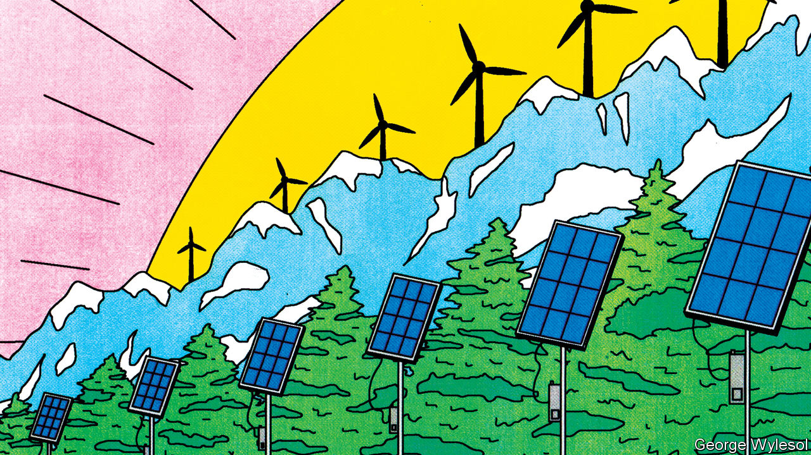
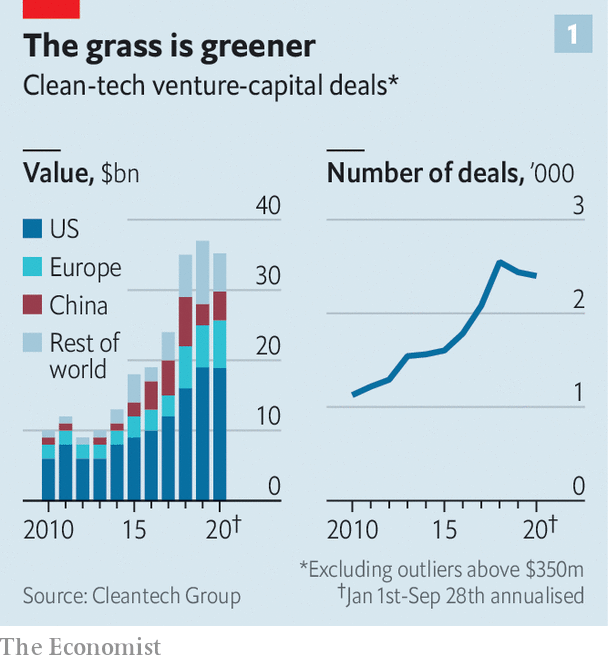
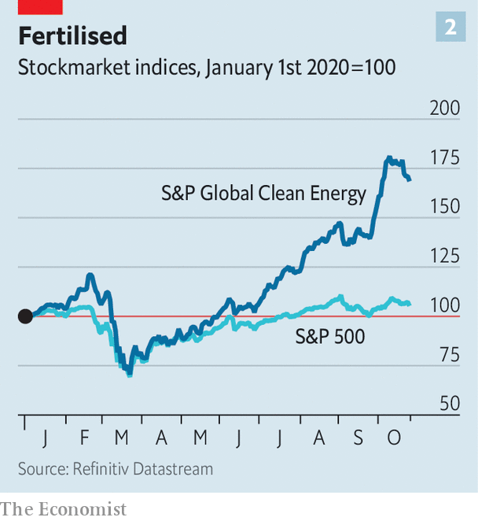

###### Greenbacks for greenery

# Climate-conscious venture capitalists are back 

##### Can they both make money and protect the planet? 

 

> Oct 29th 2020 

“TO SOME EXTENT, we try to scare off investors,” admits Mateo Jaramillo, co-founder of Form Energy. The startup is trying to solve one of renewables’ knottiest problems. Solar and wind power are intermittent, so green utility firms must store excess energy and release it when no sun shines or breeze blows. Large lithium-ion batteries can discharge energy for up to four hours. Form Energy, founded in 2017, wants to extend that to days with a different, and undisclosed, battery technology. In May it announced a pilot project with Great River Energy, a Minnesotan utility. So star-studded is its team of founders that a rival’s boss calls it “the Travelling Wilburys of energy storage”, in reference to the 1980s supergroup featuring George Harrison and Bob Dylan. Still, Mr Jaramillo does not expect to start scaling up until 2025.

The combination of long wait times and unproven technology would give many venture capital (VC) investors the jitters. Most want to see returns in five to seven years. Form Energy has more patient backers. They include Breakthrough Energy Ventures (BEV), a fund set up by Bill Gates and supported by other billionaires; Eni Next, the Italian oil firm’s VC arm; and The Engine, a fund run by the Massachusetts Institute of Technology. This reflects the evolving nature of the green VC ecosystem, which is teeming again after years in relative hibernation.


In 2019 investors poured a record $36bn into climate-related technology, up from $17bn in 2015, according to Cleantech Group, a research firm. Half the money flowed into North American startups (see chart 1). China accounted for between 15% and 30%, depending on how the sector is defined, and Europe for another 15%. This should spur innovation and, hopefully, lower the relative price of climate-friendly technology even in the absence of regulations making carbon-heavy ones dearer. And it needs to happen across the board, not just in energy and transport. “When we think about decarbonisation we have to remind ourselves that this is the entire industrial economy”, says Mr Gates.

 


The International Energy Agency (IEA), a global forecaster, predicts that a quarter of the reductions in emissions needed to put Earth’s climate on a sustainable path by 2070 come from mature technologies, such as hydropower. A further 41% come from relatively new technologies with less than 1% of a given market, such as offshore wind in electricity generation. Technology at the demonstration or prototype stages (battery-powered ships or aircraft, respectively) account for 17% apiece. That presents a huge opportunity for investors—so long as they have a strong stomach.

Green VC has a chequered past. In the late-2000s it experienced a boom and bust cycle in America and, to a lesser extent, Europe. VC funds took a financing model designed for software firms and applied it to companies producing physical products, mostly solar panels and biofuels, that take plenty of time and money to generate revenues. Many companies went bust. Their VC backers lost more than half of the $25bn they had bet. Capital dried up.

Now it is flowing again. This time investors are looking at a broader range of clean tech. About half the deals by value go to low-carbon transport, encouraged by Tesla’s credulity-stretching success. In 2004 Elon Musk bought a 14% stake in the electric-car maker for $6.5m. Six years later it went public and is today worth $385bn, more than any other carmaker. Mr Musk’s stake alone is worth perhaps $72bn, just shy of General Motors and Ford combined.

Investments are not confined to Tesla wannabes. Impossible Foods, a $4bn plant-based-protein firm backed by Mr Gates and Google, and Beyond Meat, its listed rival now worth $10bn, have whetted investors’ appetite for agricultural technology. Form Energy and other developers of grid-scale storage are also in demand.

So is software. PwC, a consultancy, estimates that of the biggest 5% of early-stage VC deals between 2013 and 2019, one in ten involved pure software firms. Another six in ten involved startups that integrate clever algorithms with clean hardware. The falling cost and commoditisation of things like solar panels or batteries, the price of which has dropped by 82% and 87%, respectively, between 2010 and 2019, allows such firms to offer auxiliary goods and services. Software innovations make it possible to take this cheaper hardware and push it beyond its previous limits, observes Varun Sivaram of Columbia University. Some startups are, for instance, trying to use clever programming to aggregate distributed energy sources, such as rooftop solar panels or batteries, and provide electricity to the grid like a virtual power plant.

Investors, too, have grown more diverse. VC firms are increasingly rubbing shoulders with governments, corporations, climate-conscious billionaires and private-equity (PE) firms.

In 2015, 24 countries, including America, China and Germany, and the EU pledged to double R&amp;D spending on clean energy over five years. Many will fall short of that goal. But the decline in spending in the mid-2010s appears to have been reversed. Last year taxpayer-funded green-energy R&amp;D around the world rose for the third consecutive year, to a record $25.4bn, accroding to the IEA.

Governments are trying to fill funding gaps at a later stage, too, when deep-pocketed banks are reluctant to hand out $50m for a factory-scale project and less risk-averse VC firms cannot afford to do so, observes Emily Reichert of Greentown Labs, an incubator. Initiatives such as the EU’s long-standing innovation fund and a new scale-up fund within ARPA-E, an American programme for advanced energy technology, aim to help startups escape this “valley of death”.

Corporations, for their part, are on the lookout for new technologies to help them decarbonise or cut energy costs. According to Cleantech Group, big business is involved in about a quarter of deals, up from 16% in 2010. They either invest through their VC arms or by providing capital directly. Oil majors including ExxonMobil have created a clean-investment fund (though it pales in comparison to their oily capital spending). Energy Impact Partners is trying to set one up on behalf of two dozen utilities, such as Southern Company, an American one, and Britain’s National Grid. This year non-energy firms have announced around $5bn-worth of climate VC. Amazon, an e-commerce empire, has backed five firms, including Rivian, an electric-van startup, and Redwood Materials, a battery-recycling firm. Microsoft, a software colossus, Unilever, a consumer-goods giant, and IKEA, a furniture-maker, have also loosened their purse strings.

High net-zero worth

So have rich individuals, who, like corporate VC funds, tend to represent more patient capital. Family offices participate in around 8-10% of deals, up from 4% in 2010. Many act in concert, as with Mr Gates’s BEV. Launched in 2015, the $1bn vehicle invests only in startups with the potential to cut annual greenhouse-gas emissions by at least the equivalent of half a gigatonne of CO—some 1% of the world’s total. Mr Gates has enlisted abou 20 fellow plutocrats, among them the richest men in America (Jeff Bezos), China (Jack Ma) and India (Mukesh Ambani). The fund is backing 40 firms and will last for 20 years.

Régine Clément, who heads Clean, Renewable and Environmental Opportunities (CREO), a network of 200 or so family offices, says that many families are trying to be “catalytic”. Some support risky prospects and when a product is established, as is happening with low-carbon protein, they take their capital and move to the next nascent market. The Emerson Collective, a foundation founded by Laurene Powell Jobs, the ex-wife of Steve Jobs, Apple’s late boss, has invested in perhaps a dozen climate-tech startups through an incubator. Mr Gates has separately founded TerraPower, a company developing advanced nuclear reactors, and invested in Carbon Engineering, a firm that builds machines which suck carbon dioxide from the air.

Green innovators are also attracting innovative financing methods. PE firms like Spring Lane Capital and Generate Capital are using new funding models to help startups escape valleys of death. In 2019 Generate lent $100m to Plugpower to install its hydrogen-powered forklift trucks in warehouses of Amazon and Walmart. The retailers pay Plugpower for the service, and it uses the proceeds to repay the loan. Specialised insurance firms, such as New Energy Risk, an affiliate of AXA, a giant insurer, help financiers manage the risk.

In September QuantumScape, a battery startup which counts Mr Gates and Volkswagen among its investors, said it planned to list through a reverse merger with a special-purpose acquisition company (SPAC) of the sort that have been all the rage on Wall Street this year. SPACs allow startups to negotiate the purchase price directly. Deals are faster and more predictable. So are exits, which may encourage climate-tech VCs to support more startups.

Many are already heartened by the rapid rise of green stocks. In the past year the S&amp;P clean-energy index, which tracks around 30 firms, outperformed the S&amp;P 500 index of big American companies (see chart 2). Liqian Ma, of Cambridge Associates, a consultancy, notes that between 2014 and 2018 green VC investments around the world generated annual returns of 20%. That is double what typical VC firms manage, and a vast improvement over the mid-2000s, when the average green VC lost money.

 


Deep decarbonisation will mean changing heavy industries, too, says Mr Sivaram of Columbia. For that, says Mike Perry, the chief technology officer of VIONX Energy, “You need someone with deep pockets.” His company, which makes large-scale flow batteries and has struggled to get financing to build its fourth plant, is now going through a restructuring process. “This is not-for-the-faint-of-heart investing,” Mr Perry concedes.

Part of the problem is that, as Mr Gates explains, “the demand side for innovation is missing.” That is particularly the case for high-emitting products bought by businesses, such as cement (which accounts for around 8% of global greenhouse-gas emissions) and steel (7-9%). Unlike software, which is easy to differentiate from rivals, “green steel is not going to be any better than steel,” notes Mr Gates. “So there is no market for early innovation.”

Targeted government procurement could boost green products, as happened when the Pentagon enlisted Silicon Valley to make computers. In the private sector Mr Gates is planning a fund that uses auctions to buy clean tech with the lowest price. This, he argues, will stimulate demand and lower costs. With ideas like this the latest green-VC boom may protect the planet—and avoid another bust. ■

For more coverage of climate change, register for The Climate Issue, our fortnightly , or visit our 

