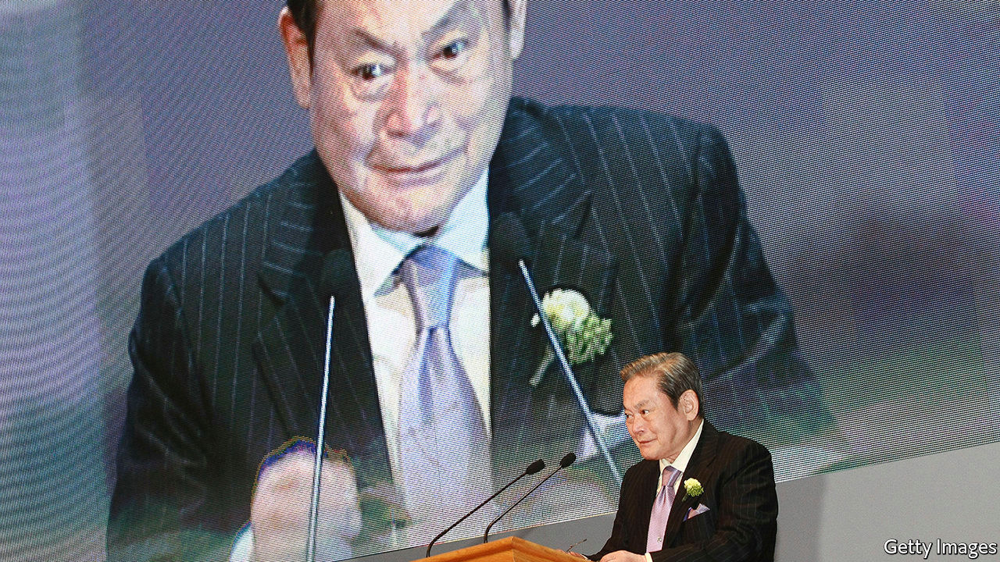
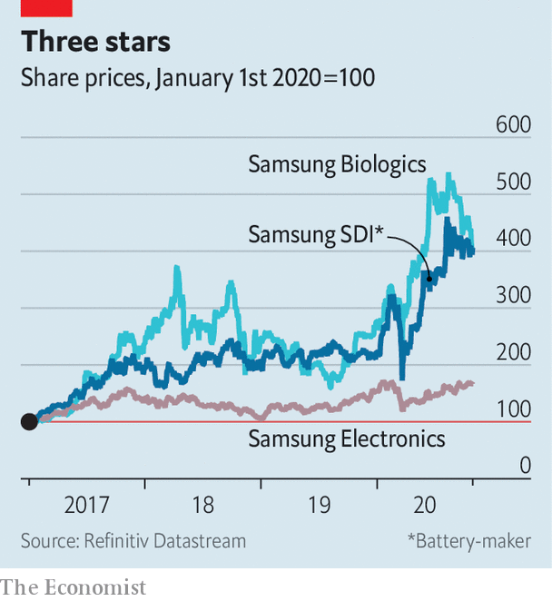

###### The Lee way

# Samsung after Lee Kun-hee 

##### The death of its patriarch leaves South Korea’s biggest conglomerate with familiar challenges 

 

> Oct 29th 2020 

IN THE SPRING of 1995 word got to Lee Kun-hee that a batch of Samsung’s brand-new mobile phones, which it had doled out as new-year gifts, did not work. Incensed, the group’s chairman ordered employees at the factory that had made the offending devices to pile up tens of thousands of them in a courtyard. A cool $45m-worth of equipment then went up in flames.

The episode is emblematic of the way Mr Lee (pictured), who died on October 25th aged 78, turned a South Korean maker of knock-off electronics into a technology powerhouse. He was obsessed with quality and demanded total devotion from executives. Every decade or so he made bold bets. His last one, on smartphones and semiconductors, paid off handsomely. Samsung Electronics, the group’s crown jewel, has a market value of $311bn, more than JPMorgan Chase, America’s biggest bank.


The patriarch’s death was not unexpected—he had been incapacitated since a heart attack in 2014. It will not prompt leadership changes. But it highlights two challenges facing South Korea’s biggest chaebol (conglomerate). The group must find growth beyond maturing smartphone markets. And it has to grapple with Mr Lee’s other legacy: an over-cosy relationship with politics that has embroiled his company, as well as his son and successor, Lee Jae-yong, in corruption cases.

The rise of Samsung mirrors that of South Korea. When Lee père took over from his father in 1987, the country was an emerging economy that had yet to make the transition to democracy. When he fell ill in 2014 it was rich, thriving and democratic. On his watch Samsung abandoned the “fast follow” strategy adopted by South Korean firms since the 1970s and allowed himself “to imagine that his company could be number one in its own right”, says Park Ju-gun of CEO Score, a corporate watchdog. This entailed some mistakes, such as an expensive foray into carmaking. But it mostly brought success.

Although the group maintains businesses from shipbuilding and life insurance to amusement parks, the younger Mr Lee, de facto boss since 2014, has kept a focus on electronics. Today Samsung is the world’s biggest maker of smartphones and its second-biggest of memory chips. It has defended its position in mobile devices against competition from China. Lee fils has forged global partnerships, including with competitors such as Apple, which Samsung Display, a subsidiary, supplies with screens for iPhones. He has also begun to move the company away from producing solid but unsexy hardware towards an emphasis on design and software, which accounts for American big tech firms’ trillion-dollar valuations.

It has not all gone the Lees’ way. Wielding economic influence to preserve a corporate structure that benefits the founding family has landed them in trouble. Lee père was twice convicted for corruption, including bribing the president—and twice pardoned when politicians deemed his continued involvement in Samsung to be in the national interest. His son has already spent time in prison, for bribing a confidante of Park Geun-hye, a former president, to gain approval for a merger, which prosecutors allege helped him consolidate control over the Samsung empire. Ms Park was removed from office and Mr Lee is facing retrial on those charges, plus a fresh one on related accusations of manipulating stock prices to facilitate the merger. Mr Lee and Samsung deny wrongdoing.

If either case lands Mr Lee in prison, his leadership may be in jeopardy. That need not spell doom—the day-to-day running of the company is in the hands of professional managers. But it may make it harder to perform the late patriarch’s occasional, sweeping changes of direction.

Some of his son’s bets seem to be working. Samsung Biologics, the listed biotech subsidiary, is building a new $1.5bn factory. Its share price is up by 50% this year. That of Samsung SDI, a battery affiliate, has nearly doubled (see chart); it has invested $2.1bn since January and is eyeing the electric-car market. It is planning to expand a factory in China and build a new one in Hungary. But at a combined value of $63bn they look small next to Samsung Electronics. And competition in both areas is hot.

 


Samsung Electronics’ third-quarter results on October 29th beat forecasts. It plans to spend around $10bn on its contract-manufacturing chip business over the next ten years. American sanctions against Chinese technology firms, which have already hurt its smartphone rivals such as Huawei, may help with that—and with its flagging foray into 5G telecoms. But the firm warned of lower chip demand in the short term. And the market share of its chip “foundries” lags behind Taiwan Semiconductor Manufacturing Company, the industry leader. No new mega-bet in the style of Lee père is on the horizon.

Lee fils has apologised for his group’s run-ins with the law and vowed to break with tradition and not pass control to his own progeny. The Lee family says it plans to pay the full inheritance tax on the patriarch’s $16bn shareholdings. Honouring his positive legacy may prove harder. ■

