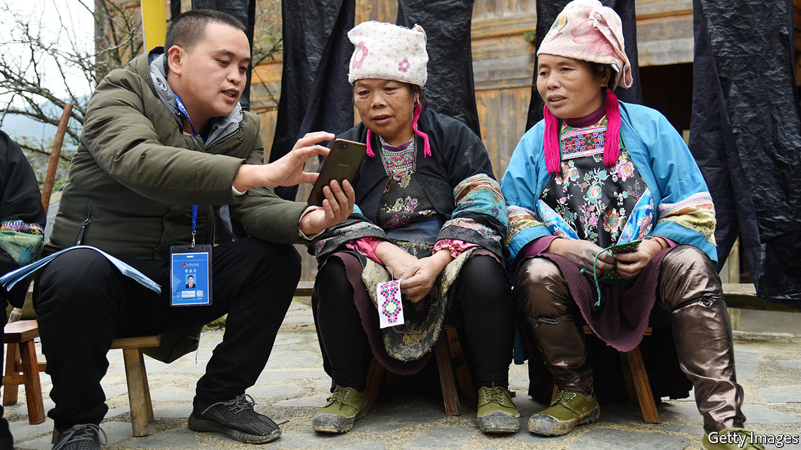
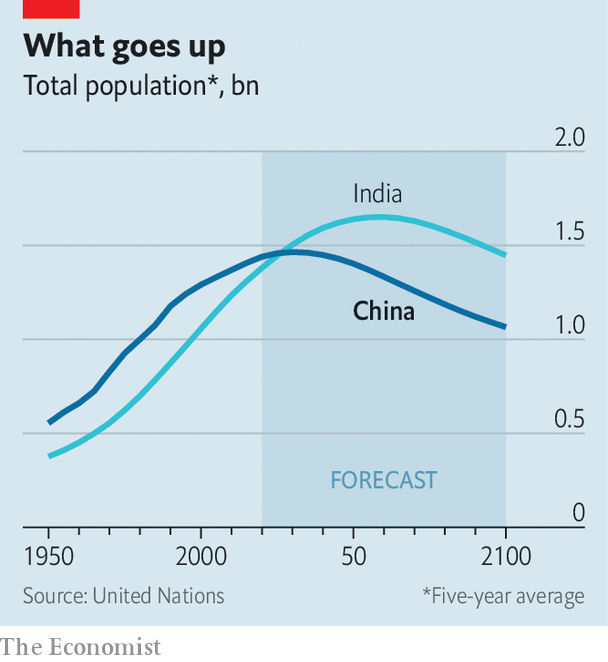

###### Go figure

# China’s 7m enumerators begin the world’s largest census 

##### Is the population already shrinking? 

 

> Oct 31st 2020 

IN THE COMING weeks nearly every Chinese house will receive a knock on the door. On November 1st 7m functionaries will begin carrying out the country’s ten-yearly census, a task that will take them until December 10th. The last such count, in 2010, found that China’s total population was growing only half as swiftly as it did between 1991-2000. This year’s megacount will provide further details about the country’s demographic crunch.

Censuses are difficult everywhere, but China’s is especially fraught. Its hundreds of millions of migrant workers are tricky to count, not least because some fear reprisals for having moved to parts of the country that the Communist Party would like them to leave. Some people do not want officials to find out that they have had more children than family-planning policies allow. Fraudsters and thieves who have posed as census-takers during past counts have given enumerators a bad name. And local governments have sometimes sought to inflate population figures in order to claim more subsidies from Beijing.


This time, says the government, new paperless systems will help to protect people’s information and make it harder for anyone to fiddle the count. There are also plans to substitute door-to-door visits with phone calls and online forms, if census officials in some places have to work around local outbreaks of covid-19. Whereas many Chinese shy from the box-tickers, some are hoping to use this year’s exercise to help make themselves more visible. A gay-rights group in the southern city of Guangzhou is encouraging people in same-sex relationships to make sure census-takers realise they are a couple, and to insist that they write this information into an open field in the census form.

 


The findings from China’s previous census helped persuade the party that it had to loosen its one-child-per-family policy. Since 2016 Chinese couples risk punishment only if they have more than two. Yet the total number of births is declining even faster than it was before the change. Last year the country produced the fewest babies since 1961, when its population was only half as large. The birth rate, of 10.48 babies per 1,000 people, was the lowest since the party took power in 1949.

The government reckons that China’s working-age population has been shrinking since 2012. The share of people aged 60 and over has risen from 10.4% at the census in 2000 to an estimated 18% last year; this group could make up one-third of the population by 2050. The Chinese Academy of Social Sciences, a government think-tank, guesses that the number of Chinese will peak at 1.44bn in 2029. But some demographers think that the population may already have started to shrink.

Preliminary results from this year’s census will not be released for some months. But it does not require an army of enumerators to see that the coercive regulation of Chinese couples’ fertility is as absurd as it is cruel. In June Chinese journalists reported that a couple in Guangzhou had been fined 320,000 yuan ($48,000) after declining to abort their third child—a sum equal to nearly three years of their household income. Someday, perhaps, Chinese people will be allowed to make their own reproductive choices.■

