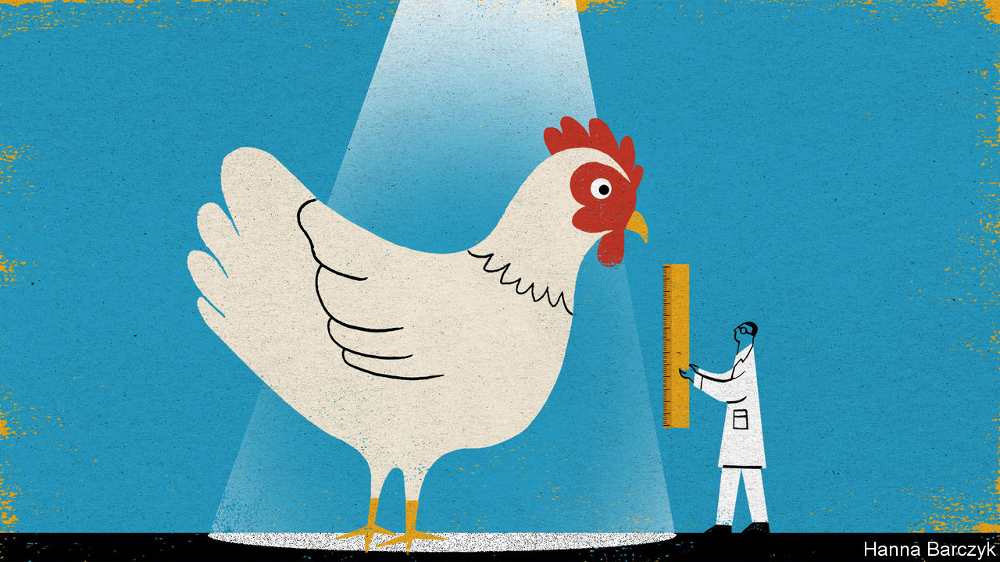

###### Chaguan

# High-tech chickens are a case study of why self-reliance is so hard 

##### For China, rearing the meatiest poultry is surprisingly difficult 

 

> Oct 29th 2020 

IT TAKES AN effort—a small hardening of the heart—to see day-old Jinghai Poultry chicks for what they are. These, for all their plaintive cheeping and soft, fuzzy plumage, are tiny, high-performance meat factories. The product of decades of genetic research in American and European laboratories, they hatch in China thanks to global supply chains, involving the air-freighting of eggs and chicks between secure breeding sites on five continents.

Those chains are more fragile than once supposed. Animal diseases, the US-China trade war and covid-19 have all disrupted, or threatened to disrupt, industrial chicken supplies. That makes those chicks a window onto something interesting: China’s increasingly complicated relationship with high-tech globalisation, a force that has made the country more prosperous, but also reliant on the outside world in ways that trouble Communist Party bosses.


The unsentimental logic of high-performance poultry-rearing is easy to grasp. Standing this week in the loading bay of a factory farm in the coastal province of Jiangsu, Chaguan heard Jinghai executives explain how “white-feather meat chickens”, as they are known in China, grow to 2.5kg in 40 days. Homegrown varieties of “yellow-feather chicken”, descended from backyard fowl, take twice as long to mature and will only ever weigh half as much. Clients collect cardboard trays holding 102 chicks, peeking through slats in the sides. Four trays can generate a tonne of chicken.

Nor is China’s interest in cheap protein mysterious. Half a century ago meat was a rare luxury. Now, many see it as a daily necessity. In the meantime, the country’s supplies of farmland and clean water have not grown. Agriculture remains blighted by food-safety scandals, the rampant use of fake or illegal animal medicines, and disease outbreaks. Small surprise, then, that Chinese leaders give frequent speeches about food security. A puzzle lurks, though. Leaders also call for self-reliance in key technologies. And in the case of broiler chickens, those two ambitions—rearing meat efficiently and avoiding dependence on imports—are in tension.

The chicks cheeping at Chaguan are the fifth-generation descendants of pedigree birds whose bloodlines represent 80 years of selection for such traits as efficient food-to-meat conversion, rapid growth, strong leg bones and disease resistance. After waves of consolidation, the industry is dominated by two firms, Aviagen (based in Alabama and owned by the EW Group of Germany) and Cobb (owned by Tyson, an American poultry giant).

The most valuable pedigree birds never leave maximum-security farms in America and Britain: a single pedigree hen may generate 4m direct descendants. Their second-generation offspring are flown to breeding sites dispersed between such places as Brazil, Britain and New Zealand, in part to hedge against supply shocks when avian influenzas and other diseases close borders. Day-old third-generation chicks are air-freighted to local partners such as Jinghai, which spend six months growing them and breeding them in climate-controlled, artificially lit indoor facilities. In all, China imports 1.6m third-generation white-feather chicks a year.

Jinghai hatches 8m fourth-generation, “parent stock” chickens annually. The company sells some to other agri-businesses. It breeds from the rest to produce fifth-generation chicks like those cheeping at Chaguan. These are “meat chickens”, consumed in fast-food outlets, schools and factory canteens, or as chicken parts sold in supermarkets. Yellow-feather chickens, deemed tastier by Chinese cooks, account for most whole birds sold in markets.

Chinese breeders have long tried to create local varieties with bloodlines available in-country. Breeding from imported third- or fourth-generation chickens is a bad solution: their genes are less desirable than those of their elite grandparents, making them a poor starting-point for a new variety. In September the State Council, China’s cabinet, issued a paper on livestock-rearing that set self-sufficiency in poultry as a goal, calling meat-chicken breeding a priority. Big foreign firms have resisted appeals from officials to send second-generation stock to China. A poultry firm with 10% of the domestic market, Fujian Sunner, says it has bred all-Chinese broilers: their performance is a source of some debate.

Dependence on foreign bloodlines does carry risks. For several months recently New Zealand was one of the only countries able to send third-generation chicks to China, after other exporters suffered bird-flu outbreaks. Li Jinghui, president of the China Broiler Alliance, an industry association, calls conditions ripe for China’s “brilliant” scientists to develop local birds. Mr Li adds that Chinese diners do not share the West’s love of breast meat and think chicken feet a delicacy, so that Chinese-bred broilers might have bigger thighs and feet. But Mr Li suggests that the government’s aim is diversifying meat supplies, rather than literal self-sufficiency. Let Chinese and foreign chicken breeds compete like Huawei and Apple smartphones, he urges: market forces should decide the result.

Don’t even ask about animal rights

Wang Hongsheng, a boss at Jinghai, admits to fretting about interruptions to chick supplies, even wondering if President Donald Trump might curb American exports. But to develop a domestic breed from scratch would take years, and if it does not meet market needs, a firm could spend a fortune “without much to show for it”.

High-tech chickens are not as sleek as high-speed trains or as clever as quantum computers. Still, they are a case study of why self-reliance is hard. China’s poultry market has room to grow: Westerners each eat far more chicken than Chinese do. But without a stronger animal-health system and environmental controls, biotechnology alone cannot help China to develop world-class agriculture. Moreover, a long-standing Chinese strategy—bullying foreign firms to hand over intellectual property—is counter-productive now. Western trust in China is low, and official talk of self-sufficiency is one cause. The politics of globalisation get tricky when one side feels it is being readied for the pot.■

