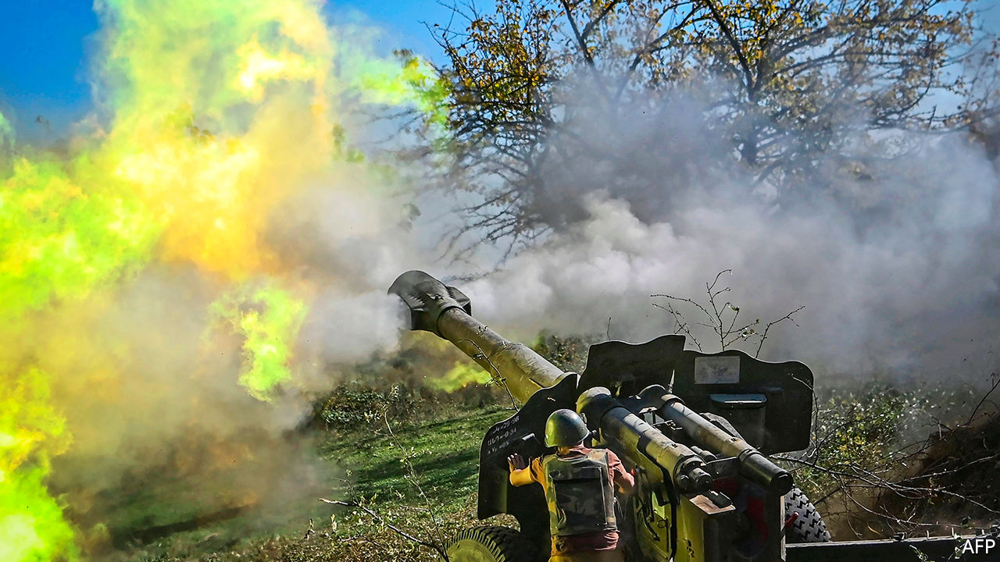
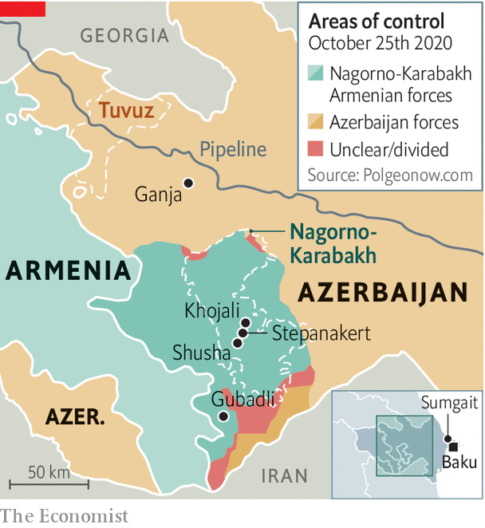

###### The wheel turns

# The fighting in Nagorno-Karabakh reflects decades of conflict 

##### The Azerbaijanis are making big gains, but Armenia won’t give up 

 

> Oct 29th 2020 

IN A COURTYARD of half a dozen identical apartment blocks in Sumgait, a charmless industrial town near Azerbaijan’s capital, Baku, a group of teenage boys are congregating around Elshan, who is recording a YouTube video. Adopting a “radio voice”, he proclaims the names of villages “liberated” by Azerbaijan’s “glorious army” around Nagorno-Karabakh, an ethnic Armenian enclave inside Azerbaijan that is at the heart of a long and deadly conflict on the edge of Europe. Like most of the residents of the compound, Elshan’s family are refugees displaced from their home in Gubadli, one of the seven districts adjacent to Nagorno-Karabakh that were captured by Armenians during a war in the early 1990s.

It was the first ethnic conflict to accompany the break-up of the Soviet empire. But Elshan and the boys, born after that war ended in an uneasy truce, know little about the Soviet Union. Nor were they ever told that the descent into war began with a horrific pogrom of ethnic Armenians in Sumgait in 1988. What the boys do know is that four years later Armenian militias staged the biggest massacre of that war outside the village of Khojali, within the enclave. The Azerbaijanis say 600 of their kin were murdered. Although the boys have never seen an Armenian in their lives, the talk in their homes is of trauma, hatred and a longing for home. “Armenians are not people,” the adults say. “We cannot live together...They must leave our land...We did nothing wrong.”


Two hours after Elshan has made his video, an announcement comes on Twitter from Azerbaijan’s President Ilham Aliyev: the army has “liberated” three villages in Gubadli district. The compound, along with the rest of Sumgait, erupts in jubilation. People pour out onto the streets dancing and waving the flags of Azerbaijan and its main ally, Turkey. A member of Sumgait’s local council delivers a message to a TV camera: “We are no longer the refugees.”

For a quarter of a century they have been waiting for this moment, since Azerbaijan, an oil-rich country of 10m people, lost the war to Armenia, a poorer and smaller neighbour. At the time Azerbaijan was in a state of turmoil, while Armenia had a better army and received stronger backing from Russia. The war ended in a ceasefire that left Azerbaijan with a loss of territory and pride. “We came back from that war with a sense of deep humiliation,” says Azad Isazade, who fought in that conflict and later served as a spokesman for Azerbaijan’s army. “We failed to defend our land, our children and our mothers.” Back then, he was obliged to announce the loss of Shusha, the citadel of Azeri culture and the highest major town in the Nagorno-Karabakh region. “Azerbaijan’s newsreaders refused to announce it on television news,” he says. Now all the talk is of “taking Shusha back”.

 


This surge of national confidence is partly the result of an oil and gas bonanza that has fuelled Azerbaijan’s economic growth and paid for vast military spending over the past two decades. Yet while Azerbaijan has gained in strength, its failure to recover land around Nagorno-Karabakh which mediators have said since the mid-1990s should be restored to it has fostered deep frustration.

The trigger for the current all-out offensive occurred in July, when Armenia and Azerbaijan clashed over the border in Tuvuz, more than a hundred miles away from Nagorno-Karabakh but close to a pipeline that carries oil from Azerbaijan to Turkey via Georgia. An Azerbaijani general was killed. Russia began to reinforce Armenian positions, bringing up a mass of military cargo. Turkey sent military planners, troops and jets for a joint drill with Azerbaijan. (Azeris are ethnically close to Turks.)

In Baku tens of thousands took to the streets demanding an end to the lockdown for covid-19—and calling for war. “Commander-in-chief, give us weapons,” they chanted. A small crowd broke into the parliament. Police sprayed tear-gas. Mr Aliyev, an authoritarian leader who inherited his post from his father in 2003, was rattled. If he needed any more excuses to go to war, one was promptly provided by Nikol Pashinyan, Armenia’s populist prime minister, who went to Nagorno-Karabakh to deliver an incendiary message: referring to it by its Armenian name, Artsakh, he called for its unification with Armenia proper. “Artsakh is Armenia, and that’s it,” he declared.

“We came to a logical conclusion that Armenia has no intention of returning the occupied territories or letting the [Azerbaijani] refugees back,” says Hikmet Hajiyev, an adviser to Mr Aliyev. So on September 27th Azerbaijan went to war. “It is not Aliyev’s war. It’s a people’s war,” says Zaur Shiriyev of the International Crisis Group, which seeks to resolve conflicts. “But it could give him lifelong legitimacy.”

Armed with Turkish and Israeli drones, trained to NATO standards by Turkish instructors and fired with nationalist ardour, Azerbaijan’s army has pummelled Armenia’s Russian-made tanks and air-defence systems. Its troops have recaptured chunks of the seven districts, have come within firing-range of the corridor that connects Armenia to Nagorno-Karabakh, and are setting their sights on Shusha. Armenians in the enclave have responded by launching missiles at Azerbaijani towns, the latest one killing 20 civilians in Barda.

What Azerbaijan sees as a war of liberation, Armenians see as one for survival. Two-thirds of the population of Nagorno-Karabakh, some 90,000 people, have fled. “A return to Shusha is essential for restoring Azerbaijan’s sense of justice, but it cannot be achieved by causing injustice to others,” says Mr Shiriyev. Taking Shusha may be a great victory; preventing another spiral of injustice will be harder. But try saying that to the boys in Sumgait. ■

