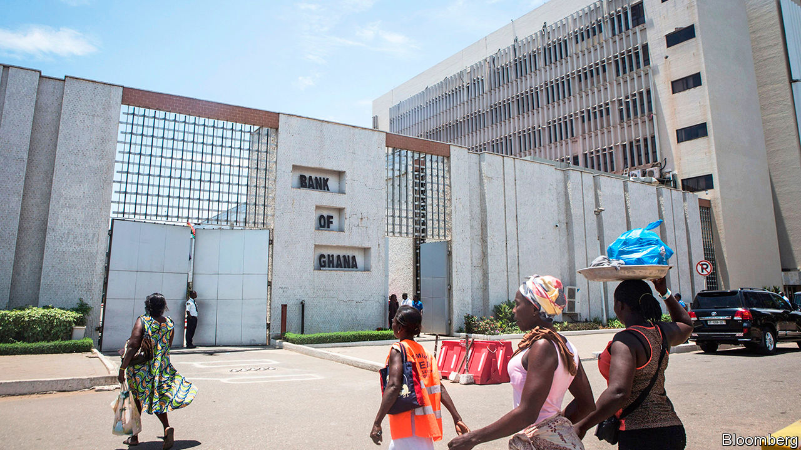
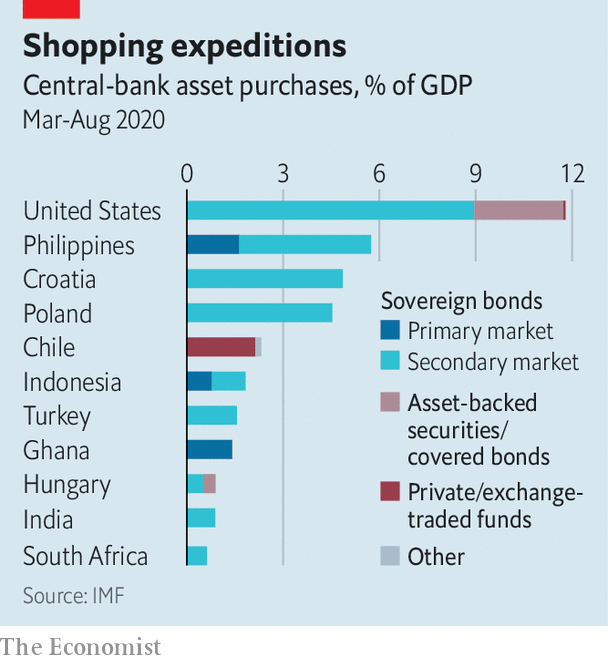

###### Quite encouraging

# Emerging markets’ experiments with QE have not turned out too badly 

##### The IMF blesses emergency bond-buying schemes 

 

> Oct 29th 2020 

ECONOMIES, UNLIKE people, become more tolerant of excess as they mature. Thus America or Japan can get away with fast-and-loose economic policies that would spell disaster if less mature, “emerging” economies tried them at home. Quantitative easing (QE) is often cited as an example. Buying government bonds with newly created money is surely the kind of indulgence best left to the rich world. Central banks in emerging markets have, after all, spent decades trying to distance themselves from gluttonous governments and prove themselves careful stewards of the money supply.

The emerging-market response to the covid-19 pandemic has, therefore, raised eyebrows. As well as cutting interest rates sharply, many central banks have experimented with their own versions of QE, buying government bonds and other financial assets. Contrary to some fears, this has not so far brought disaster. Indeed the early evidence suggests it has worked quite well.


At least 18 central banks have carried out asset-purchase programmes of some kind, according to the IMF. Policymakers in some countries, such as Chile, Hungary and Poland, resorted to them because they had already lowered interest rates about as far as they could go. Others, however, had different motives. In some countries the authorities admitted that bond-buying had a partly fiscal aim. The central bank’s purchases would help finance the government’s efforts to fight the pandemic. The Bank of Ghana, bought a “covid-19 relief bond” worth 5.5bn cedi ($950m) from the government in May to help fill its financing gap. In the Philippines, Rosalia De Leon, the national treasurer, described the central bank’s purchases as an “extra lifeline” for the government.

A third group of central banks, including those in India and South Africa, bought bonds for a subtler reason: to help make a market for them. Their aim was not simply to lift bond prices, but also to reduce their volatility and narrow a widening gap between the prices demanded by prospective sellers and those offered by potential buyers. In addition, by acting as a buyer of last resort, central bankers hoped to embolden other, private buyers of earlier resort.

 


Sure enough, the announcement of these measures helped reduce bond yields, says the IMF’s latest global financial stability report, by about 0.2 to 0.6 percentage points. They also helped to reduce the “term premium”, or the extra yield investors demand to hold a long-term bond rather than a series of short-term ones. More surprisingly, perhaps, these purchases added little, if any, downward pressure to currencies. This was partly because central banks often sold short-term claims even as they bought longer term assets, thereby mopping up the money they had created. It was also because investors seem to have been comforted, not threatened, by the presence of the central bank as a fellow buyer. Their purchases had a “catalysing effect”, the fund says.

If these shopping sprees have been helpful, should central banks make a habit of them? And should they splash out as freely as central banks in the rich world? The IMF urges caution. The pandemic created exceptional circumstances. Investors might react differently to larger, more routine forays into the bond market. Central banks should also consider what private investors can buy instead. If a country’s markets offer few alternatives to government bonds, then the central bank might inadvertently push investors out of the country’s assets altogether.

Unconventional policies help only if central banks are credible. Turkey provides one illustration. Foreigners have halved their holdings of lira-denominated government bonds this year, according to the Institute of International Finance, a bankers’ group, and the currency has plunged to record lows in recent days. Turkey’s president, Recep Tayyip Erdogan, harbours unorthodox views on monetary policy and the central bank manifestly lacks the independence needed to defeat inflation, which exceeds 11%. If Turkey’s central bank were to expand its modest bond-buying scheme, it would only make things worse. You cannot stop a run on a currency by printing more of it and lowering the reward for holding it. The unconventional and the unorthodox are a poor mix. ■

