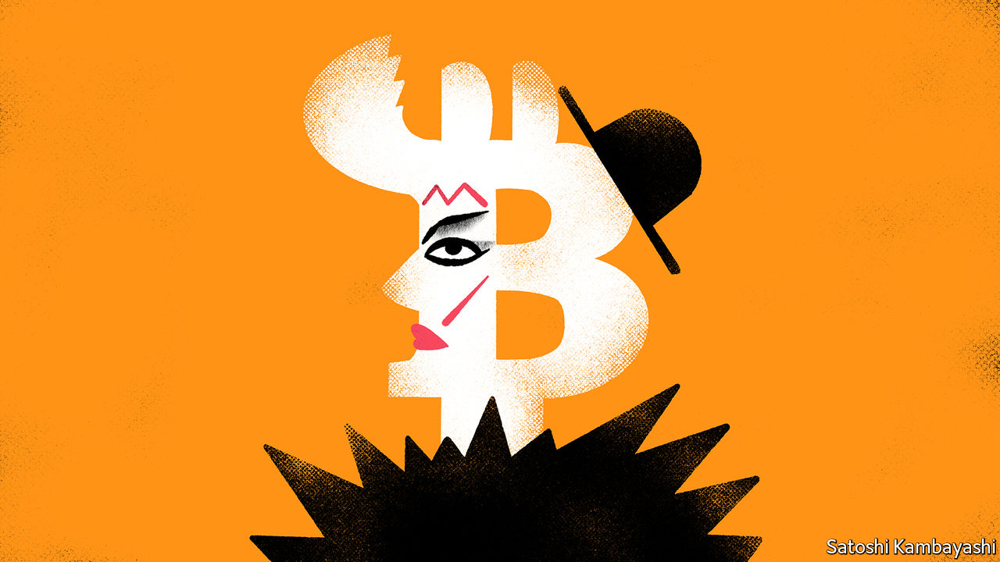

###### Blitz-coin

# Getting down with the cool kids on bitcoin 

##### How investors might learn to stop worrying and love crypto 

 

> Oct 29th 2020 

EVERY TUESDAY for most of 1979-80, the Blitz wine bar in Covent Garden was host to an influential club-night. London was then a run-down city. The Blitz was a seedy spot. What made it remarkable were the Blitz Kids, the extravagantly dressed Tuesday-night regulars. A teenage Boy George worked in the cloakroom. The door policy was strict. To get in, said Steve Strange, who ran the club-night, you had to look “like a walking piece of art”. Mick Jagger was once refused entry.

This all seemed shallow and transient. The make-up, the get-ups and the evident disdain for people who were not walking pieces of art were marks of unseriousness. Yet the Blitz Kids, a mix of art students and urchins, would go on to shape popular culture, according to “Sweet Dreams: The Story of the New Romantics”, a new book by Dylan Jones. This brings us to another hangout for oddballs, fantasists and drop-outs: bitcoin. To most people it seems at best a fad, at worst a con-job. But it refuses to disappear. And its price in dollars is up by around 150% since March.


It is hard to have a sensible conversation about bitcoin. To show interest is to invite contempt from sceptics and an inbox stuffed with get-rich-quick proposals from boosters. But a nagging thought will not go away. What if these crypto-kids are on to something just as the much-derided Blitz Kids were? After all, as well as notoriety, bitcoin has ingenuity and scarcity on its side.

Start with the ingenuity. Even people who are hostile to bitcoin will concede that its technology is fiendishly clever. It is essentially a way of accounting for who has spent what. Instead of a central exchange to keep score, and to verify payments and receipts, it uses an electronic ledger that is distributed across the entire system of bitcoin users. The system’s dispersed nature means that tampering with the accounts would require gaining control over a majority of the network’s computers. That is an important source of trust in bitcoin.

A big part of its appeal to users is that no one official entity—no government, bank or tech firm—is in charge. (This is also what a lot of people dislike about it.) The system is self-regulating. It is also self-limiting. Bitcoins are “mined” when a computer solves a very time-consuming maths problem. It must identify a large number encrypted in the system’s code. Over time the remaining numbers become harder to find. Eventually the mine will be exhausted. Bitcoin’s supply protocol is as restrictive as the Blitz’s door policy. Only 21m bitcoins will ever be produced.

Millennial techies are at home with all this. The older technophobic crowd tends to be hostile. So be it. “That most people still hate bitcoin isn’t a bad thing,” writes Dylan Grice of Calderwood Capital, an alternative-investment boutique, in a recent letter to clients. This is to say that it is difficult to make a lot of money buying an asset that everybody likes. And as with the Blitz, the infamy and outrage is part of the allure. Older visitors might grumble that the music played there was unremarkable or that the venue was a dump. It didn’t matter. The club acted as a focal point for like-minded people. That is an underrated virtue. Thomas Schelling, a Nobel prize-winning economist and game theorist, contended that people gravitate towards focal points without formally agreeing to do so. His insight extends to asset markets. Gold bars—or bitcoins—have value if enough people tacitly agree that they do.

What precisely might that value be? An honest answer is: “Who knows?” Bitcoin has no intrinsic worth. As with gold, there is no stream of future dividends to build a valuation around. Yet people have become comfortable with gold as an asset because it has been around for so long. Bitcoin is a newcomer, but its use is growing. So if you believe it has a future, you may want to own some, says Mr Grice. Indeed if you like gold as a hedge against a revival in inflation or some other calamity, you might consider transferring some of your gold allocation to bitcoin. It has advantages over the precious metal: it can be more easily stored and transferred, for instance. In some places, you can actually use it.

Bitcoin is a pretty tiny club. Beside it, gold looks as capacious as Wembley Stadium. The market value of all bitcoin is just 1-2% of the value of all the gold above ground. Scarcity is a trait of many things that are perceived to have value. Steve Strange, who sadly died in 2015, understood this fully. “The best move I ever made was turning Mick Jagger away at the door,” he said.

