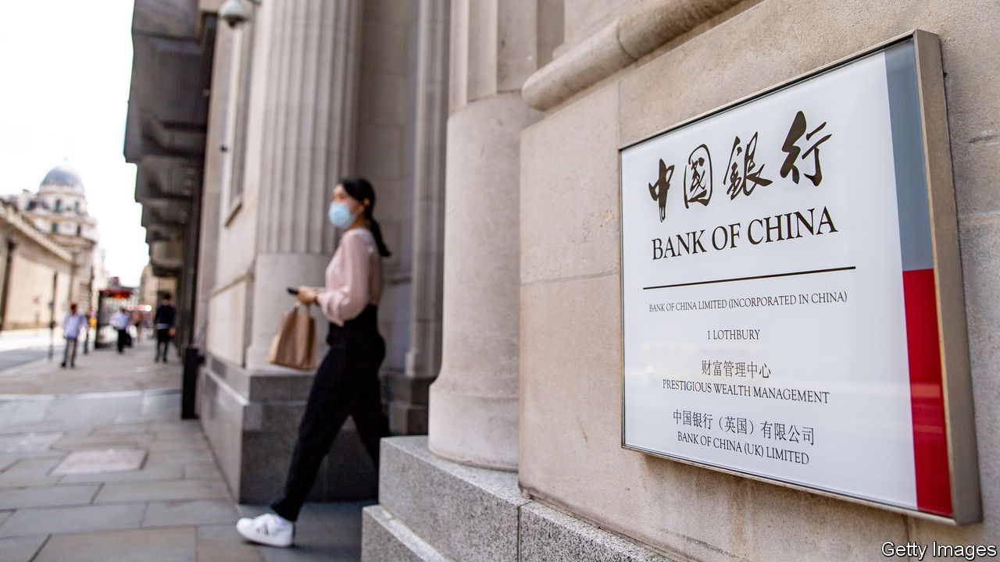
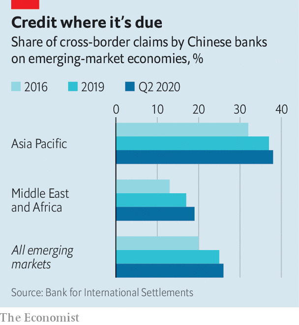

###### Making inroads

# The overseas activities of Chinese banks shift up a gear 

##### In many emerging economies, they are the chief source of cross-border loans 

 

> Oct 28th 2020 

CHINA’S BANKING system, with $35trn in assets, is the world’s largest. Its four biggest lenders, measured by assets, head the global league table. Yet Western banks rarely come up against Chinese peers in foreign climes. That has fed the stereotype that China’s banks are either uninterested in global business or, staffed by staid bureaucrats and stuffed with bad loans, are uncompetitive abroad. A new study suggests that this portrait is wide of the mark.

In fact the global footprint of China’s banks has grown to rival that of Western lenders. In June this year its deposit-takers, including some of its policy banks, accounted for 7% of total cross-border lending flows, up from 5% in 2015, and lent to 196 out of 216 countries. A recent paper by Catherine Koch and Swapan-Kumar Pradhan of the Bank for International Settlements (BIS) and Eugenio Cerutti of the IMF explains why the rich world hasn’t noticed: China’s banks reign in poorer markets that Western lenders either never entered or are now abandoning.


Chinese banks provide 26% of all cross-border loans to developing countries today, most of them in dollars (see chart). That is up from a fifth in 2016, and has risen since the pandemic. (Ms Koch points out that the BIS’s figures cover only countries that report to it, and suspects that the true share could be higher.) China’s share is still lower than that of European banks, which, though retrenching, account for 34% of cross-border lending to poor countries. In half of these places, though, its banks are now the largest cross-border lenders.

 


Banks from emerging economies are typically reluctant to lend far away from home, perhaps because their own markets are still growing and the creditworthiness of far-flung borrowers is harder to assess. By looking at loans made by banks from their home base, as well as by their foreign subsidiaries, the researchers show that Chinese lenders are not so put off. In that sense they resemble banks from Europe and America, says Mr Cerutti, even though they are typically state-owned and their overseas expansion is much more recent.

In another respect, however, China’s banks stand out. Cross-border loans tend to be correlated with trade and investment flows, which give lenders more information about foreign borrowers. The link between lending by China’s banks and bilateral trade is especially strong. But lending bears little relation to investment flows. The authors suspect that this reflects China’s capital controls, and the fact that its portfolio investments target rich markets.

What does all this mean for borrowers? The rise of China’s banks brings both risk and reward. One concern has been that the lending has added to some poor countries’ debt woes. In some places China’s banks are now important enough that, if a shock causes them to pull back, then a local credit crunch could ensue. But China could be a source of needed capital too. Strong inflows into the country this year mean that its banks are flush with dollars (see ). If recent form is a guide, a chunk will be recycled into developing countries. ■

