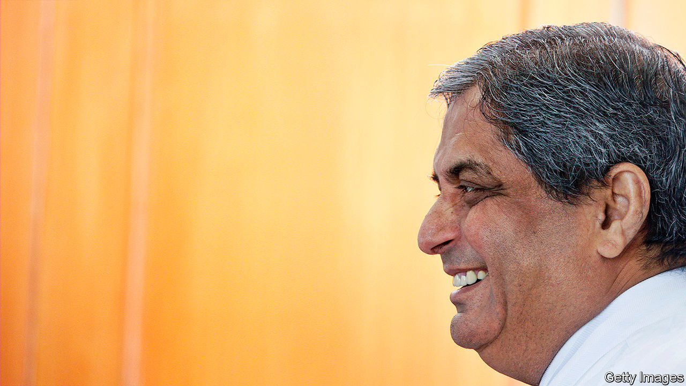
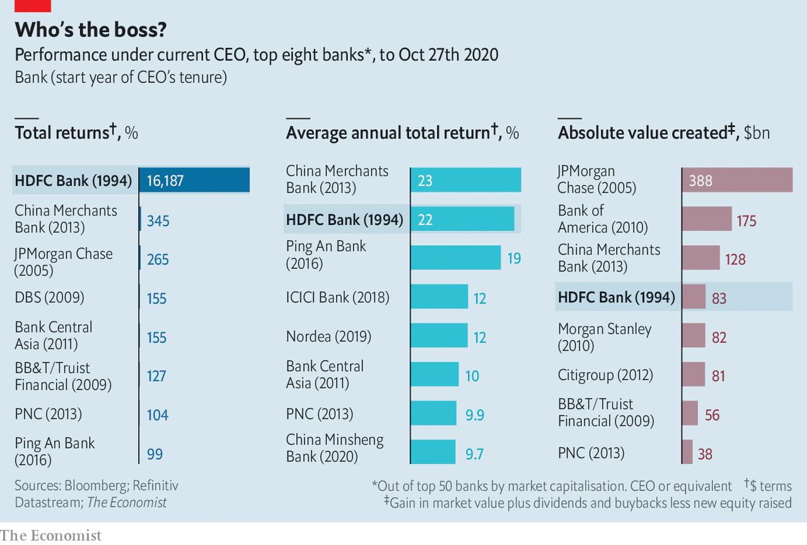

###### Star performers

# Who is the world’s best banker? 

##### It may be someone few outside Asia have heard of: Aditya Puri, of India’s HDFC Bank 

 

> Oct 29th 2020 

WHO IS THE most impressive banker on the planet? Judged by their swagger and $20m-40m paypackets, the bosses of Wall Street’s big firms are contenders; yet several run firms that have delivered weak returns, been bailed out and left a toxic trail of scandals. Measured by sheer clout, the heads of China’s state lenders are in the running. The boss of Agricultural Bank of China keeps an eye on a mere 23,000 branches and half a million staff. But he is an instrument of the Communist Party.

Measured by the hardest test of all— creating something from nothing and delivering long-term shareholder returns while supporting the economy—the answer is someone of whom few outside Asia and the investment elite would have heard: Aditya Puri, who on October 26th retired from HDFC Bank. Now the world’s tenth-most-valuable bank, it is worth about $90bn, more than Citigroup or HSBC.


HDFC is Indian, headquartered in Mumbai, and has been run by Mr Puri since its creation in 1994. Today it has branches in mega-cities and rural backwaters alike. It serves consumers and firms and eschews the wilder reaches of investment banking and foreign adventures. This unlikely formula has produced spectacular results.

In order to assess Mr Puri’s performance The Economist has compared total shareholder returns during his tenure with those achieved by the chief executives of the world’s top 50 banks, by market value (see chart). Mr Puri has delivered cumulative returns exceeding 16,000% over the quarter-century since his bank went public. That is far more than any other boss in our sample, including Jamie Dimon of JPMorgan Chase, widely viewed as the leading banker of his generation. This is not wholly a function of the length of Mr Puri’s tenure: annualised total returns have been 22%, placing him among the top two. The power of compounding means the absolute value created for shareholders during his tenure is a giant $83bn.

 


Such returns seemed unimaginable in 1994, when Mr Puri returned to India from Malaysia, where he had worked for Citigroup (Mr Dimon cut his teeth at the bank, too). Back then India’s banks were almost entirely state-owned. Licences began to be issued to private banks in the hope that these would operate without the corruption and inefficiency that had held back the economy. Mr Puri received a call from Deepak Parekh, the head of Housing Development Finance Corporation, a mortgage lender, who offered him less than half his Citi salary to set up a bank. He credits his wife, Anita, for convincing him to say yes.

So what is HDFC’s secret sauce? Being in India is no guarantee of success—the industry still features decrepit state lenders and wild-west chancers and is in the midst of a slump that has only been aggravated by covid-19. Instead three factors stand out. First, Mr Puri’s management style, which features a clear vision, microscopic attention to detail, blunt speaking and a knack for retaining talent. Such was his dedication that, presented with a staggering bill for heart surgery, he sought to encourage the doctor to bank more with HDFC.

The second factor is strategic discipline. Mr Puri intuited that Indian consumers and firms would be a consistent money-maker and has stuck to that view. He took the sophisticated processes used by foreign banks and used them to target local retail and commercial clients. The result is a large branch network, half of which is outside cities. The firm’s cash-machine and credit-card networks are the largest among India’s private banks.

Mr Puri stayed away from foreign ventures and investment projects, avoided lending to India’s indebted oligarchs, and financed HDFC’s balance-sheet through deposits rather than debt. That all has proved prescient. Other banks chased a credit boom in 2004-07, channelling funds into infrastructure projects. Many proved to be bad prospects, or were bogged down by red tape, leaving lenders with a pile of bad loans.HDFC’s ability to take the long view may have been helped by having an anchor shareholder in the form of Housing Development Finance Corporation.

The final element is HDFC’s approach to technology—though not a pioneer, it is a fast follower. Mr Puri famously does not own a mobile phone; Aseem Dhru, a former HDFC executive, recalls meetings in Mr Puri’s office taking place across a desk that had no computer. But HDFC has invested heavily in technology to automate its processes and keep costs low. Loan approvals have gone from days to seconds. Its credit systems are particularly rigorous.

HDFC’s trivial write-offs for poor loans were once attributed to its small size. But it has been the source of as much as a quarter of new credit in India since 2017 without any sign of its standards slipping or bad loans rising, says Ashish Gupta of Credit Suisse, a bank. Figures from Jefferies, an investment bank, suggest that HDFC’s gross non-performing assets were 1.3% of total assets in the year to March, compared with 2.3% for Kotak Mahindra and 6% for ICICI, India’s other big privately owned banks.

Mr Puri leaves behind some question marks. The man many saw as his most likely successor quit in 2018; the bank’s new CEO is Sashidhar Jagdishan, another veteran. Some investors wonder if the bank will eventually merge with its largest shareholder, Mr Parekh’s Housing Development Finance Corporation. The biggest question of all is how Mr Puri got away with working the sort of hours that get you laughed off Wall Street. He tended to take a lunch break, often at home with his wife, and would leave the office at 5.30pm. Perhaps this was the secret of his success. ■

