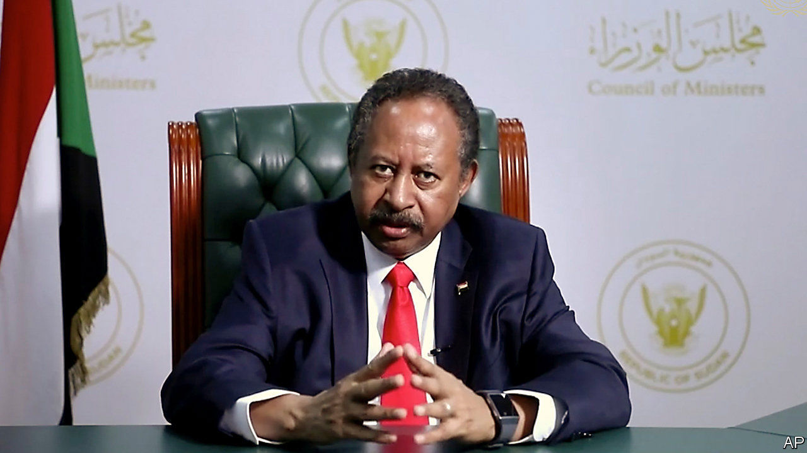

###### General agreement

# Sudan joins a wave of Arab states recognising Israel 

##### But the decision may strengthen the generals in a supposedly emerging democracy 

 

> Oct 29th 2020 

KHARTOUM, THE capital of Sudan, holds a symbolic place in the history of the Arab-Israeli conflict. It was there in 1967 that the Arab League declared their “three nos”: no peace with Israel, no recognition, no negotiations. Unity was short-lived. Egypt said yes to peace in 1978, followed by Jordan in 1994. But for half a century most Arab states refused to recognise Israel.

On October 23rd the government in Khartoum abandoned the Khartoum declaration, agreeing to normalise ties with Israel. It was the third Arab state to do so this year, after the United Arab Emirates (UAE) and Bahrain. They saw a compelling strategic interest: Israel makes a reliable partner against both Iran and an emerging Sunni Islamist axis led by Turkey.


For Sudan’s decision, though, one must credit President Donald Trump’s cynical style of diplomacy. In 1993 America labelled Sudan a state sponsor of terrorism and imposed sanctions. In recent years, as Sudan sought to improve ties with the West, many in Washington argued that it was time to reverse the decision. Their case grew stronger after last year’s popular coup against Omar al-Bashir, the longtime despot. Sanctions seemed to punish the new government for the sins of the old.

But the Trump administration insisted that Sudan must recognise Israel in exchange. In public it has tried to make the quid pro quo less explicit. Sudan agreed to pay $335m into a fund for American victims of terrorism to win removal from the state-sponsors list; the deal with Israel was presented as separate. In private, though, one was a demand for the other. And Sudan had little choice: it desperately needs foreign aid and investment.

The decision puts some of its leaders in an awkward position. Unlike Bahrain and the UAE, Sudan is meant to be a nascent democracy. After the coup the army agreed to a power-sharing arrangement with civilians, meant to culminate in 2022 with an elected government. The transitional prime minister, Abdalla Hamdok, insists that recognition of Israel must wait until then. But the men in uniform want to plough ahead.

Mr Bashir governed in concert with the Islamists who backed his coup in 1989. He also kept close relations with Iran. The Gulf states consequently treated him as a pariah. Around five years ago, however, they spotted an opportunity to flip him. Sudan’s economy was floundering. The south seceded in 2011, taking most of the country’s oil reserves with it. The Sudanese pound lost more than 50% of its value between 2011 and 2015. Iran, an economic omnishambles itself, offered no succour.

So in 2015 Mr Bashir sent troops to join the Saudi-led war in Yemen against the Houthis, an Iranian-backed militia. Saudi Arabia then deposited $1bn in Sudan’s central bank. The UAE invested billions in the country as well. Mr Bashir cut ties with Iran. Breaking with Islamists proved more difficult, though, as he feared alienating powerful allies. In 2017 he refused to join four Arab states (Bahrain, Egypt, Saudi Arabia and the UAE) in imposing an embargo on Qatar. The small Gulf emirate, a supporter of Islamists across the region, was a big investor in Sudan.

When the army tossed out Mr Bashir last year, the UAE was happy to see him go. It is not terribly eager to see democracy emerge in Sudan, though—or any other Arab country. It helped orchestrate the coup in 2013 that toppled Egypt’s only democratic government, led by the Muslim Brotherhood, and replaced it with an authoritarian general, Abdel-Fattah al-Sisi. It has also backed a wannabe Sisi, Khalifa Haftar, in his unsuccessful quest to conquer Libya. If ties with Israel, unpopular with some in Sudan, undermine its transition to democracy, the UAE won’t mind.

For Mr Trump the announcement seemed like a bit of pre-election politics. In a televised phone call he asked Binyamin Netanyahu whether “Sleepy Joe”—his opponent, Joe Biden—could have negotiated a similar deal. (He looked annoyed when the Israeli prime minister gave a diplomatic answer.) The agreement is unlikely to sway voters in Kenosha. But it may help sway the balance of power in Khartoum. ■

