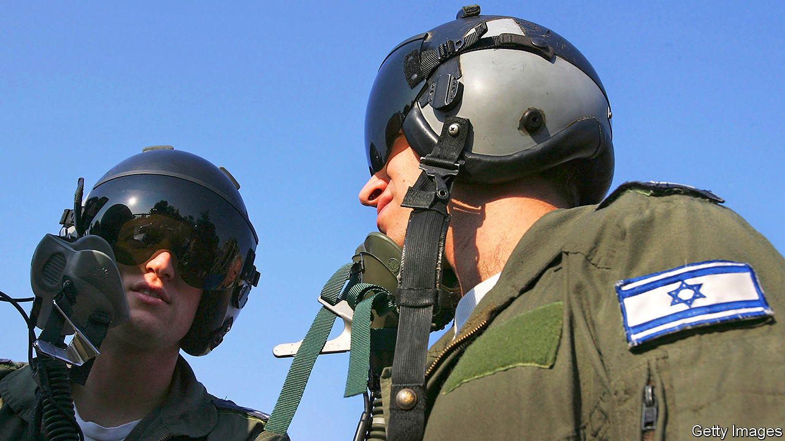

###### Not in my wetland

# The battle over where to put Israel’s new airport 

##### Surprisingly, the air force is losing 

 

> Oct 31st 2020 

BIRD-WATCHERS in northern Israel are spoiled for choice. Griffon vultures, imperial eagles and long-legged buzzards swoop over the Golan Heights. Cranes, cormorants and kingfishers congregate in the wetlands around the Sea of Galilee. And flying over them all are the biggest birds in the sky, Israel’s F-16 fighter jets, which climb steeply from the runways of Ramat David airbase—in order to avoid sucking any feathered friends into their engines. But the skies in the north may soon look different, if the air force gets its way.

Israel needs a new airport. About 90% of all travel to and from the country moves through Ben-Gurion International Airport, just outside Tel Aviv. It serves the entire population of 9.2m and most of the millions of tourists who visit each year. Before covid-19 the airport was close to full capacity. Nearly everyone agrees that another is essential. They just can’t agree on where to build it. And the fight is making for strange bedfellows.


With land in central Israel scarce, the choice has come down to two air-force bases: Ramat David in the north or the much larger Nevatim in the south. The air force would rather part with Ramat David, which hosts only two F-16 squadrons. Nevatim, by comparison, hosts six squadrons, which include heavy-cargo and tanker-reconnaissance aircraft, as well as F-35 stealth fighters. The location of Nevatim, in the middle of the Negev desert, gives the air force almost exclusive access to airspace over more than half of Israel’s territory. It likes that.

But that site also makes it a good choice for the new airport. Ramat David is surrounded by marshlands, making building expensive. Nevatim, by contrast, already has runways long enough for big passenger and cargo planes. Moreover, it is surrounded by sand, leaving abundant space for terminals and future expansion.

Local officials in the south, most from the conservative Likud party, are clamouring for the project, which they hope will bring jobs and infrastructure. Miri Regev, the transport minister, also from Likud, stymied plans favoured by the fighter-jockeys and is working on new ones that put the airport in the south. In her previous post, as culture minister, Ms Regev was the bane of liberals. But now she has their support. Northern farmers and nature-lovers, many of whom are scions of the old Labour movement, don’t want to see their fields and wildlife sanctuaries paved over.

Israel’s air warriors are not used to such opposition. “They want the Negev to remain their playground, and will try and wait this transport minister out,” says an officer in the army (which sometimes resents the better-equipped air force). Ms Regev, for her part, is talking to the Ministry of Defence before bringing the issue to the prime minister, Binyamin Netanyahu (also of Likud). But she has made a point of saying that it is a “civilian airport”—the implication being that civilians will decide where it goes.

