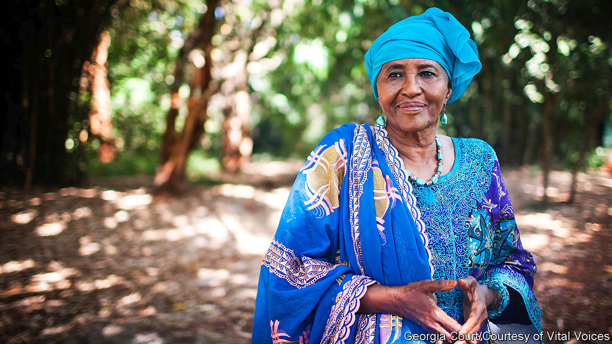

###### It takes a village

# Hawa Abdi died on August 5th 

##### The doctor who dreamed of rebuilding Somalia was 73 

 

> Oct 31st 2020 

AFTER HER morning prayer and before she had eaten breakfast, the sun barely up, Hawa Abdi liked to walk around the village. First she would go to the communal farm to start the generators and check the crops: sorghum, maize, bananas, beans. Then she would go past the villagers’ dwellings, just stirring. When she had bought this land, in the Lower Shebelle west of Mogadishu, the capital, trees stretched to the horizon. Many remained, but now thousands of people sheltered among them, in a haven that had come to be called Hawa Abdi, after her. “Where are you going?” one dusty, desperate traveller might ask another in the years of Somalia’s civil wars, and the frequent answer was: “To Hawa.”

Her name was not only on it, but she ran it, sorting out problems with the village elders in the shade of the mango grove she had planted. She guided its growth over three decades from a one-room rural maternity clinic, built in 1983 with some family gold she had put by, into a 400-bed hospital with three operating theatres, a school for 850 children and seven feeding centres. Eventually the village was home to 90,000 people. She was chief doctor and surgeon, farm manager, strategist, fundraiser and spokesman for the place. When the rest of the world forgot about Somalia, or turned away, she kept going at a furious pace. “Sitting is empty,” her grandmother taught her, “but working is plenty.”


This was a village of the poor and needy. Its houses were shacks of sticks and woven grass, or bubble-tents rainproofed with plastic sheets. New arrivals often slept in the open, lining up each morning to see her and ask to stay. Many would be women, heavily pregnant, seeking a safe place to give birth where care was free. Some people came to find jobs; she trained a band of sharp-eared boys to be security guards and put men to work at building and farming. In the 1990s, when the hospital overflowed with injured soldiers and refugees who stumbled out of the bush, she became skilled, well beyond her expertise in obstetrics and gynaecology, at taking bullets and shrapnel out of them. When famine struck, especially the dreadful hunger of 2011, people came simply to be fed. At times she could not think how to help so many, but gave them whatever she had: sorghum chapatis every other day, a little donated rice cooked up in oil drums, cool water from the wells, a place to sleep.

The residents of her village were mostly women and children. Their men had gone: killed, away fighting, or working in some other land. This gave her a fine chance to empower women, and she set to it. She knew how little they counted in Somali society, where boys were kings. When she was a child her mother had died before her eyes after a miscarriage, the blood pooling out of her robe; she decided then to become a doctor, to save the lives of other mothers. At seven she had been cut and stitched, which made the birth of her first child, at 13 after a forced marriage, wretchedly hard. The sickly little girl died, but happily her husband divorced her, and at 17 she leaped into studying: medical training in Kyiv on a Soviet scholarship, then a law degree in her spare time. Devoutly Muslim though she was, she dressed as she liked, and hotly disputed the parts of sharia law that offended her. In her village, equal rights were meant to prevail. Men were not allowed to beat their wives, and were locked in a storeroom if they did. Women were taught to sew and read in a special centre. Girls packed the school, smiling shyly in their uniform yellow hijabs alongside the boys. Her two daughters by her second, free, marriage, Amina and Deqo, set the example by becoming doctors and working with her.

As for her, she could hold her own against anyone. Her body might be weak, but her tongue could defend against a thousand. She refused to tolerate the clan identities that made men fight each other, forbidding clan politics in the village and hanging white sheets round the boundaries to show it was a neutral place. That did not stop the Islamist militants, however. They routinely blocked food shipments and barged several times into the village, most violently in 2010 when teenage fighters ransacked the hospital, smashed the four incubators that were the only ones in the country, drove out the patients and tore up their records. She shouldn’t be in charge of anything, one gunman sneered, because she was old, and a woman. Well, she shouted back, he was young, and a man; he had two testes; but so did a goat. She was doing something to help her country. What exactly was he doing? She demanded a written apology. To her great satisfaction, it came.

As their staff were increasingly attacked and killed, the international aid agencies left one by one. She had mixed feelings about that. People should work, not get handouts; it was better to train Somalis, many of them nomadic herders, to fend for themselves by farming or fishing. She gave the villagers patches of land and a small fleet of boats to encourage them. But she also needed big infusions of money and willing hands. In 2010 her three-year partnership with Médecins Sans Frontières, which had helped run large parts of the hospital, came to an end; in 2013 MSF left Somalia. The UN World Food Programme suspended aid too, and the Italian company that had subsidised the farm no longer dared send ships to buy its bananas. Trips to America from 2010 brought her welcome publicity and money from the diaspora, but when the foreign NGOs ventured back in later years they still avoided the riskiest areas, like hers. She thought about leaving too, but who would care for her patients then? She sighed and stayed.

Sometimes she was so weary that she could hardly walk. She felt Somalia was lost. What kept her going was a dream of her village as the country in miniature: the Somalia she remembered from childhood as a string of jewels along the Indian Ocean, its fields and tall trees greening miraculously after the rains. This seemed to her to have been a society of diligence, honesty, respect and love. Slowly, she had begun to rebuild it. No sound of gunfire there, just the sing-song of children at their lessons; no one hiding in terror from armed gangs, but women working at crafts and men fishing off the shore. And if a traveller should ask these people where they came from, they would answer: “From Hawa.” ■

