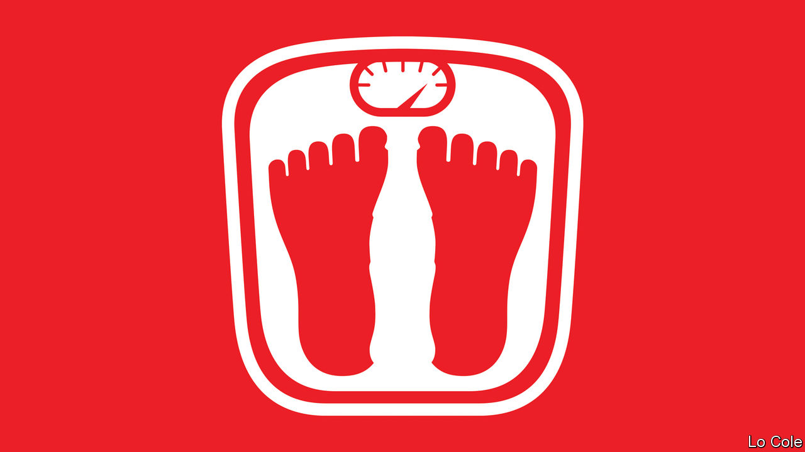

###### Bello

# Politicians step up the fight against Mexico’s Coca-Cola habit 

##### The pandemic has increased worry about the country’s fondness for fizzy drinks 

 

> Oct 29th 2020 

ON A VISIT in July to Chiapas, a poor southern state, Hugo López-Gatell, Mexico’s covid-19 tsar, condemned an unlikely culprit for deaths from the disease. Fizzy drinks are “bottled poison”. Every year 40,000 Mexicans, the number of recorded covid-19 victims at the time, die from drinking too many, he claimed. The country’s health “would be different had we not been fooled” by a marketing machine that promotes products “as if [they] were happiness”.

The blasé response to the pandemic by President Andrés Manuel López Obrador and his administration is a bigger reason why the official death toll now stands at 90,000. But they are correct to point out that sugary drinks contribute to Mexico’s high rates of obesity and diabetes, which make people more vulnerable to the virus. Three-quarters of Mexicans are overweight, up from a fifth in 1996. Although fizzy drinks are a worthier target than some of Mr López Obrador’s nemeses (suppliers of renewable energy, for example), they are also inescapably part of the country’s culture.


Mr López-Gatell did not single out any brand. He did not need to. Although Coca-Cola is popular across Latin America, it is especially so in Mexico. In 2012, the last time the Coca-Cola Company published data on the popularity of its beverages, Mexicans guzzled 50% more per person than citizens of anywhere else. Drinking Coke “is a ritual, like [drinking] red wine for the French”, says Álvaro Aguilar, who owns burger joints in Jalisco, a western state.

Nowhere is the habit, damned by the left as “Coca-colonisation”, more evident than in San Juan Chamula, a town in the hills of Chiapas. There four-month-olds suck Coke from baby bottles. In the town’s church, indigenous Tzotzil medicine men light rows of candles before spilling Coca-Cola onto the flames to vanquish bad spirits.

Mr López-Gatell has blamed free trade with the United States, which began in 1994, for Mexicans’ poor diets. But Coke mattered a lot before that. Backlashes predate Mr López Obrador’s presidency. Since Mexicans popped open their first bottles in the 1920s, Coke has become the cornerstone of an industry. Bottlers, chiefly Arca and Femsa, get the syrup from Coca-Cola and handle the rest. Bottling and distribution directly employ 100,000 people, says Joan Prats of Coca-Cola Mexico. All told, he claims, the company is responsible for 1m jobs and 1.4% of GDP.

Mr López Obrador often expresses dismay that Coke reaches every village while medicines do not. Vicente Fox, who in 2000 became the first president of Mexico’s democratic era, was Coca-Cola Mexico’s boss in the 1970s. In his memoirs he writes that his early years criss-crossing the country in a delivery lorry were “like those a US presidential candidate spends barnstorming from Iowa to New Hampshire”. He gained a feel for Mexico that his predecessors had lacked.

Only in the 1960s and 1970s, as the dangers of too much sugar became widely known, did Mexicans begin to view Coca-Cola as a foreign brand. “The Secret Formula”, a black-and-white film made in 1965, opens with a shot of Coca-Cola being injected into the veins of a hospital patient from a hanging bottle. That produces “a series of nightmares” about his Mexican identity, in the words of Juan Rulfo, who wrote poetry for the film.

Those who would curb the habit are now motivated more by concern for public health than by anti-yanqui ideology. Mr López Obrador’s market-friendly predecessor, Enrique Peña Nieto—a Diet Coke drinker—imposed a fizzy-drinks tax of one peso (eight cents) per litre in 2013. It seems to have curbed the growth of consumption. In October this year Mr López Obrador’s administration thwacked big black warning labels on Coca-Cola and other foods deemed unhealthy. Oaxaca, a southern state, has banned the sale of packaged junk food to minors. Other states are following.

Coca-Cola is adaptable. According to Mr Fox, the company fended off nationalisation in the 1970s with a promise (never kept) to build a desalination plant. In 2018 it cut a third of the sugar out of its Coke recipe for Mexican consumers. At a meeting with Mr López Obrador in October the company promised to buy more Mexican goods for its other drinks—juicing apples from Chihuahua rather than from Chile, for example—and to support the country’s 1.2m pandemic-ravaged Coca-Cola-sellers. The quintessentially American brand is determined to remain Mexico’s national drink. With a shove from politicians, it may succeed at a lower cost to Mexicans’ health.

