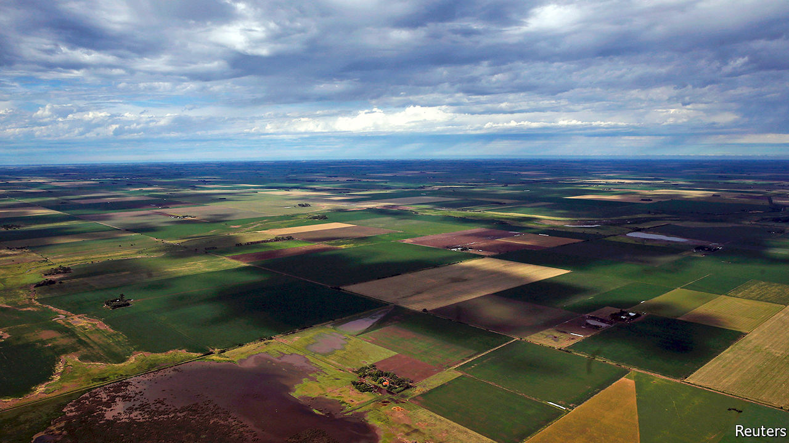
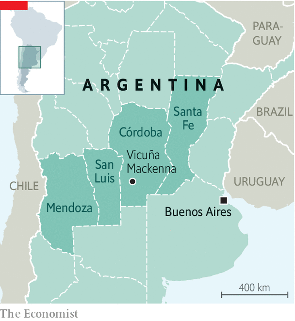

###### A harvest of grievance

# What a drive through Argentina’s breadbasket reveals 

##### Anger at the government is intense in the country’s interior 

 

> Oct 29th 2020 

LORRY-DRIVERS at a roadside grill near Vicuña Mackenna, a small town in central Argentina, looked on appreciatively as Jorge Gutiérrez rode up bareback on a young stallion, doffed his blue boina (gaucho hat) and sat down to join them for lunch. “Normally a gaucho has little, or nada, in common with truckers,” he said, wiping sweat from his brow with a red scarf as he tucked into a flame-grilled matambre, or flank steak, so rare that it was almost the hue of that scarf. “But now we agree this pandemic is creating a disaster.” Aldo, a middle-aged trucker with a youthful ponytail and the body of a prize-fighter, interjected: “My friend, all of us will be buried by this crisis if it goes on much longer.”

Discontent is louder in Buenos Aires, the capital, and other big cities, where large protests have taken place since July. But it is just as intense in the agricultural interior. That part of the country was never going to be friendly towards Alberto Fernández, the Peronist president. He was elected a year ago, with Cristina Fernández de Kirchner, a populist former president, as his running-mate. Córdoba, the province where Vicuña Mackenna is located (see map), voted strongly in favour of Mauricio Macri, the conservative incumbent who lost. The province, like most of the others along the route of this correspondent’s road trip in September westwards from the capital, is bound to pose problems for Mr Fernández’s Front for All coalition in crucial mid-term elections due in October next year.


He imposed one of the world’s longest and strictest lockdowns. In addition to shutting borders and shops it impedes internal travel. To drive from Buenos Aires to the campo required permission from the central government. At a roadblock on the border between Santa Fe and Córdoba, police demanded evidence of a negative covid-19 test taken within 48 hours.

 


Such measures have not suppressed the disease. On October 19th Argentina recorded its millionth case. It is among the ten countries with the highest cumulative caseloads. In terms of deaths as a share of the population, it ranks just outside the top ten. Whereas early in the pandemic nine-tenths of new cases were in the capital, half are now in the interior. Córdoba, Mendoza and Santa Fe, with a fifth of Argentina’s 45m people, have reported more than a third of new cases in the past fortnight.

The lockdown has weighed heavily on the economy. The IMF expects it to contract by 11.8% this year, compared with 8.1% for South America as a whole. Next year it is expected to grow by just 4.9%. Despite price controls, the inflation rate exceeds 36%. That is partly because the Central Bank is printing money to finance the budget deficit, which is forecast to be higher than 10% of GDP this year. More than half of children are below the official poverty line. “This is an economy imploding,” says Federico Sturzenegger, a former president of the Central Bank. “The pandemic has become an excuse to avoid tough decisions.”

The toughest would be to devalue the peso, which would boost exports, including of the grains that grow in central Argentina, and preserve scarce foreign exchange. But it would drive inflation still higher. The government’s policy is to control the currency’s descent. It is officially valued at 78.3 to the dollar. On the black market the peso has slumped to 181. Rather than devalue to the level set by the market, in September the government introduced fresh currency controls to restrain demand for dollars. These have dismayed businesspeople and failed to stem the decline in the country’s reserves. Economists believe the Central Bank’s net liquid reserves are close to zero.

To hold down domestic prices and fill its coffers, the government has levied punishing taxes on exporters. One landowner, whose family has grown soya, wheat and maize near Vicuña Mackenna for generations, fumes at a 33% tax on farm exports. His goal is to survive the country’s impending “meltdown”. After this conversation the government temporarily reduced export taxes on soyabeans. That seems unlikely to improve the landowner’s mood.

According to a recent opinion poll conducted by Reale Dallatorre, 65% of people in Córdoba and 54% in Santa Fe believe that the national government discriminates against them because they oppose the Peronists. In Córdoba 40% of respondents said they favoured secession, a “stunning” finding, said the pollster. Nationally, the president’s approval rating has dropped from the 80s at the start of the pandemic to 43% by late October.

San Luis, west of Córdoba, is friendlier towards the central government. Its governor, Alberto José Rodríguez Saá, is a scion of a Peronist family. A brother was Argentina’s president for a week during an economic crisis in 2001. San Luis’s 508,000 people are accustomed to support from the federal government, especially when Peronists are in charge, which is most of the time. Yet just outside the capital city Marta, a young mother, sees little to like in its handling of the pandemic. The lockdown cost her her job at a clothes shop. “Our president talks about protecting our jobs, our health, and putting food on the table,” she says as she plays with her three children. “We don’t see any of that.” A police escort hurried visitors out of the province, “to prevent you infecting us”, said an officer.

In wine-growing Mendoza, which requires visitors to present national- and provincial-government permits before entering, attitudes towards the government in Buenos Aires harden. There separatist sentiment has a spokesman in Alfredo Cornejo, a former governor who is now a congressman and leads the opposition Radical Party. In June he called for “Mendoexit”. Mendoza, along with Córdoba and Santa Fe, could be an “economic engine-room”, he says. (Currently they produce a fifth of Argentina’s GDP.) But separation, Mr Cornejo admits, will not happen any time soon. Argentina’s constitution outlaws it.

Mr Fernández’s advisers deny that Argentina’s plight is as dire as people in the breadbasket believe it to be. “Collapse? Out of the question,” says one. The government is striving to boost confidence and attract investment in dollars. It is cutting or capping export taxes for minerals, oil and some industrial goods as well as farm products. It plans to renegotiate its $44bn debt to the IMF, a sequel to its deal on $65bn of debt owed to private bondholders. Mr Fernández has revived the idea of a “social pact” with businesses, trade unions and civil-society groups to reduce inflation and make labour law less rigid.

Reassurances from Buenos Aires mean little in the interior. In Córdoba an old farmhand in a face-mask closes gates on a herd of Aberdeen Angus cows as a young trucker looks on, smoking a cigarette. “Do we need a government to make the most of everything we have, as a country?” the gaucho wonders. His sigh is the answer. The trucker nods. At one in their sense of alienation, they tap elbows.■

