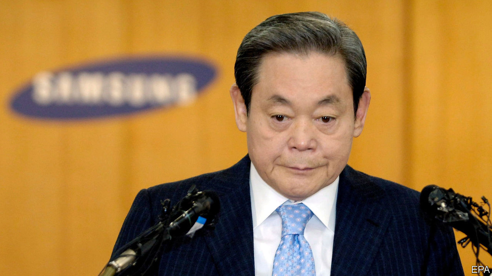
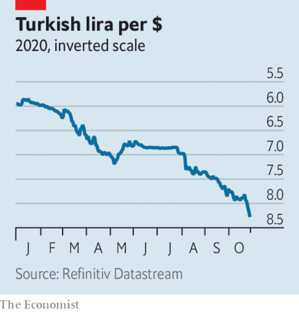

###### 

# Business this week 

#####  

 

> Oct 29th 2020 

The prospect of a resurgence in covid-19 and new lockdowns made it a rocky week for stockmarkets. On Wall Street the S&amp;P 500 and Dow Jones Industrial Average each fell by 3.5% in a day, the Nasdaq by 3.7%. The FTSE 100 dropped by 2.6%. The sell-off was even sharper in French and German markets. Oil prices also plunged; Brent crude fell to $39 a barrel.


Ant Group set the share prices for its forthcoming dual listing in Hong Kong and on Shanghai’s tech-focused Star market. The Chinese fintech firm’s initial public offering could raise more than $34bn, which would vault it ahead of Saudi Aramco’s debut last year to make it the world’s biggest-ever IPO of stock.

A spanner in the works

America rejected the candidacy of Ngozi Okonjo-Iweala, a former Nigerian finance minister, as the next head of the World Trade Organisation, instead throwing its weight behind Yoo Myung-hee, South Korea’s trade minister and the only other person running for the job. Both candidates are women. Ms Okonjo-Iweala would also be the first African to lead the WTO and has the backing of its selection committee. But America wants the organisation to be overhauled, and says it “must be led by someone with real, hands-on experience in the field”.

A report from the Intergovernmental Science-Policy Platform on Biodiversity and Ecosystem Services, based in Bonn, warned that future pandemics will do more damage than covid-19 to the world economy unless measures are taken to reduce contact between wildlife, livestock and people, because increasing human activity is driving transmission. It estimates that between 540,000 and 850,000 unknown viruses in nature could still infect people.

HSBC’s net profit declined by half, to $1.4bn, year on year, though it recorded significantly lower credit losses. The bank is considering whether to resume dividends. It cut them in March at the behest of British regulators, causing outrage in Hong Kong, where a third of its shareholders are based.

 


The Turkish lira hit a new low against the dollar, in part because Turkey’s central bank did not raise its main interest rate at its recent meeting, leading to more speculation about the extent of political interference in its decisions. Recep Tayyip Erdogan, the country’s president, is opposed to rate rises. Investors are also nervous about America’s warnings to Turkey about deploying an anti-aircraft missile system it has bought from Russia.

LVMH and Tiffany reportedly negotiated a new deal with a lower price tag for the French luxury-goods group’s takeover of the American jeweller. LVMH had said it wanted to pull out of the acquisition, arguing that Tiffany’s post-pandemic prospects are poor. Both sides are trying to avoid an expensive court case to solve the matter.

Lee Kun-hee, a giant in the world of South Korean business, died at the age of 78. A son of the founder of Samsung, Mr Lee transformed the sprawling group into the world’s biggest manufacturer of smartphones, televisions and memory chips. He was considered to be South Korea’s most powerful man before a heart attack in 2014 confined him to bed. He officially remained chairman of Samsung, though the de facto leadership passed to his son, Lee Jae-yong, who, like his father, has been tarnished by allegations of corruption.

Aston Martin, a struggling British maker of sports cars, announced that Daimler will increase its stake in the company to a maximum of 20% in exchange for access to the German car group’s electric-vehicle technology.

AMD, a chipmaker, announced that it would buy Xilinx, another chip firm, for $35bn. The deal is the latest in a banner year for mergers in the semiconductor industry. AMD hopes its acquisition will help it move into new markets, and to compete with Intel, its arch-rival, in the lucrative market for data-centre chips.

A surge in demand for commercial cloud services helped Microsoft rack up a quarterly profit of $13.9bn, a 30% increase year on year. The company said it expects cloud computing will become ever more important as firms rely less on IT systems physically located in their offices. The number of daily active users of Microsoft’s Team message-and-chat service, a rival to Slack, has risen to 115m, from 32m at the start of the crisis.

Aloha

Japanese tourists are to be allowed to enter Hawaii, and avoid the American state’s strict two-week quarantine, if they test negative for covid-19 in an approved programme. Japanese visitors, many of whom have family connections with Hawaii, are the islands’ second-biggest source of tourism revenue, after travellers from the American mainland. How many will go is unclear, as they will still have to self-isolate when they return to Japan.

