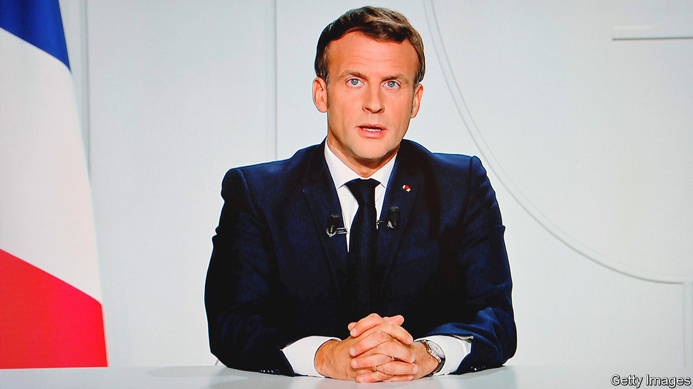
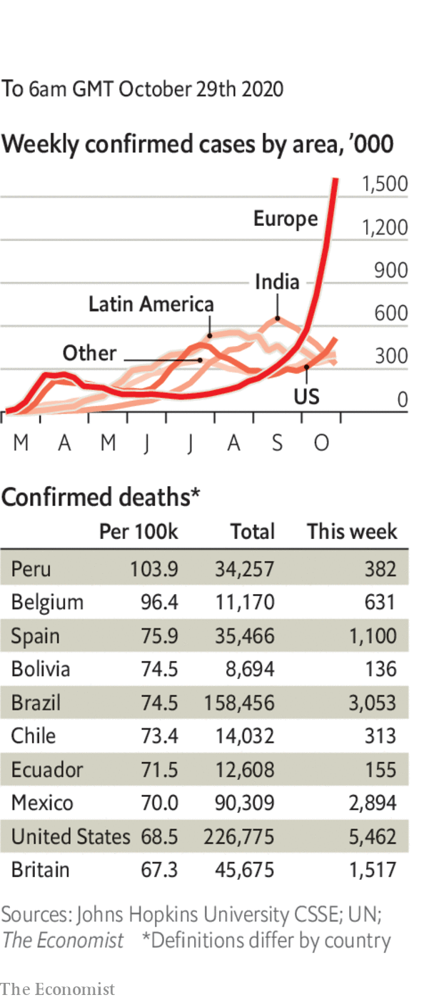

###### 

# Politics this week 

#####  

 

> Oct 29th 2020 

The second wave of covid-19 worsened across Europe, leading a number of countries to impose stricter measures. A second national lockdown was announced in France; Emmanuel Macron, the president, said the country had been “overwhelmed” by the spread of the virus. In Germany restaurants, cafés and bars were ordered to close during November. Spain announced a new state of emergency, and much of Italy has introduced curfews. A study in England suggests that 100,000 people are catching the disease there every day.

A suspected Islamist killed three people at a church in Nice, virtually beheading one of his victims. He was shot, injured and arrested by French police. On the same day police shot dead a man near Avignon who had threatened passersby with a gun. The attacks came soon after the decapitation of a teacher near Paris, after he had shown cartoons of the Prophet Muhammad to his pupils.

Large demonstrations in Poland greeted a decision by the Constitutional Tribunal to make it even harder for women there to have abortions. They will no longer be allowed to cite serious foetal defects as a justification. Abortions are now legal only in cases of rape, or incest, or to protect the mother’s life.

Amy Coney Barrett was sworn in as a justice on America’s Supreme Court. The Senate had voted to confirm her just a week before the presidential election. All Republican senators except Susan Collins of Maine, approved her nomination. The court now has a 6-3 conservative majority.

The number of people who have already voted in America’s election passed 76m as of October 29th. In Florida, a key state, 7m people have voted early, only 2.4m fewer than the total turnout in 2016. Early voting is less prevalent in Pennsylvania and other swing states in the Midwest.

Israel and Sudan agreed to normalise relations in a deal brokered by America. As part of the agreement, Sudan is being taken off an official list of countries sponsoring terrorism. It is the third Arab country to recognise Israel in the past two months.

Libya’s warring factions agreed to cease fire. The UN envoy, Stephanie Williams, said all foreign fighters must leave Libya within three months.

Russian air strikes killed dozens of Turkish-backed fighters in northern Syria. The attack threatens to undo a truce, brokered by Russia and Turkey, in Idlib province, which is partially controlled by rebels.

Police in Nigeria arrested over 800 people in connection with the looting and burning of shops and warehouses. Angry young people targeted government facilities believed to be storing food and other supplies meant to be distributed as covid-19 relief. The unrest follows recent protests against police brutality.

Over 20 people were killed in violence that erupted after a disputed presidential election in Guinea. Alpha Condé won a third term, according to the official results. But his main opponent also claimed victory.

Tanzania’s election was also marred by violence and allegations of vote-rigging. In the semi-autonomous island region of Zanzibar, opposition leaders accused the police of killing at least nine people during protests. John Magufuli, the incumbent, is expected to be declared the winner of the presidential race.

By a large majority, Chileans voted in a referendum to scrap the constitution written under the dictatorship of Augusto Pinochet, who governed Chile from 1973 to 1990. They also voted to summon an elected assembly, half of whose members must be women, to draft a new one. Critics of the current constitution say it gives private firms too big a role in providing public services and concentrates too much power in the presidency.

Leopoldo López, a leader of the opposition to Venezuela’s dictator, Nicolás Maduro, secretly left the residence of the Spanish ambassador in Caracas, where he had taken refuge, and fled to Spain.

A judge in Bolivia annulled the arrest warrant for the former president, Evo Morales, clearing the way for him to return from exile in Argentina. The decision does not end investigations into allegations that Mr Morales committed acts of “sedition and terrorism” by helping to foment unrest a year ago.

Japan pledged to reduce its net emissions of greenhouse gases to zero by 2050, in line with promises made by Britain and the EU. Two days after the announcement, South Korea made a similar pledge.

Sri Lanka’s parliament approved an amendment to the constitution that enormously strengthens the powers of the presidency. The amendment reverses changes made in 2015 to rein in the president.

The king of Malaysia declined the government’s request to declare a state of emergency. That means the government will have to put a budget to parliament, in a vote it might lose, triggering an election.

China tested all 4.7m residents of Kashgar for covid-19 in a matter of days, following a spike in infections. Some 183 people tested positive in the city, which is in China’s autonomous region of Xinjiang.

Coronavirus briefs

 


America hit 83,000 new daily infections on two consecutive days, the highest numbers since the pandemic began.

Russia broke records for both the daily number of cases and deaths in the country. Some 27,000 people have officially died in total, though the true figure may be much higher.

Iran said it would extend the closure of schools, mosques, shops, restaurants and other public institutions in Tehran until November 20th. State television reported that a person was dying from the virus every four minutes.

Taiwan went 200 days without any locally transmitted cases. It has had just seven deaths.

Melbourne came out of a lengthy strict lockdown, which has been credited with suppressing the spread of the disease in the Australian city. Its 5m residents had been largely confined to home.

