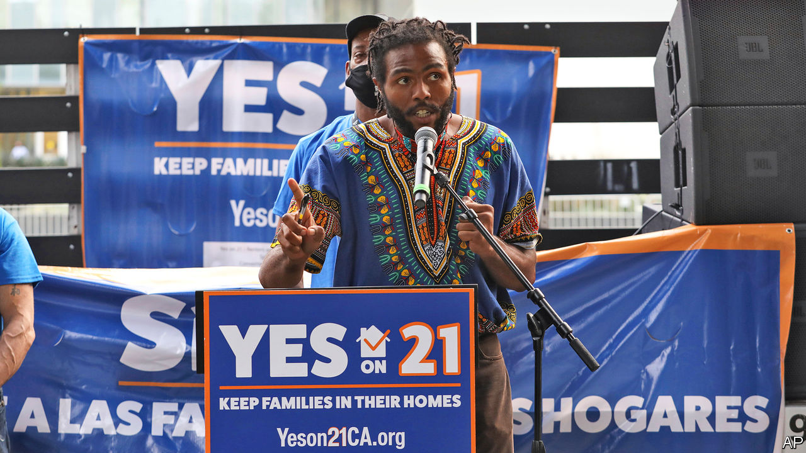

###### Gentle propositions

# California is in play on November 3rd (sort of) 

##### The state’s voters have big decisions to make on affirmative action, property tax and gig workers 

 

> Oct 31st 2020 

CAMPAIGNS TO BAN affirmative action at state universities and reduce property taxes normally smack of Trumplandia. But after achieving majorities in statewide referendums, both these measures have actually been in effect in deeply Democratic California for decades. The disconnect between this lingering, libertarianish regime and the current left-leaning electorate in the state is the result of the unusually frothy version of direct democracy practised in California, which can bind policy decisions decades into the future. The coming election is interesting less for who will win California’s 55 electoral-college votes—Joe Biden will, barring apocalyptic divine intervention—than for whether its liberal voters will reverse these measures.

Because of a ballot initiative approved in 1996 by 55% of voters, the prestigious University of California system has been unable to deploy affirmative action for minorities for nearly 25 years. Advocates say that without such a scheme, minorities have been and will continue to be perpetually under-represented at the state’s leading universities. They are pushing a new ballot measure, Proposition 16, to repeal the pre-existing one. Hispanics currently make up a majority of the state’s high-school graduates, for example, but just 33% of incoming undergraduates. African-Americans are slightly less under-represented—making up 5% of the state’s graduating high-schoolers but 3% of the university system’s freshmen. Even after two decades and a recent summer of protest over racial injustice, the prospects for repeal look tough. A poll in October from the University of California, Berkeley, found that 38% of voters supported repeal against 49% who want to keep the affirmative-action ban (the rest are still unsure). Even if this deficit is reversed, California may find the policy short-lived: the Supreme Court is likely to revisit affirmative action, and, given its more conservative orientation, may severely limit the use of the practice nationwide or strike it down altogether.


Polls show a better chance of success on the state’s property-tax quagmire. Proposition 13 is perhaps the only state law well-known by number alone across the country. This too is facing a partial repeal. Passed by 65% of voters in 1978, the measure caps property taxes at 1% of real-estate value. As long as a property is not sold, its assessed value may grow only by the rate of inflation rather than the growth in market prices. Since housing prices have surged in the past 40 years, this has meant enormous benefits for incumbent landlords and forgone revenue for counties and schools. A repeal measure, Proposition 15, would link property tax back to reality for commercial plots, but not for residential ones. It is being richly funded by strange bedfellows: the teachers’ union, the SEIU (another big labour union), and Mark Zuckerberg, Facebook co-founder, who has spent around $11m on the campaign.

The expected returns from partial repeal of Proposition 13 are large: just taxing commercial property according to market prices should generate between $6.5bn and $11.5bn in extra funds. The many millionaires benefiting from residential exemptions might be a plum subsequent target. That would exert downward pressure on stratospheric housing prices in the state, which are stifling growth in some of America’s most productive places.

But unless California can kick its addiction to bureaucratic suffocation of new development—through anonymous environmental lawsuits, height limits, parking requirements, land-use committee reviews and zoning rules requiring some apartments to be leased at well below market rates—its housing crisis will continue. Already, it has made bad ideas like rent control more appealing. A state law called the Costa-Hawkins Rental Housing Act exempts cities from many kinds of rent control; advocates are also aiming to revoke this through the ballot box. It would be a good way to restrict rental supply and increase prices for all except the lucky few, and a rather bad way to actually resolve the state housing crisis.

Despite the money at stake over property-tax rules and the free-flowing Zuckerberg dollars, the housing question is not the costliest referendum campaign facing Californians. That distinction instead goes to Proposition 22, which would exempt app-based delivery workers from a recently passed law that would relabel some gig workers as full-time employees requiring paid benefits from companies like Uber, Lyft and DoorDash (see ). The effort is being funded by exactly those companies, which have already spent $190m to escape what they see as a death-knell for their businesses in the state. Uber is so keen on the idea that it took the mildly dystopian step of pushing its political ads directly to the phones of its customers, claiming the measure will “save lives”.■

Dig deeper:Read the  and explore our , then sign up for Checks and Balance, our  and  on American politics.

