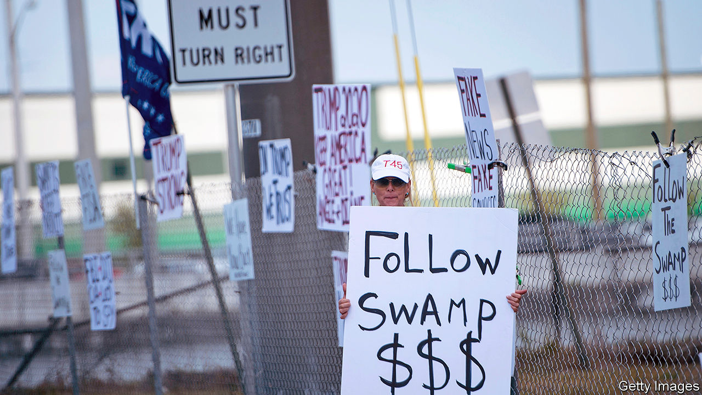

###### The art of the self-deal

# Donald Trump’s record on corruption and conflicts-of-interest 

##### Plain venality in the Trump administration has been bad; the sleaze that weakens institutions has been worse 

 

> Oct 31st 2020 

PROMISING TO “drain the swamp” was a popular line in 2016. Four years on some Republicans still cheer, pointing out admiringly that President Donald Trump forgoes his $400,000 salary. Even critics concede that America continues to support sanctions on corrupt foreigners. And despite Mr Trump’s widely reported wish to scrap the Foreign Corrupt Practices Act, his government still energetically applies the law against paying bribes overseas.

Yet concerns about what swamp-draining really meant surfaced early in Mr Trump’s presidency. Federal prosecutors looked into questionable spending around his inauguration. Among his first acts was to scrap a rule requiring oil and other firms to say what they paid foreigners. As for those swamp-dwelling lobbyists, he drained several directly into his cabinet.


Mr Trump’s reluctance to cut ties to his business interests, or to reveal what they were, was unlike anything seen for over a century. He concedes he owes hundreds of millions of dollars, but will not name his creditors. Deutsche Bank, a German bank, is said to have loaned him $2bn over the past two decades. He is due to refinance some of this, but nobody knows how. Unlike presidents since Gerald Ford, he has not released his personal tax returns.

He has continued to receive financial updates on the 100-plus entities—office blocks, hotels, resorts and more—that make up the Trump Organisation, and to promote his brand. He pushed for one of his resorts to host a summit of G7 leaders this year (the idea was scrapped), one of many cases where he tried to steer official business to his own firms. He has spent over 530 days at just one of his other resorts, Mar-a-Lago. As a result, officials, lobbyists, the secret service and others have spent millions there. At his chandelier-heavy hotel in Washington, diplomats, party operatives and businessmen have spent heavily.

Outsiders’ views of America’s tolerance of corruption have shifted as a result. Transparency International said in January that America ranks 23rd-cleanest of 198 countries, down from 18th in 2016. Since then, the sacking of five independent inspectors-general (who look into government corruption) and the forced removal of the top federal prosecutor in New York (who was studying people close to Mr Trump) probably heralds a further drop.

Worse than the venality has been the weakening of institutions meant to keep corruption in check. Take three examples. The first relates to indictments of men—Michael Cohen, Michael Flynn, Rick Gates, Paul Manafort, Roger Stone—who hung close to Mr Trump. All were convicted of crimes. Steve Bannon, another close adviser, was charged with fraud in August. Scandal has embroiled various cabinet officials. A culture of rule-breaking is encouraged by the boss: in July he commuted the sentence of Mr Stone, convicted of seven felonies.

Next are efforts to break those who would resist, such as the whistle-blowers, professional civil servants, who testified against Mr Trump in his impeachment trial. An executive order he signed in mid-October grants him the power to fire such officials. Matthew Stephenson of Harvard Law School says this “threatens to subvert one of the most important bulwarks against corruption in all of US law”.

Last comes the slide of the Justice Department (DOJ) under William Barr. One corruption expert calls it “weaponised”, saying it serves increasingly as a personal defence team for the president, for example in fending off subpoenas for his personal tax returns. More bizarre, the department had tried to replace Mr Trump as defendant in a defamation case, linked to a claim of rape against him in the 1990s. A court this week rejected the manoeuvre.

This sort of creeping damage is disturbing, but can also be reversed. David Cay Johnston, an author who has long studied Mr Trump’s finances, calls this moment an “anomaly”. Mr Trump’s bad behaviour could yet provoke legislative changes, for example by writing the expectation that presidential candidates will disclose their tax returns into law and scrapping a rule that exempts the president from a federal law on conflicts of interest. Such talk is less thrilling than vows of swamp-clearance, but it could have more welcome effects. ■

Dig deeper:Read the  and explore our , then sign up for Checks and Balance, our  and  on American politics.

