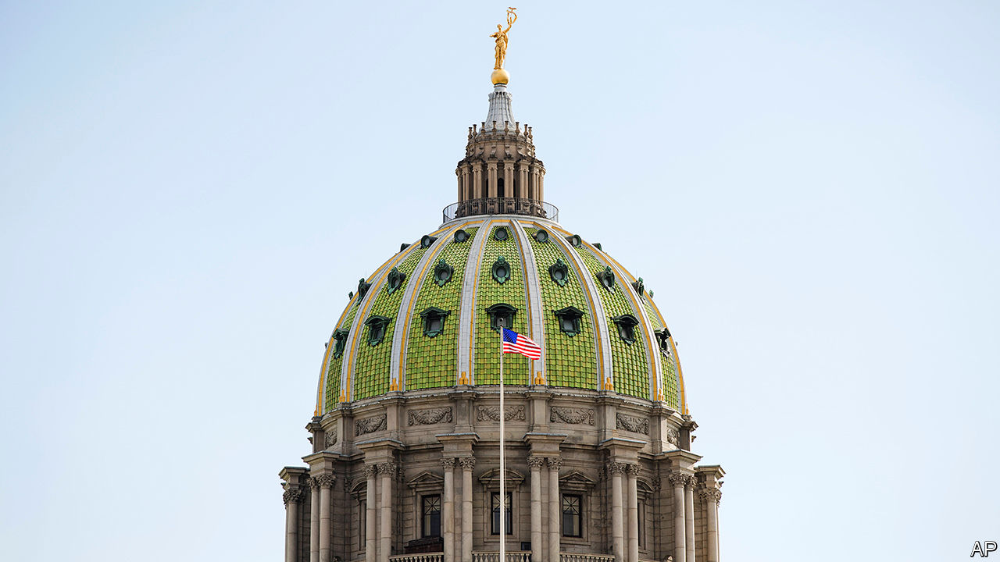

###### Flipping houses

# If a Democratic wave breaks over state elections, its effects will be lasting 

##### Redistricting, police reform and election law all hang on the November 3rd elections 

 

> Oct 31st 2020 

MOST AMERICANS do not know who their state representatives are. Only 12% could correctly name them in a Co-operative Congressional Election Study from Harvard in 2018. But on a recent Saturday when Janet Diaz, who is running for Pennsylvania’s state Senate, knocked on doors belonging to Democratic-leaning households with (her data suggested) patchy voting records, the looks were not as blank as normal. Some even recognised her.

If elected, Ms Diaz would be the first Democrat to win the district since the 1870s. The 13th state Senate district, which stretches from Lancaster and its suburbs to rolling farmland, is probably the most fought-over race in a fought-over state. Our modelling suggests that Pennsylvania is the state most likely to determine who wins the White House. It is also one of the states the Democratic Legislative Campaign Committee (DLCC) is trying to flip.


Democrats need nine seats to win control of Pennsylvania’s state House and have a shot at winning the Senate, too. The DLCC is spending a record $50m in 13 states including Arizona, Michigan, North Carolina, Pennsylvania and Texas. Other left-leaning groups, such as the National Democratic Redistricting Committee, headed by Eric Holder, Barack Obama’s attorney-general, are also spending heavily.

The Democrats have been trying to catch up since 2010, when they were outspent, outsmarted and lost control of 21 chambers. During Mr Obama’s two terms, Democrats lost around 1,000 of the 4,000-odd state seats they held in 2009 (there are 7,383 in all). This cost them not only control of the policy agenda but also, in many states, control of the power to draw congressional-district boundaries.

A decade later Democrats control 39 out of 98 chambers (not counting Nebraska’s unicameral, non-partisan legislature) and have regained 450 of those lost seats. On the watch of Jessica Post, head of the DLCC, they have taken ten state-legislative chambers and made inroads in North Carolina and Texas. They are unlikely to match the Republicans’ success in 2010, but only because they have already won the easiest targets. At stake, once again, is control over redistricting. David Abrams of the Republican State Leadership Committee says this means “there’s a decade of power hanging in the balance” on November 3rd.

In addition to Pennsylvania, other states to watch include Arizona, which has not had a Democratic chamber in more than 40 years and where the party needs only two seats to flip the House and three to take the Senate. The Texas House needs nine seats to change hands. Mark Jones of Rice University judges that Donald Trump’s name at the top of the ticket “has put the Texas House in play”.

It is not just the scale of spending which is unusual. Run for Something, a political-action committee, has recruited 62,000 young Democrats to stand for office, with 500 on the ballot next week. Rita Bosworth, a founder of the Sister District Project, which pairs volunteers with swing districts, points to Colorado as an example of the difference that candidate recruitment can make. Her group helped secure a Democratic clean-sweep there in 2018. In June Colorado’s lawmakers passed broad police reforms. The opportunity for more of that is on the ballot, too.■

Dig deeper:Read the  and explore our , then sign up for Checks and Balance, our  and  on American politics.

