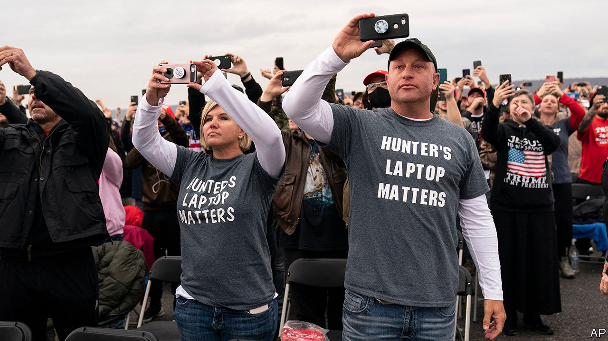

###### Big little lies

# The story of Hunter Biden and the diminishing returns to disinformation 

##### To work, dumps of hacked email need a juicy target and credulous institutions. This one had neither 

 

> Oct 31st 2020 

DONALD TRUMP’S rally in Martinsburg—his third of the day in Pennsylvania—felt less like a political gathering than a greatest-hits concert of an ageing rocker. Vendors selling T-shirts, buttons and banners lined the streets leading to the airstrip. The talent trotted out all the golden oldies: “Crooked Hillary”, “They’ll confiscate your guns”, “Mexico is paying for the wall”, and abundant derision of a rival band (“Joe Biden and the Democrat socialists”).

As at many such events, the crowd liked his old stuff better than the new. The mention of Mrs Clinton prompted “Lock her up” chants from the crowd. They booed dutifully when Mr Trump mentioned his latest target, Hunter Biden, his rival’s troubled son. But allegations concerning the younger Mr Biden seem not to have shifted the race in Mr Trump’s favour as those regarding Mrs Clinton did four years ago. The target is less enticing, and American institutions more prepared.


It helps that the allegations concern not the candidate himself, but his son. Rudy Giuliani, Mr Trump’s personal lawyer, gave a cache of emails to the New York Post, a tabloid owned by Rupert Murdoch. They seem to show Hunter exploring a Chinese investment deal in 2017 that included a 10% equity stake “held by H for the Big Guy”. One of Hunter’s former business partners, Tony Bobulinski, stated that “the Big Guy” was the elder Mr Biden, who was aware of his son’s activities.

Another email purports to show Hunter arranging a meeting between his father and an executive at Burisma, a Ukrainian energy firm that paid Hunter a lot of money to occupy a seat on its board. Both Mr Biden’s campaign and Hunter’s lawyer say no such meeting ever happened. Mr Trump’s camp has alleged that as vice-president Mr Biden perverted American foreign policy to benefit his son and Burisma. The opposite appears true: Mr Biden pushed Ukraine to remove a corrupt prosecutor who had scuppered an investigation into Burisma. Mr Biden’s 22 years of tax returns show nothing fishy. He has called the allegations “garbage”, but neither he nor Hunter have denied that the emails were genuine.

Whether they are real or fake is not the main point, argues Marc Polymeropoulos, the CIA’s former acting chief of operations for the Europe and Eurasia Mission Centre—one of more than 50 retired intelligence officials who signed a letter arguing that the email dump “has all the classic earmarks of a Russian intelligence operation”. He notes that “the use of actual material is a hallmark of Russian disinformation campaigns”. In 2017 Russians hacked Emmanuel Macron, then battling Marine LePen for the French presidency, then released false and genuine emails mixed together.

The hack failed to derail Mr Macron’s candidacy; French law bans campaign reporting in the 44 hours before an election, and the emails were released just before that blackout took effect. No such law exists in America, but mainstream media outlets have been much more circumspect than they were in 2016. Lesley Stahl, a prominent news anchor, told Mr Trump that the allegations “can’t be verified”, so her show would not air them. Twitter blocked the New York Post’s account, infuriating many conservatives.

The allegations have been shared widely on Facebook, and Fox News has given them more airtime than they did to the Wikileaks dump four years ago. But they have failed to spread much beyond Trump-friendly echochambers. Other bits of disinformation from Mr Trump’s campaign, such as a deceptively edited video that purports to show Mr Biden referring to Mr Trump as “George”—implying that he confused Mr Trump with George W. Bush, when in fact he was referring to his interviewer, George Lopez—have also flopped.

Mr Trump brought up the allegations during his last debate with Mr Biden, but the references were unclear (nobody not already steeped in the story, for instance, would have known what “the laptop from hell” was). Partisans may cheer disinformation that confirms their views, as the crowd in Pennsylvania showed. But to change minds, disinformation has to catch on with a broader audience, and in this race it has not.■

Dig deeper:Read the  and explore our , then sign up for Checks and Balance, our  and  on American politics.

