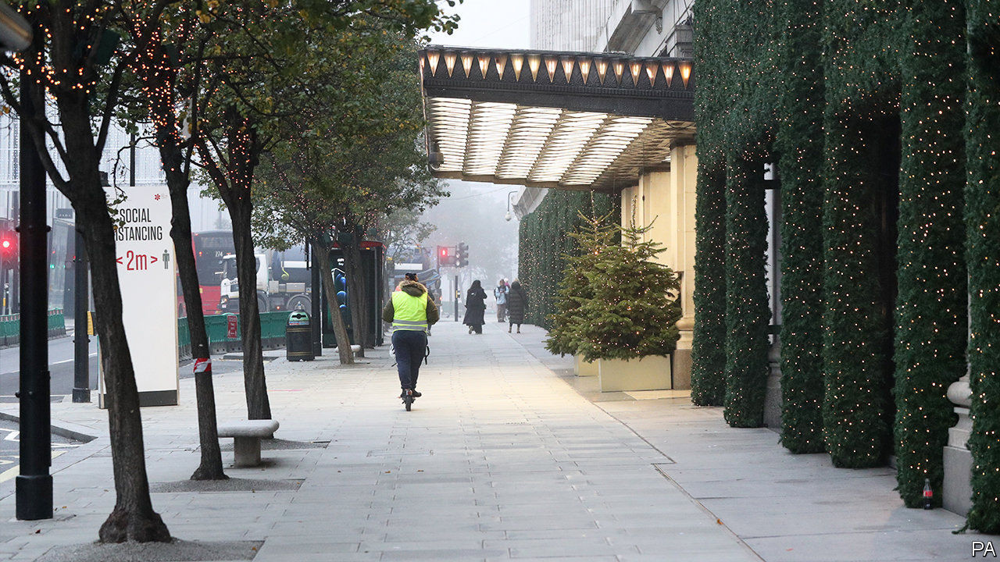
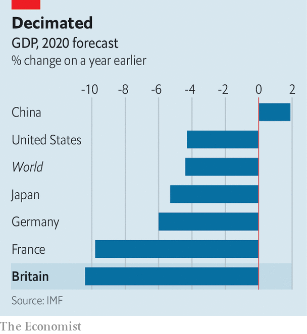

###### Covid-19 and the economy

# Britain’s awful economic performance 

##### The fright before Christmas 

 

> Nov 5th 2020 

WHACK-A-MOLE is what Boris Johnson called the approach to eliminating the coronavirus through local lockdowns, which he has now abandoned. Business must be tempted to describe the new approach, a national lockdown imposed on November 5th, as “whack-a-firm”. Pubs, restaurants and all but essential shops are forced to close in the run-up to Christmas, the most profitable time of the year. The restrictions will ensure that 2020 is one of the worst years ever for the economy. Carolyn Fairbairn, the director general of the Confederation of British Industry (CBI), called it “the start of a bleak midwinter”.

After the spring lockdown, overall output had steadily recovered as people trickled back to work in the summer, and the government encouraged consumers to spend with a cut in value-added tax on hospitality and the “eat out to help out” subsidy for restaurants. Even so, before the second lockdown was announced, the IMF estimated that British output would drop by 10.4% this year, compared with an expected 8.3% decline in the euro zone. The duration and severity of Britain’s spring lockdown, longer and stricter than those in continental Europe, largely explains the disparity.

 


The hit this time round is unlikely to be as bad. Still, on the basis of the new restrictions, Credit Suisse, a bank, thinks that the British economy will shrink by 5% this quarter, and by 11.8% over 2020 as a whole.

Normally, such big declines in GDP would translate into a jump in unemployment. But Rishi Sunak, the chancellor, fended off such an increase with a furlough scheme that paid workers 80% of their normal pay. The scheme was due to stop at the end of October but Mr Sunak changed course and extended it at the last moment, a relief to the estimated 2m workers who were benefiting. But the cost of government support measures, along with the decline in tax revenues caused by the slowdown, has already pushed up the budget deficit to £246bn in the first six months of the financial year and taken government debt up to 103.5% of GDP.

On November 5th, the Bank of England stepped in to give the economy a boost through its quantitative-easing programme, buying an extra £150bn of government bonds. This was a response, it said, to signs that “consumer spending has softened across a range of high-frequency indicators, while investment intentions have remained weak.” The Bank’s actions have helped keep down the cost of government borrowing; even with the massive deficit, ten-year gilts offer an annual return of a mere 0.2%.

As if business did not already have enough to worry about, the British government has still not agreed a trade deal with the EU, even though the Brexit transition period comes to an end on December 31st. Failure to reach a deal could lead to substantial disruption to international trade and supply chains. Companies may feel even more battered in early 2021.■

