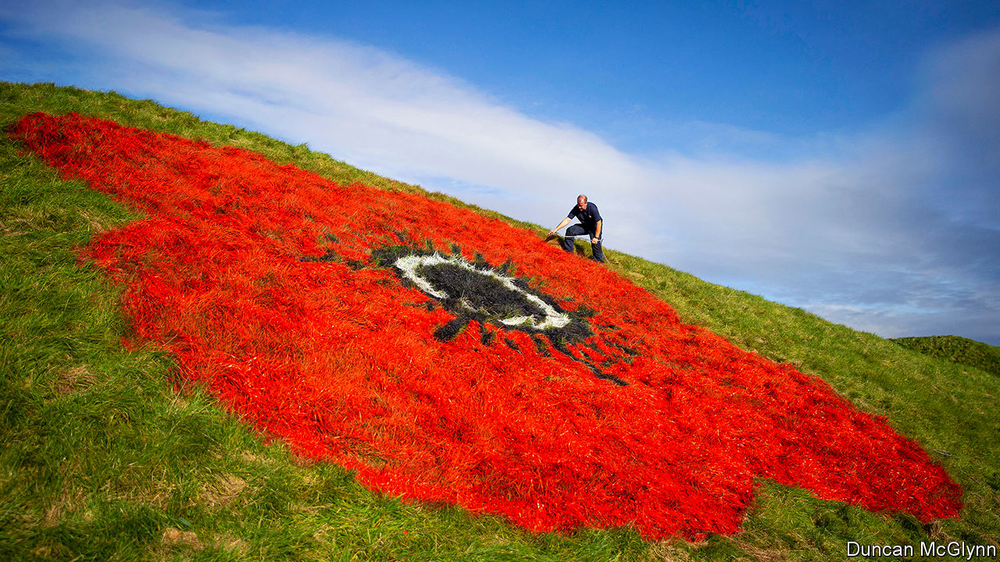

###### Over the top

# Competitive Remembrance Day celebrations 

##### Commemoration is getting more ostentatious 

 

> Nov 5th 2020 

IN PELSALL, A Spitfire fighter plane is suspended in flight above the memorial clock. The wooden replica is part of Remembrance Day celebrations in the West Midlands village. The event has been a hotly anticipated annual spectacle since 2015, when an ambitious display featuring 1,500 knitted poppies hit the headlines. “We are becoming a Poppy Village,” says Garry Perry, a councillor. Preparations for November 11th take up much of his year.

Remembrance Day was not always as extravagant as this. In the years after the first world war, Britons were split on how best to remember the fallen. Some wanted solemn parades; others alcohol-fuelled parties. Restraint won the day. Poppies—a reference to those that grew on the battlefields—were worn, a two-minute silence was observed and veterans marched. It seemed likely that, once all the survivors of the Great War were dead, the ceremonies would wither away.


The opposite has happened. Inspired by the Tower of London’s 2014 installation of 888,246 ceramic poppies marking the war’s centenary—each bloom representing a casualty from Britain and its colonies—towns are now creating ever more ostentatious displays. Giant roadside poppies painted on grass verges are popular, as are road markings. In Bolton, Greater Manchester, 12 poppies have been painted onto strategic thoroughfares.

Poppy cascades are also in vogue. In Callington, Cornwall, 9,000 knitted poppies float down a church wall. After dark in Melksham, Wiltshire, an animation of a poppy fading into love hearts plays continually on the town hall’s facade. Not even covid-19 is allowed to interrupt remembrance ceremonies: the government has let socially distanced parades go ahead.

This iconography helps fill the void left by veterans, whose stoic marching in regimental ties once provided a meditative imagery on its own. “Creativity comes forward in the space of living advocates of the events, to try to find other ways to prompt people into thinking and reflecting,” says Alexander Ehmann, a councillor in Richmond, London, who turned a zebra crossing into a multi-colour poppy design.

The boom in remembrance artistry has coincided with a resurgence of patriotism. “There was a period in this country where you were afraid to show your nationalism,” says Mr Perry. “Villages like mine…want to be able to keep the traditions that they’re proud of.” Andy Morgan, a Bolton councillor and veteran, thinks enthusiasm for the armed forces has grown, too. “It’s much more respectful, almost like it is in America now.” He believes that the Iraq and Afghanistan wars, which provided a fresh supply of veterans for Bolton’s parades, burnished that admiration.

Councils now vie to have the biggest and boldest remembrance artworks, some of which stay up for months. “It’s way more pressure every year,” says Mr Perry. “We’re sitting here thinking, ‘how are we going to beat this?’” Pelsall has an edge: a committee entitled the Preservation of Pelsall Remembrance Service, or POPRS for short. Pronounced “poppers”, the abbreviation’s narcotic overtones caused a little frisson when people noticed. “I’m thinking, ‘Crikey, they’re going to think we’re all going round the village high as a kite’,” says Mr Perry.■

