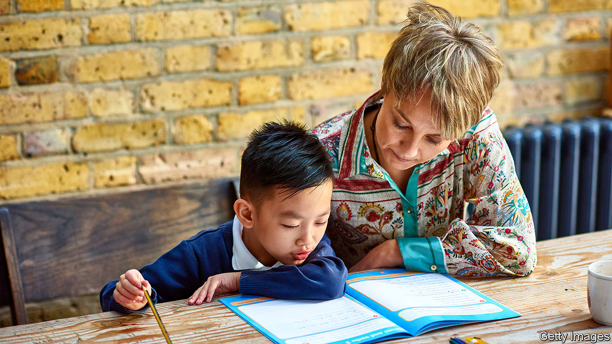

###### Education

# England’s catch-up tutoring programme has bold ambitions 

##### With covid-19 spreading and schooling disrupted, pupils are likely to need even more help 

 

> Nov 7th 2020 

IT IS A straightforward process. Go to the National Tutoring Programme website, type in your location and pick a provider. A school in Tyneside can, for instance, choose from 19 options, including TLC Live (a firm offering online tutoring from qualified teachers), the Brilliant Club (a charity providing lessons from PhD students) and White Rose Maths (just maths teaching, from a chain of schools in Yorkshire).

In June, Boris Johnson announced a £1bn ($1.3bn) pupil catch-up fund, with a portion set aside for tutoring. On November 2nd the National Tutoring Programme launched—and not a minute too soon. Children spent the end of the last academic year at home. They have now returned to school, but things are not going entirely to plan. Before the start of half-term, the spread of covid-19 meant that one in eight secondary-school pupils was absent.


English schools have an unusually high degree of autonomy, so the government can’t simply order head teachers to hire tutors. Schools have thus been given £650m to aid their efforts to bring children up to speed. Another £76m has been spent establishing the National Tutoring Programme, which is run by a group of charities, and which will subsidise 75% of the cost of tuition, to encourage schools to spend on extra pairs of hands. The government had planned to spend more: the limit is the availability of top-notch providers.

According to research by the Sutton Trust, one of the charities running the scheme, 10% of pupils received tutoring last year, up from 5% in 2009, mostly paid for by parents. The market is something of a Wild West, making it hard to identify high-quality providers. The National Tutoring Programme hopes to impose some order. Only 32 out of the 393 outfits that applied made it through the approval process, which required proof of safety standards and an idea of how to work with schools.

There is plenty of evidence that tutoring is effective, with trials finding that 12-week programmes can lead to the progress that would be expected from three to five months of normal schooling. As Robbie Coleman of the National Tutoring Programme notes, tuition tends to work best when it happens regularly over a longish period, which is why it is offered in 15-hour blocks. The programme will also add to the evidence base. By measuring the outcomes of pupils involved in the programme, and comparing them with similar ones who are not involved, officials will be able to measure which approaches do the most good.

That will help determine the relative effectiveness of, say, online versus in-person tutoring. It could also come in useful if the programme is extended, allowing resources to be directed to better outfits (and thus may help convince the Treasury to stump up the cash). Even before the results are in, the programme has a powerful cheerleader. Speaking at prime minister’s questions on November 4th, Mr Johnson hailed the tutoring programme as one of the most innovative ideas to have come out of the crisis, adding that he wanted to see it continue in the post-pandemic era. As more evidence emerges of the distance pupils have fallen behind, support for such interventions is likely to grow. ■

Editor’s note: Some of our covid-19 coverage is free for readers of The Economist Today, our daily . For more stories and our pandemic tracker, see our 

