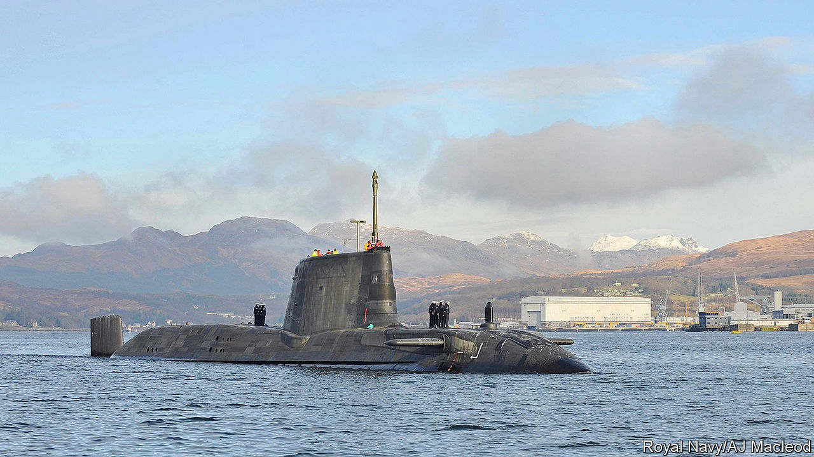
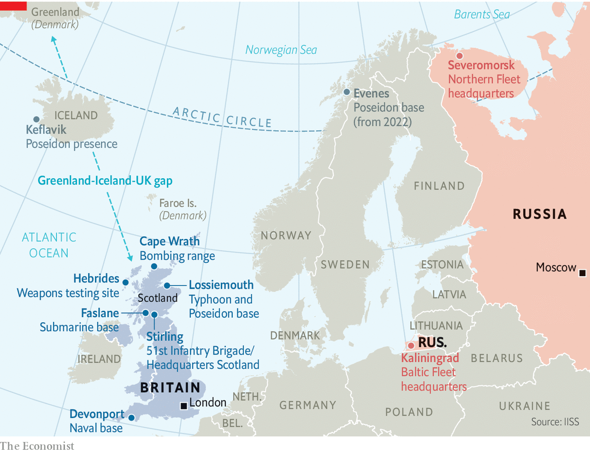

###### Defence policy

# How Scottish independence would threaten Britain’s defence 

##### As support for independence grows, so does Scotland’s military importance 

 

> Nov 5th 2020 

THE GARELOCH seems a tranquil place. At its northern tip there is a tiny village with a pub, a café and a welding shop. But the ramshackle camp on the loch’s eastern shore, whose signage exhorts that there be “nae bombs, anywhere!”, hints at its unusual nature. An exploration of the surrounding countryside reveals another—a density and attentiveness of police jeeps that is somewhat higher than average. A pair of squad cars arrives to check on your correspondent within half an hour of his arrival in the area.

Their scrutiny is warranted, for the Gareloch is home to Britain’s nuclear weapons. A rotating fleet of submarines is stationed at Her Majesty’s Naval Base, Clyde, a streak of buildings that runs along the loch’s eastern shore. The policemen, who work for the Ministry of Defence (MoD), explain that the base, also known as Faslane, is just one component of the infrastructure in the area, a network of roads, bunkers and jetties all focused on a singular mission: keeping several megatonnes of atomic weaponry in the Atlantic at all times.


“Faslane will be ideal for a headquarters of the Scottish armed forces,” says Stewart McDonald, the defence spokesman of the Scottish National Party (SNP), which favours independence. For now, that is aspirational. In a referendum held in 2014, 55% of voters in Scotland opted to stay in the United Kingdom. But Britain’s constitutional settlement has frayed since then, at the same time as Scotland’s military importance has grown.

In a general election held the year after that referendum, the SNP won 56 out of 59 Scottish seats in Parliament (it currently holds 47). When a majority of Britons voted to leave the European Union in 2016, 62% of voters in Scotland voted to remain. If Britain and the EU fail to agree a trade deal before the end of this year, when a transition period ends, many Scots would opt to leave the union and rejoin the EU. In Scotland, support for independence has accordingly grown. A poll in October put it at 58%, excluding undecided voters—the highest ever recorded. Nicola Sturgeon, the leader of both the SNP and Scotland’s devolved government, wants a fresh mandate for a second referendum from Scottish parliamentary elections in May 2021. That would require British consent, something that Boris Johnson has ruled out.

 


If there is another referendum, it will not happen for years. But the consequences of a yes vote could be profound. That is not because of Scotland’s economic weight—last year it accounted for less than 8% of British GDP—but because over the centuries Scotland has played an outsized role in projecting British force around the world. Out of proportion to their numbers, Scots ran the empire and, until recently, manned the army. “The British armed forces are the most Unionist of all the main public services,” says Malcolm Chalmers of the Royal United Services Institute.

As the threat from Russia has grown since the invasion of Ukraine in 2014 (see ), so has Scotland’s military importance. Its northerly latitude is ideal for projecting air and naval power into key Atlantic sea lanes and bastions of Russian power in the High North. RAF Lossiemouth in Moray, north-east Scotland, now houses four squadrons of Eurofighter Typhoon fighter jets and Britain’s entire fleet of new Poseidon submarine-hunting planes. Scotland’s geography is vital to both.

The Typhoons intercept Russian bombers from Murmansk that approach British airspace. If the planes had to be scrambled from southern bases, explains Group Captain Chris Layden, station commander at Lossiemouth, a Russian bomber would “already be over Aberdeen by the time you get anywhere near it”. Similarly, the Poseidons must quickly get to Russian subs passing from their Arctic bases through the “GIUK gap”—a choke point created by Greenland, Iceland and Britain—to the North Atlantic. “If they get into the North Atlantic, it is bloody hard to find them,” he says.

Scotland’s jagged west coast is also the simplest and safest way for Britain’s own submarines to slip quietly into the deep northern waters of the Atlantic, which in turn affords the quickest route for nuclear missiles to travel over the Arctic to Russia. Britain’s entire submarine fleet, including the four nuclear-armed boats colloquially known as Trident, is therefore based at Faslane. Nuclear warheads are stored and loaded onto the subs at nearby Coulport on Loch Long. At both Lossiemouth and Faslane, assets that were once split between England and Scotland are now concentrated in the latter.

Scottish real estate is vital in other ways, too. The MoD uses 115,000 square kilometres of airspace over the remote Hebrides archipelago as a range for honing its missile defence systems and other weapons. Cape Wrath in the Highlands is the only naval gunfire range in the country. Over 10,000 Scots are also employed in Britain’s defence industry, particularly in shipbuilding. Boeing, an American company, designed and built a facility to house the Poseidons at Lossiemouth. Raytheon is planning to open a second high-tech Scottish facility, in Livingston. Leonardo, an Italian firm, operates a tech “incubator” in Edinburgh.

The degree to which Scottish independence would up-end these arrangements depends in part on political choices in Edinburgh. The SNP has had an anti-Western-alliance streak—its former leader, Alex Salmond, hosts his own show on RT, a Russian propaganda outlet—and some fear that Scotland would become a chink in NATO’s armour. However, the party’s leadership has moved in a more pragmatic direction over the years. “I don’t think there’s much appetite in the SNP leadership for Scotland to go off in a neutralist direction,” says Mr Chalmers. “I think the model for them is Norway or Denmark.”

In 2012 the SNP reversed its traditional antipathy to NATO and said it would seek membership, subject to an agreement that it would not have to host nuclear weapons. That is not a formality. NATO is a self-proclaimed “nuclear alliance” and America, which routinely uses Faslane, does not tell allies when nuclear-armed planes or ships are passing through allied territory. This issue could probably be overcome, says Mariot Leslie, a former British diplomat who retired in 2014 as envoy to NATO, and supports independence. If so, Scotland would be “snapped up very quickly”, she says.

Faslane would be a serious bone of contention, though. The SNP says that it expects Britain to remove its nuclear weapons in the event of independence “on the fastest possible timetable”. A study by Mr Chalmers in 2014 estimated that transplanting Faslane and Coulport to England would cost £3bn-4bn and take years. Few sites in England are suitably remote and close to deep water. Devonport in Plymouth, which previously housed attack submarines, is the likeliest candidate, though 30 times as many people live within 5km of Devonport as Faslane. Stuart Crawford, a former British army officer and one-time SNP parliamentary candidate, suggests a compromise by which Scotland would lease out Faslane, Lossiemouth and other sites to Britain for around £1.2bn a year, for up to two decades. That, he estimates, could fund Scottish armed forces comprising 8,500 soldiers and sailors, 20 ships and 50 planes and drones—comparable to Ireland or New Zealand.

Mr McDonald suggests renting Lossiemouth back to the RAF is “perfectly sensible”, but leasing out Faslane “is not something we’ve even thought about”. Even if a transition period could be agreed, Trident would probably need to move, eventually. “If independence comes,” says Mr Chalmers, “we’re faced with a situation in which most of our submariners will bring up their families in Scotland. They will be Scottish voters and Scottish citizens.” The prospect of eviction would hang over the base, he adds. “The risk is that in 15 to 20 years, just when you need it the most, you get turfed out, as happened in 1938 when the Royal Navy was turfed out of Ireland.” In theory, Britain or America could veto Scottish membership of NATO unless the issue was resolved—with a decades-long lease, for instance.

Conventional forces could stick around for longer, or indefinitely, assuming that negotiations over partition were not too acrimonious. A former British civil servant points out that some Scottish forces could operate as an independent part of a joint force, just as many European countries have merged elements of their armed forces. There are Dutch tanks in German divisions, for instance. But despite Scotland’s martial history, its leaders would almost certainly be less willing than British ones to deploy and exercise military forces abroad, as Britain does everywhere from Iraq to the South China Sea. “We’re not going to be projecting power around the world”, says Mr McDonald. “We agree with countries such as Finland, for example, who see the North Atlantic as a key strategic region that needs attention.”

Secession would undoubtedly dilute British military power—even if an amicable outcome were in reach, the mechanics of “Skexit” would make Brexit look like light entertainment. The question is whether it would also occasion an existential crisis. “There would be a tendency to carry on as if it hadn’t happened,” says a former senior British defence official who served at the MoD during the 2014 referendum. “Just as Russia took on the mantle of the Soviet Union, the argument will be that England is the successor state which takes over the permanent seat at the UN Security Council—nothing to see here, move on.”

Yet a former defence chief suggests that if relocating Faslane proved too costly, Britain might even reconsider whether it could afford nuclear weapons at all. Moreover, the dynamics driving support for Scottish independence—the rise of English nationalism and the prospect of a harder Brexit—are also stirring a debate in Northern Ireland over unification with the next-door republic. The loss of either Scotland or Northern Ireland, and certainly both, would force Britain to consider whether the time had come to give up on trying to project the global clout of a big power, and accept a position in the world somewhat more in keeping with its declining economic and political status.■

