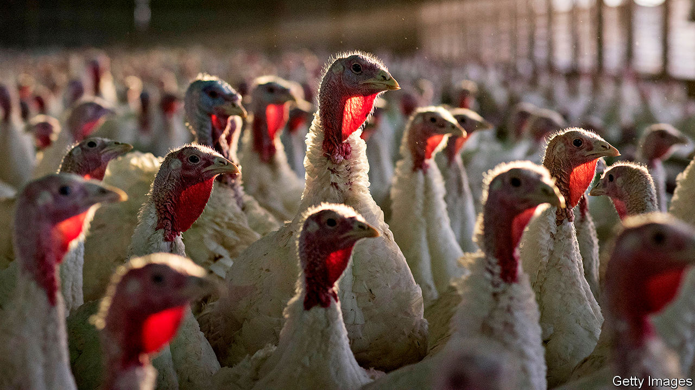

###### Gobble, gobble?

# Socially distanced Thanksgiving weakens appetite for big turkeys 

##### Smaller gatherings raise demand for smaller birds 

 

> Nov 5th 2020 

IN BARNS OR pens, or already in freezers, 40m American turkeys await their fate. More than half of the whole turkeys sold in America each year are eaten over Thanksgiving, which this year falls on November 26th. Most of the rest are polished off the following month, at Christmas. Social-distancing rules and travel restrictions mean that celebrations will look rather different in 2020—and so will the market for meat.

Some 30% of Americans say they will spend Thanksgiving with their immediate family only, up from 18% last year, according to Butterball, a North Carolina firm which rules the roost of turkey producers, supplying one in three Thanksgiving birds. Flight bookings for November are a third lower than last year, reports Skyscanner, a search platform, suggesting fewer people are going home for the holidays. In Britain, where 9m turkeys are usually eaten over Christmas, 61% of people say they are less likely than usual to have guests on Christmas Day, according to Kantar, a data firm.


Birds bred to feed large gatherings are therefore out of favour. Walmart and Kroger, large American food retailers, both plan to offer more small turkeys. However, “a lot of supply for the holidays is locked in well before the fall,” says Beth Breeding of America’s National Turkey Federation, an industry group. It is too late for producers to switch to daintier varieties, since a hen takes 14-16 weeks to mature from hatchling to main course. Changing a bird’s diet or the temperature of its surroundings can reduce its size, and it can be slaughtered earlier. But many Thanksgiving turkeys have already been dispatched and frozen, to fatten up inventory for the “Super Bowl” of the turkey calendar, as a Butterball spokesman describes it.

Some consumers may therefore end up buying spare parts cut from big birds. Walmart plans to increase by 20-30% its stock of breast meat, for families who can’t manage a whole turkey. Such cuts command a premium but may mean that the leftover dark meat goes unsold. “Whole birds are easier to produce and with no waste, so producers like them,” says Richard Griffiths of the British Poultry Council. Some farmers are in a flap at the prospect that turkey could lose out to more petite meats. Kroger is buying in more ham, beef, pork-roast and seafood, as well as vegetarian “meatless roasts”.

Yet the signs are that most consumers want to stick to tradition. Although millions of people accustomed to their mother’s cooking will have to fend for themselves this year, convenience products will mostly stay on the shelf, believes Scott McKenzie of Nielsen, another data company. Lockdowns have encouraged homely hobbies: Americans are buying 81% more yeast than last year and 41% more seaweed for wrapping home-made sushi, Nielsen reckons. Mr McKenzie expects increased demand for “made-from-scratch” products over the holidays, and beyond: “Homebody habits are here to stay,” he believes. If that is true, the glut of large turkeys may have a happy outcome: more leftovers. ■

Editor’s note: Some of our covid-19 coverage is free for readers of The Economist Today, our daily . For more stories and our pandemic tracker, see our 

