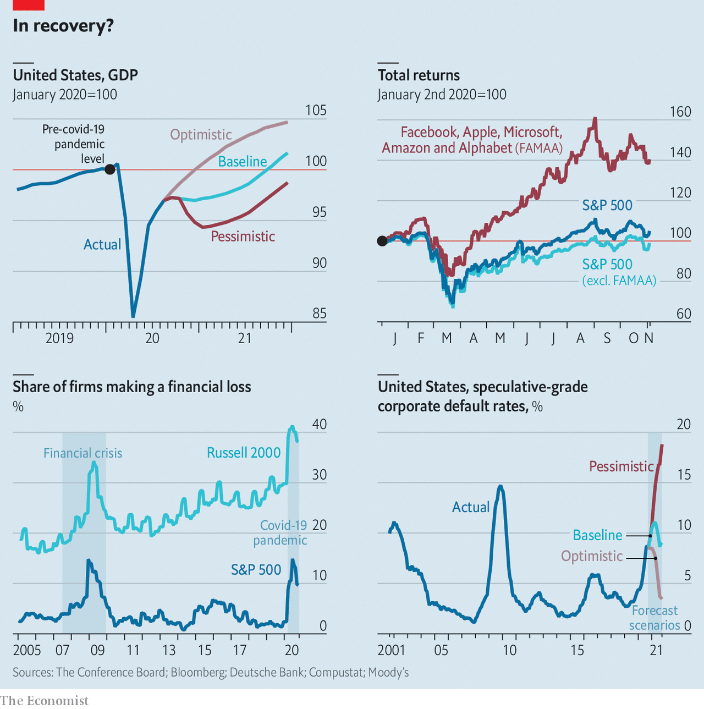

###### Still ailing

# USA Inc’s ponderous recovery 

##### USA Inc’s uncertain recovery 

 

> Nov 7th 2020 

ON THE HUSTINGS, both Donald Trump and Joe Biden promised to revive America’s economy from its pandemic-induced funk. Doing so will require a turnaround for corporate America, which has suffered a savage downturn. When the occupant of the White House starts his four year term in January, in what state will American business be?

Some recent vital signs may look promising. America’s economy expanded at a record pace of 33%, on an annualised basis, in the third quarter. Total profits for the big firms of the S&amp;P 500 index have surpassed analysts’ expectations by roughly a fifth, with 85% beating forecasts for the quarter. Michael Wilson of Morgan Stanley, a bank, calculates that revenues for the median S&amp;P 500 firm rose by 1% year on year. Small wonder that the Conference Board, a research organisation, published a survey on October 20th finding that its measure of confidence of bosses at big companies has jumped to 64 from 45 in the previous quarter—a figure above 50 indicates more positive than negative responses.


Yet anyone tuning into big firms’ quarterly update calls with Wall Street investors could not help but pick up the tentative tone and frequent dour notes of executives. Visa, a payments company, for example, called the recovery “uneven”. Caterpillar, a maker of industrial machinery, admitted it is “holding more inventory than we normally would” because of the uncertainties resulting from the pandemic. And a close analysis of the figures suggests that the corporate recovery is very patchy, with some industries and smaller firms still in big trouble. Meanwhile, corporate balance-sheets are under strain, which could hold back investment and lead to an eventual rise in defaults.

America’s economic boom in the latest quarter would be impressive had it not come on the heels of a comparable decline in GDP in the previous three-month period. The economy remains 3.5% smaller than it was at the end of 2019, reckons the Conference Board, and it is not likely to return to its pre-pandemic level until the tail end of 2021 or possibly later (see chart). As for the large proportion of companies where profits exceeded expectations this quarter, Tobias Levkovich of Citi, a bank, is unimpressed: “Beating lowered earnings expectations is not that great a feat.” It is now clear that analysts were too pessimistic when they pencilled in their forecasts earlier in the year. He adds that many firms managed to improve profits not by boosting sales but by slashing their expenses. The business outlook remains “squishy”, he reckons, as “you can’t cost-cut your way to prosperity.”

 


The more you peer into the numbers, the more inconsistent the recovery looks. One source of differentiation is where a company’s customers are based. Jonathan Golub of Credit Suisse, another bank, estimates that the companies in the S&amp;P 500 reported an aggregate revenue decline of 2.8% and a fall of 10.2% in profits in the third quarter compared with a year earlier. But he estimates that at American firms focused on exports profits plunged by over 14%, whereas those companies more reliant on the domestic market suffered a drop of less than 9%.

Size is another lens which reveals the uneven recovery. Binky Chadha of Deutsche Bank argues that it is “a tale of two stockmarkets”. The market capitalisation of the five biggest tech giants (Facebook, Amazon, Apple, Microsoft and Alphabet) has fallen in recent weeks from its peak of roughly a quarter of the entire value of the S&amp;P 500 index. Even so, they have generated returns of 39% for shareholders this year and without them the 495 others have produced a return of -1%.

Small and medium-sized firms (SMEs) have been crushed. The proportion of them that are making losses—based on the Russell 2000, an index of SMEs—has declined a bit from its peak of above 40%, but it remains well above 30%. SMEs are nearly four times as likely to be losing money as big firms, a far worse situation than during the recession of 2001 or the global financial crisis a decade ago.

The mood in the board rooms of small companies is foul. The latest survey of executives at SMEs, published by the Wall Street Journal and Vistage, an executive-coaching organisation, found sentiment “stalled in October 2020 due to increased concerns about an economic slowdown amid a resurgence in covid-19 infections.” The gloomy outlook, the most pessimistic in six years, may be explained by the fact that 42% of small firms believe they will run out of cash in under six months.

If the inconsistency of the recovery is one worry, the other is the state of firms’ balance-sheets. Corporate debt was rising before the pandemic, and many firms have piled on more borrowings in order to cover the shortfall in revenue they have experienced this year. Edward Altman of NYU Stern School of Business is worried about what he calls “the enormous build-up of non-financial corporate debt.” By his estimation, firms have issued more than $360bn in high-yield debt (ie, junk bonds) so far this year, surpassing the previous record of $345bn in all of 2012. With debt-earnings ratios reaching critical levels, and a resurgence in corporate defaults, Mr Altman reckons that 6.5% to 7% of junk bonds, by dollar value, will default in 2020.

His fears are echoed by S&amp;P Global, a credit-rating agency. It calculates that the “distress ratio” (distressed credits are junk bonds with spreads of more than ten percentage points relative to US Treasuries) for American companies had come down to 9.5% in September from its peak of 36% in March but that it remains above pre-pandemic levels. Corporate America already leads the world in the tally of corporate defaults this year, with 127 by the end of October. Nicole Serino of S&amp;P Global notes that corporate credit quality is deteriorating, with the number of firms rated a lowly CCC+ or below now 50% higher than at the end of 2019. For such firms, she worries that “excess liquidity and low interest rates are only postponing the inevitable.”

With a large share of firms still making losses and given the weakening of balance-sheets it is far from clear that American business is in the clear. What happens next depends on three unknowns. One is the fallout from this week’s presidential vote. A prolonged period of post-election uncertainty would weigh on the mood, notes Mr Levkovich. He points to the 11% fall in the S&amp;P 500 index after the election in 2000 while legal wrangling decided the outcome of the contest for the presidency between George W. Bush and Al Gore.

Another unknown is the timing and size of the next package of fiscal stimulus from Congress, which at the moment is frozen by partisan gridlock in Washington, DC, and which could be limited if the Republicans keep firm control of the Senate. This matters to companies because, as Mr Golub puts it, “the government has effectively said, ‘We do not want market forces to drive firms out of business right now and so we are going to backstop a large part of the economy.’” Mr Wilson believes that the number of companies going bankrupt so far this year has been much lower than otherwise feared because of generous stimulus measures.

The biggest unknown, though, is the pandemic. Moody’s, a credit-rating agency, predicts that corporate-debt defaults will continue to rise until March 2021. The reason it gives is “economic recovery remains fragile amid risks of another pandemic resurgence leading to another round of countrywide lockdowns”. That should serve as a sober reminder to the next president and corporate bosses alike that, despite a rebound, there may yet be difficult days ahead for USA Inc.■

