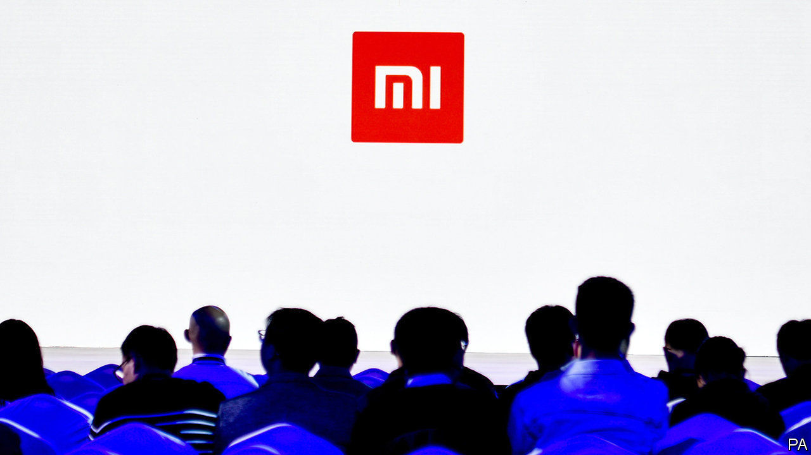

###### Mi time

# Xiaomi takes advantage of Huawei’s woes 

##### A Chinese smartphone-maker shrugs off feelings of inferiority 

 

> Nov 5th 2020 

LEI JUN, THE founder and boss of Xiaomi, a Chinese smartphone-maker, has long had something of an inferiority complex. For a decade Xiaomi has played second fiddle to Huawei, a rival Chinese producer of handsets. In a recent live-streamed address watched more than 30m times, Mr Lei admitted that his firm is not yet “in the same league” as Huawei. The audience, comprising mainly “Mi fans” (as devotees of Xiaomi products are known), booed the dispiriting assessment. That prompted Mr Lei to change tack, quickly adding that “you will find lots of things we do well”.

Investors are not complaining. Xiaomi’s share price has doubled since June. Its value surged to $80bn on November 5th. The main explanation is the flagging performance of none other than Huawei, which has been cut off from a critical resource—mobile chips—after export restrictions imposed by America came into effect on September 15th. The regulations prohibit chip manufacturers whose products contain American technology, including suppliers outside America, from selling to Huawei, which is accused of acting on behalf of the Communist Party. The chokehold is likely to depress Huawei’s sales for the foreseeable future.


Xiaomi is better insulated from the geopolitical storm. Unlike Huawei, which sells telecoms gear to foreign network operators, Xiaomi runs only a consumer operation. It is thus less likely to stoke foreign ire. Big chipmakers like Taiwan Semiconductor Manufacturing Company, for instance, continue to supply Xiaomi even as they are forced to cut ties with Huawei.

New data from Canalys, a research firm, suggest that Xiaomi is cashing in on Huawei’s troubles. In the third quarter Xiaomi shipped 47m smartphones worldwide, up by 45% year on year. Huawei hawked more handsets, 52m units, but that is down by 23% from a year ago and the next quarter will almost certainly be even weaker. Xiaomi could soon overtake Huawei to become the world’s second-biggest smartphone vendor—behind only Samsung, which shifted 80m units in the quarter. Xiaomi is the undisputed winner from Huawei’s woes. Compared with the same period last year, third-quarter shipments from Samsung and Apple, which dispatched 43m handsets, barely budged. This suggests that consumers regard Xiaomi smartphones as a suitable substitute for Huawei’s products.

Like its Chinese rival, Xiaomi tries to cater to every customer. Wealthier folk favour the flagship “Mi” phones. “Redmi” phones are aimed at the mass market (similar to Huawei’s “Honor” series). This explains Xiaomi’s popularity in both developed and developing countries. It is the leading smartphone supplier in markets as diverse as India and Spain. Apple’s pricey products have less appeal in poorer countries.

The question is how long Xiaomi can sustain its fortuitous ascent. A new administration in America may lift restrictions against Huawei, enabling it to buy chips from global suppliers once again. If that happens, Xiaomi could be squeezed. To avoid this fate it talks of building on an “ecosystem” designed to keep customers interested. In addition to smartphones, which account for three-fifths of revenues, the company sells a range of smart devices, from light bulbs to electric scooters. It also offers fintech services like micro-lending. Xiaomi’s sense of inferiority could be a thing of the past. ■

