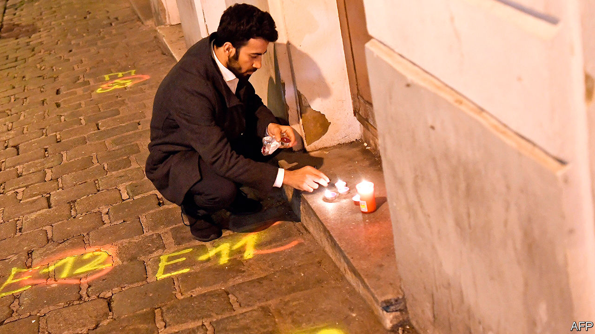
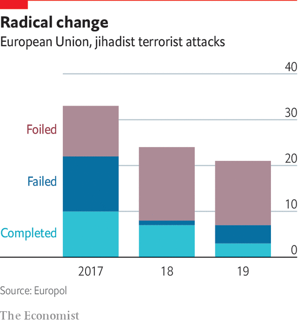

###### Terrorism in Europe

# Despite the horrors in Vienna and Paris, jihadism has declined 

##### But prisons are still a problem 

 

> Nov 3rd 2020 

TEEMING WITH spooks and intrigue, Vienna is no stranger to political violence. “Carlos the Jackal” held OPEC’s oil ministers hostage there in 1975. Since then, assassinations in Austria’s capital have claimed the lives of Kurds and Chechens, among others. But until November 2nd Vienna had largely been spared the attacks on civilians that have menaced cities like London, Madrid or Paris. That night four people were killed and 23 injured, several of them seriously, during a gun and knife rampage in Vienna’s centre. Many were attacked as they took their last chance of a drink or a meal before Austria’s second coronavirus lockdown.

The Austrian authorities identified Kujtim Fejzulai, a 20-year-old man with dual Austrian and North Macedonian citizenship, as the sole gunman. Further arrests were made on November 3rd. Mr Fejzulai, who was shot by police, was born and raised in Vienna to Macedonian parents of Albanian extraction. Radicalised as a teenager, in 2019 he was convicted of terrorist offences and given a 22-month prison sentence after authorities thwarted his plan to join Islamic State (IS) fighters in Syria. But he was released in December under Austria’s lenient rules for young offenders.


The attack follows a spate of terrorism in Europe. On October 4th a Syrian asylum-seeker stabbed two men, killing one, in the German city of Dresden in what may have been a homophobic attack. Twelve days later, on the outskirts of Paris, a teenage Chechen refugee beheaded Samuel Paty, a teacher who had shown his class controversial cartoons of the Prophet Muhammad from Charlie Hebdo, a satirical magazine. On October 29th a Tunisian national who had arrived in France that month killed three people at a church in Nice. On the same day, French police shot dead a man claiming allegiance to a far-right anti-immigrant group near Avignon.

 


The flurry of attacks recalls the bloodshed of 2015-16, when Islamist terrorists killed 12 people at Charlie Hebdo’s offices in January 2015, 131 people at multiple sites in Paris in November and 86 people in Nice the following July. Since then, however, jihadism in Europe has declined markedly. The number of completed Islamist attacks fell every year from 2017 to 2019, while the number of foiled ones rose, according to Europol, the EU’s law-enforcement agency. Ten people were killed in 2019.

Much of the violence has been associated with IS, which swept through Iraq and Syria in 2014 with the help of 5,000 or so European recruits. The IS “caliphate” was crushed in 2019 and European security services feared that a flood of returning fighters would overwhelm their ability to monitor suspects back at home. In practice, IS veterans have not proven as numerous or violent as feared, even if the group’s ideology has remained potent.

Even so, the threat continues to dominate the work of security services. In a speech in October, Ken McCallum, director-general of MI5, Britain’s domestic-intelligence service, said that Islamist extremism remained the country’s largest threat by volume, with “tens of thousands” committed to the ideology, though he added that a growing share of plots came from right-wing extremists, like the attacker in Avignon. Mr McCallum said that tracking plots had become harder in recent years “as more terrorists have gone for basic attack methods requiring little preparation”.

None of the attackers in Dresden, Paris, Nice or Vienna is thought to have reached Iraq or Syria. Though the Dresden suspect had been convicted of recruiting on behalf of IS and downloading terrorist manuals, he is believed to have been radicalised only after arriving in Germany five years ago. Mr Paty’s killer is known to have had contact with a jihadist in Syria, but he never fought there and was not known to the French authorities. The Nice attacker, who had crossed from Tunisia to Italy in late September, had been arrested in Tunisia for using a knife but was not otherwise on the radar of Tunisian, Italian or French authorities. The problem seems to be less about hardened combat veterans than those with looser ties to the jihadist ecosystem turning to violent action.

Propaganda remains a serious issue, too. Large caches of material inciting and glorifying terrorism continue to circulate freely online, says Julian King, who served as European commissioner for security until January. The European Parliament has been sitting on proposals for Europe-wide action to remove online propaganda for almost two years, he says.

The recent attacks also highlight another worrying pattern. Mr Fejzulai was let out of prison early; the Dresden suspect had been released only five days before his attack. That reflects a wider failure of counter-terrorism policy, as does the fact that Mr Fejzulai had completed a deradicalisation programme that was evidently unsuccessful. “In many European countries the priority was to get people locked up,” says Peter Neumann of King’s College London, “and then to forget about them, with many becoming further radicalised in prison.” ■

Editor’s note: this article has been changed to reflect the police’s identification of a sole gunman, rather than several as was first suspected

