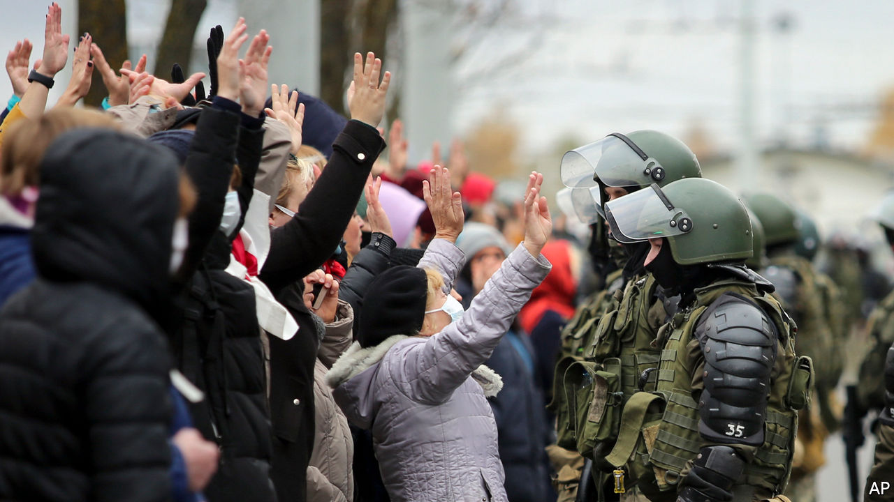

###### Staying put

# In Belarus neither dictator nor protesters are backing down 

##### And Vladimir Putin is still waiting in the wings 

 

> Nov 5th 2020 

THE YOUNG man tore open his coat, threw his arms in the air, and dared the riot cop to open fire. The startled officer retreated, his assault rifle still aimed at the approaching protester. “Long live Belarus!” chanted the crowd. It was just another Sunday in Minsk, the capital of Belarus, where the opposition has staged huge rallies every weekend since August 9th, when Alexander Lukashenko, the country’s erratic dictator, rigged presidential elections to claim a sixth term.

Despite the bravery of the protesters, Mr Lukashenko, 66, shows no sign of relinquishing power. And as winter approaches, the opposition movement could be slowly running out of options. A nationwide strike called for October 26th by Svetlana Tikhanovskaya, the exiled opposition leader, has largely crumbled amid a clampdown on picketing and threats of dismissal. Dissenting students have been expelled from university. More than 230 protesters were accused this week of taking part in “mass disorder”—a charge that could see them incarcerated in a brutal Belarusian prison for up to three years.


Mr Lukashenko has urged security forces to ramp up the violence against protesters. At least five people have already been killed and dozens more have been injured. Speaking recently to security chiefs, he said protesters who confront police should have their arms torn off. “We’re not taking prisoners,” he said. Days later, security forces used live bullets at a demonstration, firing warning shots into the air. The show of strength was met by sarcastic applause from the crowd of opposition supporters.

The clampdown does not mean that the opposition is going to give up its fight to topple Mr Lukashenko. One in every five urban adults is estimated to have taken part in the protests, and around 85% of them intend to continue demonstrating until new elections are held, according to a poll by Chatham House, a British think-tank. (Independent opinion polls are banned in Belarus.) Ms Tikhanovskaya has called for more protests and fresh strikes to pile economic pressure on Mr Lukashenko. “Neither side has the strength to decisively turn the tide in its favour,” said Igor Ilyash, a political analyst in Minsk. “This is a war of attrition.”

Whatever comes next, it is hard to see how life in Belarus can go back to normal. An entire generation of Belarusians has been politicised by the protests and Mr Lukashenko’s frenzied attempts to crush them. “Where are our guys, dad?” asked a small child recently, as he gazed at a phalanx of riot police officers. “Over there, see, with the flags?” his father reassured him. The video went viral.

Waiting in the wings, should the protesters get the upper hand, is Vladimir Putin. The Russian president has said the Kremlin will intervene in Belarus, Russia’s closest ally, if the protests “get out of control”. Late last month, Russian security officials accused the West of financing the opposition. The comments came as Russian state television used images of widespread destruction from the Nagorno-Karabakh war between Armenia and Azerbaijan in a report on “aggressive” protesters in Minsk. Was it a technical error or a bid to swing Russian public opinion in favour of a military intervention in Belarus? Only the Kremlin knows the answer. ■

