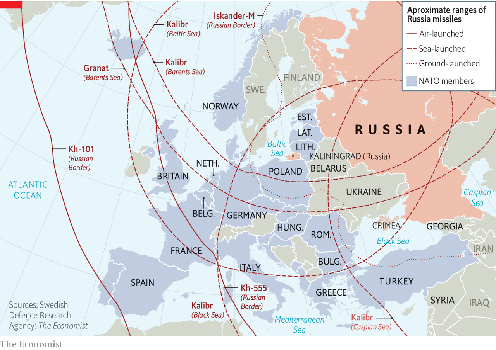
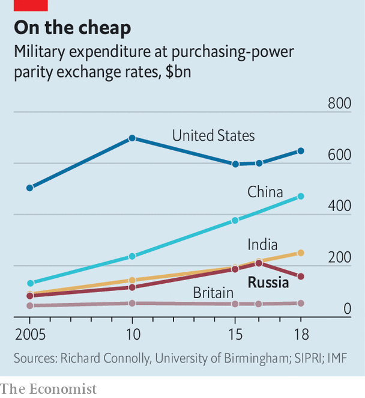

###### Putin’s new model army

# Russian military forces dazzle after a decade of reform 

##### NATO will need to step up 

 

> Nov 2nd 2020 

AFTER THE Soviet Union’s collapse, Russia’s once-mighty armed forces were laid low. Moscow bus drivers outearned fighter pilots. Hungry soldiers were sent to forage for berries and mushrooms. Corruption was rife—one general was charged with renting out a MiG-29 for illicit drag racing between cars and jets on a German airfield. “No army in the world is in as wretched a state as ours,” lamented a defence minister in 1994. Yet few armies have bounced back as dramatically. In 2008 Russian forces bungled a war with Georgia. In response, they were transformed from top to bottom.

That began with large sums of money. Russian military expenditure roughly doubled between 2005 and 2018, when measured in exchange rates adjusted for purchasing power. Though much of the budget is secret, Russia’s annual military spending probably stands somewhere between $150bn and $180bn, says Michael Kofman of the Centre for Naval Analyses, a think-tank in Virginia. That is around three times as much as Britain and close to 4% of GDP.


Much of that money has been spent on kit. In the past decade Russia has added around 600 new planes, 840 helicopters and 2,300 drones, estimates Julian Cooper of the University of Birmingham. Whereas 99% of Russian armour in 2007 was classified as “legacy”—ie, introduced into service more than three decades ago—today fully 27% is modern, according to a study published by the International Institute for Strategic Studies (IISS), a think-tank in London, on September 29th. Russia’s warplanes have gone from being 97% legacy to being 71% modern in that time.

The key investments were in precision missiles like the land-based Iskander, sea-launched Kalibr and air-launched Kh-101, putting in range targets across Europe (see map). A decade ago the idea that the Russian navy could accurately hit targets in Syria from warships in the Caspian Sea would have been science fiction, notes Dmitry Stefanovich of IMEMO, a research institute in Moscow. “Now it’s a reality.” In a European war, the idea would be to use such missiles to threaten civilian and military infrastructure deep behind the front lines on the ground, ensuring that a conflict over, say, Tallinn would stretch far to the west of the Rhine.

 


Russia’s ultimate aim is to create a “reconnaissance-strike complex”—originally a Soviet idea—in which data from vehicles on the ground, drones in the air, satellites in space and radio signals emitted by enemy units are collected, processed and fed into the weapons in real time. Any “sensor” (for instance, a drone) can feed a target to any “shooter” (like a faraway ship), with targets prioritised centrally and struck, ideally, within minutes. Though Russia is behind America and probably China in this ambitious endeavour, it has made “huge leaps”, says Dima Adamsky of IDC Herzliya, a university in Israel.

Russian forces are not just better armed, but also more fleet-footed. Thanks to improvements in readiness, Russia could probably get 100,000 troops, complete with heavy armour, to a European hotspot within 30 days. NATO might struggle to muster half the number, of lighter forces, in that time. Around 5,000 of Russia’s airborne troops are said to be on two hours’ notice. Soldiers are kept on their toes with huge exercises. The latest, Kavkaz (Caucasus) 2020, involved 80,000 personnel and concluded on September 26th. “Russia has traded mass for tempo,” concludes Lt-General Jim Hockenhull, Britain’s chief of defence intelligence.

Russia’s armed forces enjoy the additional advantage of being blooded in battle. Though Russia and China may have comparable weapons, the quality of the forces, in training and combat experience, is “night and day”, says Mr Kofman. In Ukraine, for instance, Russia has practised armoured warfare and artillery duels, experimenting with the use of cyber-attacks and drones to feed targeting information to its guns. Syria, where over 63,000 Russian personnel have served, has been a testbed for precision strikes, air defence against rebel drone swarms, and the use of unmanned vehicles.

Russian officers in Syria have even shown signs of shedding the Soviet legacy of rigid, top-down command and acting with more autonomy and creativity, a practice known as “mission command”, observes Mr Adamsky. That, he says, would be “a major departure from the Russian military tradition”. And in both countries, Russia has honed its skills in electronic warfare by jamming radios, radars and drones. Russia’s fake GPS signals in Syria were even strong enough to bamboozle civilian airliners in Israel.

 


Not everything has been fixed, of course. Viktor Murakhovsky, a former officer who now edits a military journal, is positive about the reforms. But he says that shipbuilding is slow and that the country lags behind its rivals in long-range drones. The new T-14 Armata tank, the next-generation Su-57 warplane and new submarines have all been delayed. Though Russia is adept at blowing things up in space, its ageing fleet of reconnaissance satellites has shrunk over the years, with modernisation complicated by Western sanctions. The biggest problem of all, says Mr Kofman, is the limited capacity of Russia’s defence industry, including shortages of skilled personnel, machine tools and components.

The trade-off between hardware and humans is also apparent. Though troops no longer go hungry, their pay is not great. Mr Murakhovsky points out that a skilled tank commander in his 20s can expect little more than 43,000 rubles ($532) a month in peacetime, lower than the national average. “In my opinion, it’s not enough.” Morale among conscripts, who still make up 55% of ground forces, remains low, and the short duration of their service limits their usefulness in combat. Though the days of renting out warplanes may be over, last year Russian military prosecutors announced that 2,800 military officials had been charged with corruption. The amount stolen totalled around $90m.

Nor has military renaissance bought peace of mind. In a war with NATO, Russia “would have conventional superiority for a limited period”, concludes the IISS, but would be outgunned if the conflict dragged on. In recent years, Mr Putin has therefore worked to ensure that a conflict would not drag on. He has invested heavily in nuclear forces, unveiling a host of lurid weapons such as hypersonic gliders, radioactive torpedos designed to pollute coastal areas and nuclear-powered cruise missiles capable of circling the Earth indefinitely. Missiles like the Iskander, Kalibr and Kh-101 can also carry both conventional and nuclear warheads (NATO officials point out that they would have no way of knowing which until they landed). For Russian generals, the hope is that their revived strength means that the nukes are never needed.

For its part, NATO has largely focused on Russian threats to the Baltic states, and the challenges of reinforcing Europe over weeks and months. It has underestimated how Russia’s new firepower may be used in a shorter, sharper and more expansive war that would stretch far beyond the Baltics. Its planners, and the national politicians that set military budgets and priorities, need to adjust their strategies and spending in the light of these new threats. ■

