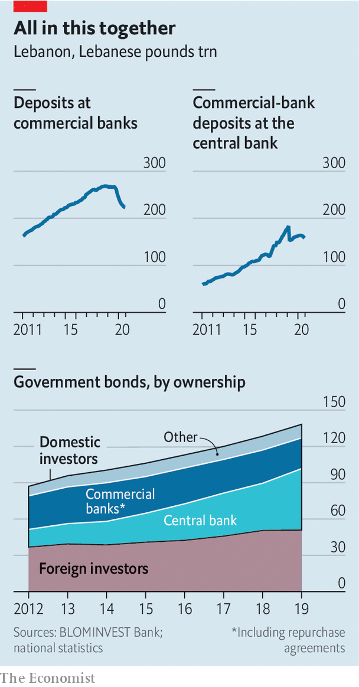

###### The final unravelling

# Deconstructing the Lebanese central bank’s Ponzi scheme 

##### A web of mutual liabilities binds the central bank to the government and the banks 

 

> Nov 5th 2020 

GEORGE AZZI no longer allows customers inside his pharmacy. Too many shops have been robbed. Instead he takes orders through a plexiglass window. But now, he jokes, there is not much left to steal. A currency crisis has left his shelves half-empty. A nearby petrol station has rationed supplies, limiting drivers to 20 litres. The supermarket around the corner has not stocked fresh chicken for weeks because poultry farmers will not sell at the government-mandated price.

Lebanon has spent the past year lurching from one crisis to the next: protests, covid-19, the catastrophic explosion at Beirut’s port on August 4th. In the background all along has been a grinding economic collapse. Pegged for decades at 1,500 to the dollar, the Lebanese pound recently traded on the black market as low as 9,000. Annual inflation hit 120% in August. GDP may shrink by a quarter this year.


Subsidies have kept a few essentials affordable: medicine, fuel, a morning manoucheh (flatbread). But the central bank, the Banque du Liban (BdL), has less than $2bn in usable foreign-currency reserves remaining. By the year’s end it will be unable to maintain its subsidy scheme, through which it grants importers of essential goods access to dollars at preferential rates. Some Lebanese have begun hoarding food and medicine in anticipation of far higher prices.

It will be the end of a monetary regime that once seemed inviolable. The peg helped restore confidence after a 15-year civil war, during which inflation peaked at 487% and the pound lost 80% of its value. But it was built on an unproductive economy and a complex series of transactions that, in recent years, came to resemble a Ponzi scheme. It has now collapsed. Yet Lebanon’s political and financial elites—sometimes one and the same—are unwilling to bear the costs of fixing it. Instead they have forced the economy into a brutal self-correction, with the heaviest consequences piled on ordinary citizens.

Most Arab states with fixed currencies defend their pegs with revenue from oil and gas exports. Lebanon has none. It has few goods exports at all: at their peak in 2012 they came to $4.4bn, against $21.1bn in imports. Other sources of hard currency, such as tourism and property, were insufficient to sustain a peg, with current-account deficits exceeding 25%, and fiscal deficits of over 10%, of GDP.

 


It did have one reliable source of dollars: a vibrant financial sector that, at its peak in 2018, held 269trn pounds of deposits, then worth $179bn—more than three times the country’s GDP. About two-thirds of deposits were in dollars. To funnel some of that into its coffers the BdL crafted a scheme it called “financial engineering”. Starting in 2016 it exchanged local-currency debt with the finance ministry for dollar-denominated bonds, which it sold to commercial banks with high rates of return. Banks could also borrow pounds against their dollar deposits at the BdL, then lend them back to it, with a spread of 11 percentage points on the transaction.

The longtime central-bank governor, Riad Salamé, defends the scheme as a short-term fix. In his telling the BdL did not create Lebanon’s deficits: those were the work of politicians who failed even to pass a budget between 2005 and 2017. True enough—but the scheme made those debts possible and tied everyone in a web of mutual liabilities. By 2018 the BdL was financing most of the fiscal deficit, and by 2019 most of Lebanon’s public debt (more than 80% of local-currency debt and 60% of foreign-currency bonds) was owned by banks and the BdL. The banks, in turn, deposited more than half their liquidity with the BdL. In its annual assessment of the Lebanese economy, the IMF reckoned that banks’ combined exposure to the BdL and the government amounted to 69% of their total assets in May 2019, more than eight times their Tier 1 capital, largely due to the rise in their deposits with the central bank.

Sustaining this house of cards required an ever larger supply of fresh dollars, which necessitated ever higher yields to lure depositors. Average interest rates on dollar deposits climbed from 3% in 2016 to almost 7% three years later. But after a decade of growth, bank deposits flattened off in late 2018, in part because low oil prices hurt the Gulf economies where many Lebanese work. Last year they began to decline. Short of cash, banks severely curtailed dollar withdrawals. Credit cards that once financed trips to Europe now carry spending limits of $50. In March the state defaulted when it failed to make a payment of $1.2bn on a hard-currency bond. The prime minister at the time, Hassan Diab, estimated an $83bn loss in the banking sector.

Most customers can withdraw their dollar savings only in local currency (Dan Azzi, a former executive at Standard Chartered, a bank, dubbed these “lollars”). Since April the BdL has allowed withdrawals at an above-market exchange rate, currently 3,900 pounds to the dollar. That is still up to 55% below the black-market rate—“a massive haircut on the Lebanese,” says Alain Bifani, who resigned in June after 20 years as the director-general of the finance ministry. Despite the haircut, people have rushed to withdraw deposits. Cash in circulation was up 274% in the year to August.

Mr Diab proposed shifting more of the losses on to banks, rather than entirely on their depositors. His cabinet approved a plan in April calling for a bail-in, wiping out shareholders and imposing a haircut on wealthy depositors. He also began talks with the IMF about a financial agreement worth up to $10bn. The fund was broadly supportive of his plan, but it was doomed by lobbying from banks. They have strong allies in parliament: most of Lebanon’s big banks are at least partly owned by politicians or their families. In meetings with the IMF, bankers would not even agree on the scale of Lebanon’s losses, insisting that Mr Diab’s numbers were exaggerated.

Mr Diab has since resigned as prime minister, though he remains caretaker. His designated successor, Saad Hariri, who is still struggling to cobble together a government, is unlikely to take up his ideas. He had been prime minister before, when the financial-engineering scheme was in full swing, and his family has a stake in BankMed, one of the country’s largest banks (his stepmother serves as vice-chair). Instead the association of banks has suggested selling $40bn in state assets to help clean up the mess. Critics argue this wildly overstates the value of Lebanon’s assets, among them an electric company that cannot provide 24-hour electricity and a telecoms monopoly that offers some of the world’s slowest internet speeds. Neither is likely to prompt a bidding war when a bankrupt state dumps them in a fire sale.

The BdL, once again, is left to pursue its policies, some of which seem to be attempts to keep the Ponzi scheme going. In August it told banks to boost their capital by 20% or “exit the market” in February next year. Depositors who have transferred at least $500,000 abroad since 2017 would be encouraged to repatriate 15% of that sum, and 30% for politically exposed persons. Banks may offer “incentives” to grease the wheels. What would incentivise customers to send money to an insolvent banking system was left unclear. Efforts to audit the central bank, meanwhile, have met with months of obstruction.

Even the good news is bad. The trade deficit fell by 51% in the first quarter, but mainly because few Lebanese can afford imported goods. Banks have fewer liabilities—customer deposits were down by 16% in August, compared with the previous year—but partly because depositors who need cash are taking haircuts to withdraw devalued pounds. Politicians and bankers still hope to avoid a reckoning, even as the economy crumbles around them. But they have nowhere left to turn. ■

