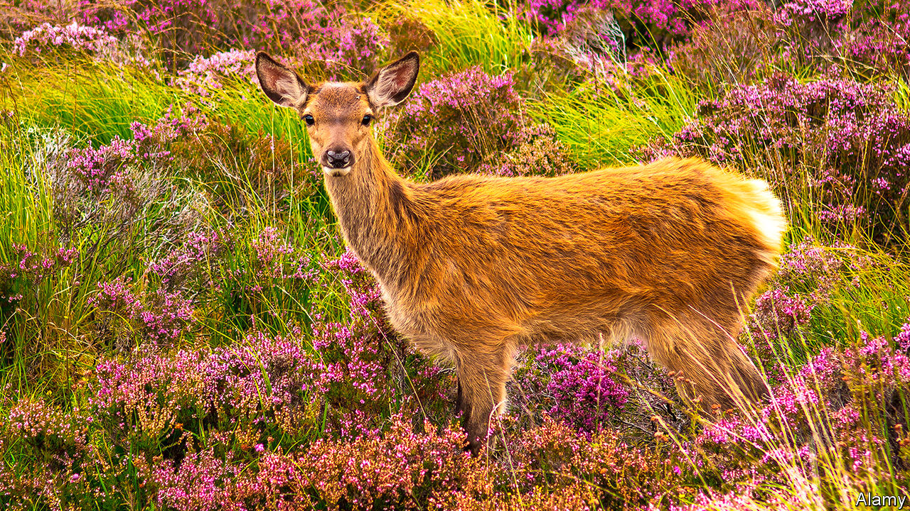
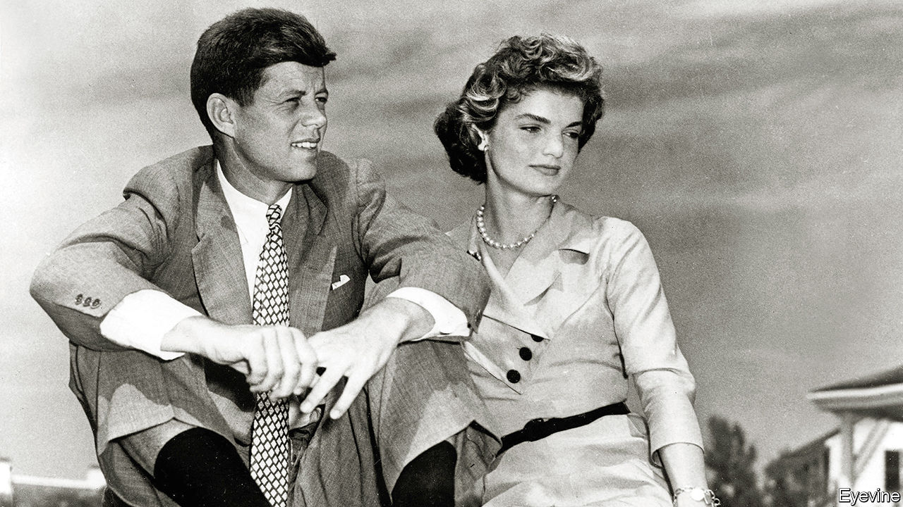
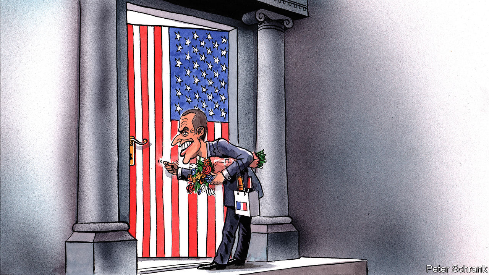
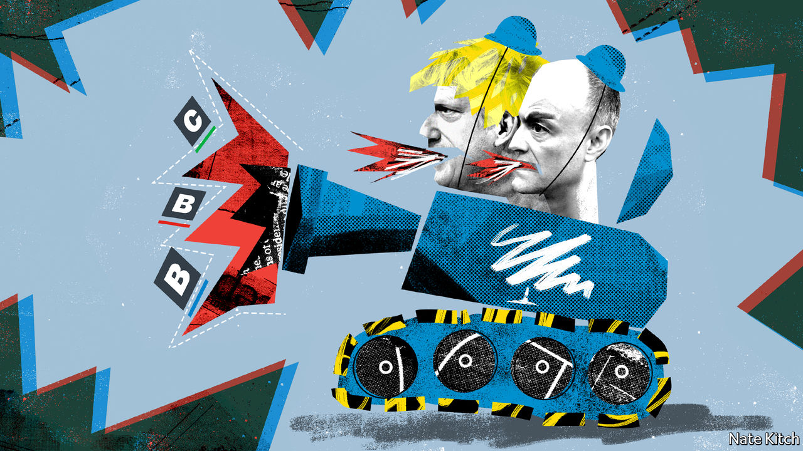

###### On nature, the Arctic, John Kennedy, Covid-19, Taiwan, culture, capitalists, Berlin, Albanians

# Letters to the editor 

##### A selection of correspondence 

 

> Nov 7th 2020 


What is nature?

Your use of quotation marks around “natural” shows the strange turn that word has taken. But your analysis of the rewilding of Scotland missed a deep irony in the effort to create a landscape purified of human influence (“”, October 3rd). This concept of natural excludes humans, but at the same time envisages a highly managed, human-constructed landscape achieved by human processes, undertaken for human goals, and based on the best human guess of what those landscapes used to be like.


The reality is that it is impossible to go back. Whatever natural world existed before humans is lost to us for ever. What is created in the project of rewilding is but a simulacrum of the prehuman ideal.

In addition, this concept of “natural” morally bypasses issues of justice. This is an exercise of the hyper-wealthy, with a contempt for the lives of people, plants and animals whose home this has been for millennia. It could be described as a project in environmental colonialism, where those enlightened, wealthy few civilise the locals or take their land in order to make the world as it should be.

Rewilding is also selective about what is part of “real nature” and should thus be saved or recreated, and what is unnatural and can be disposed of. This project requires the killing of thousands upon thousands of animals, namely deer. One would hope in the very least that these animals will be properly processed and eaten, but even still they remain a waste product in the pursuit of a “natural” Utopia.

None of this is to say that it is inherently wrong for humans to cultivate and shape environments. But let us call rewilding what it is: another attempt to manage our natural environment for specifically human goals. It should thus be morally evaluated and debated like all other human projects and goals, with reference both to the human and environmental impact. It is this, and not some mystical prehuman status, that makes it properly natural.

ROBYN BOERÉAssociate lecturer in Christian ethicsUniversity of St Andrews

NEIL STANGEProfessional agrologistSt Andrews, Fife

Finding north

In my earlier letter () I erroneously identified the northernmost point of contiguous land in the “New World” as Point Barrow, Alaska. That is the northernmost point of the United States. The correct northernmost point of mainland North America is in fact Murchison Promontory, marking the extremity of the Boothia Peninsula in the Bellot Straights, Nunavut.

KEN HEDGESBarrie, Canada

 


Born to be president

Your review of Fredrik Logevall’s biography of John Kennedy did not persuade me that it succeeds in deflecting “myths” about the family (“”, October 17th). On Joseph Kennedy, you say “it’s not every multimillionaire father who takes such broad interest in his children” and “instils in them a firm commitment to public service.” It isn’t every millionaire, perhaps, but I’m not sure that grooming your children to become the president of the United States counts as instilling in them a commitment to public service.

John Kennedy himself is “cursed by a sense of entitlement”—poor Jack, what a cross to bear. Can there ever have been a more self-aggrandising book than JFK’s “Profiles in Courage”, which your reviewer regards simply as a reflection on the role of leadership. In reality it was a first step in staking a claim to become leader of the democratic world.

As for the assertion that the Kennedys “had every reason to hate America’s WASP elite”. Hardly. As the review makes clear, they had not just beaten but joined that self-same elite to their own enormous advantage.

ANDREW CLIFFORDLondon

Covid-19 in China* made groundless accusations against China’s handling of covid-19 by once again referring to cover-ups and blaming China for the outbreak (October 17th). The Chinese government and people took swift action to control the disease, making enormous sacrifices. The country managed to contain the rapid spread of the virus in just over a month. In about two months, the daily increase in domestic cases fell to single digits. Meanwhile, a decisive victory was secured in Wuhan, once the hardest-hit Chinese city, in just about three months. Sporadic outbreaks have been contained.Acting with transparency and responsibility, China has been releasing pandemic-related information in a timely manner. China informed the WHO and the international community of the outbreak, and was the first to release the genome sequence of the virus and the first to share information on control and treatment. Because of our strict prevention and control measures, China prevented hundreds of thousands of infections, containing and slowing down the spread of covid-19. China supports a review into the outbreak of this new disease led by the WHO at an appropriate time in order to promote international co-operation on health. When such challenges arise again, the world will be better equipped to safeguard life. But there was no cover-up. There was no delay. China’s record is clean. It will stand the test of time and history.ZENG RONGSpokesperson of the Chinese embassyLondon

 


Protecting chips

Setting aside the fact that the civilised world has an obligation on moral grounds not to sit idly by and watch Taiwan fall into the hands of China (“”, October 10th), it is also a matter of national interest for nearly every country in the world. German cars, French telephony networks, British chipmakers, American smartphones, Japanese robots, and almost every other product we rely on rely in turn on the Taiwan Semiconductor Manufacturing Company. You pointed out its importance in an article last year (“The pivot”, December 21st 2019). The world may run on data, “the new oil”, but data are processed on TSMC’s chips.

HAROLD DEE LEANHsinchu, Taiwan

 


Ode to joy

“What exactly is European culture?” asks (October 17th). That there is such a thing as European culture seems undeniable. The inhabitants of Europe have shared Roman occupation, conversion to Christianity, the Renaissance, the Reformation, the Enlightenment, the French Revolution. They may have reacted to some of these in massively different ways, but the depths of consciousness they stirred are very widespread. Indeed, the European Union could one day become, like China, “a civilisation state”. This is not even to mention music, painting, architecture (before and after Bauhaus). There is no need to be self-conscious about this; European culture is at a state of maturity where development simply happens. One does not need to define it, only live it. So says one who must regretfully soon view this process from the outside.

ANTONY BLACKDundee

With regard to the EU’s plans to take up cultural projects, you seem to have forgotten that the organisation has very capably turned Beethoven’s 9th Symphony into Eurokitsch.

J.A. HOULDINGNuremberg, Germany

 


Capitalist lives matter

I enjoyed insightful column on the Tories’ new culture war, until he claimed that banning anti-capitalist material in schools is wrong (October 3rd). As a lifelong capitalist I’m keenly aware that there is precious little taught in schools in favour of capitalism these days to level up against the considerable anti-capitalist propaganda that pervades all aspects of Western cultural life. I can only assume you think anti-capitalist literature is okay because we are a much smaller minority than most others. You must educate yourself on the need to protect us as much as any other group.

NICK WALKERBurnley, Lancashire

 


Now open for business

You noted the many failings of the new Berlin Brandenburg Airport (“”, October 17th). I chuckled when I realised that its designated airport code, BER, is also an acronym used in manufacturing to mean Beyond Economical Repair.

PHILIP NAGLEDublin

Comedy gold

There are more to “” (October 3rd) than Mother Teresa and Enver Hoxha. John Belushi was also of Albanian heritage. So, along with the saint and the sinner you also have the silly samurai.

DAVID GILEFSKIWilmington, Delaware

* Letters appear online only

