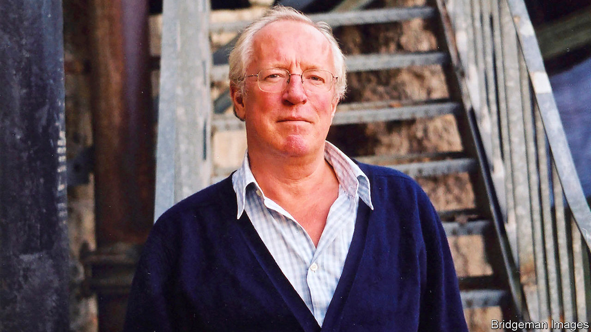

###### Rage on the page

# Robert Fisk, a voice on the Middle East, died on October 30th 

##### One of the best-known journalists in the region was also one of the most controversial 

 

> Nov 5th 2020 

ROBERT FISK, who died in Dublin on October 30th, aged 74, was one of the most influential correspondents in the Middle East since the second world war. For the past 30-odd years he wrote mainly for the Independent, a left-of-centre British newspaper with dwindling circulation and influence at home, but his reach extended far beyond. His bitter narrative of Arab victimhood and Western wickedness (particularly American and Israeli), often brilliantly crafted, resonated across the region and was picked up in newspaper columns, by radio stations and on campuses across the world, America included. Again and again, Western correspondents in Cairo, Damascus or Baghdad would listen politely as Fisk-aficionados, from diplomats and politicians to taxi drivers and coffee-house waiters, regaled them with the wisdom of Mr Fisk’s latest diatribe.

Brought up in small-town England, Mr Fisk (pictured) made his journalistic mark for the Times, covering the Troubles in Northern Ireland, where the British authorities found his reports unduly keen on the Irish republican cause; he later took up Irish citizenship, while keeping a British passport. Leading the paeans of praise on his death was Ireland’s president.


Some of his scoops were world-beating. In 1982 he was among the first to enter the Palestinian refugee camps in Sabra and Shatila, where more than a thousand people had been massacred by Lebanese militias as Israeli forces looked the other way. In 1993 in Sudan, he became the first Western journalist to interview Osama bin Laden, penning an article headed: “Anti-Soviet warrior puts his army on the road to peace”. “I am a construction engineer and an agriculturalist,” he told Mr Fisk, who pulled off two more meetings with him before the al-Qaeda leader orchestrated the killing of some 3,000 people in New York in 2001. In one session bin Laden praised “Mr Robert” for being “neutral”.

Based most often in Beirut, Mr Fisk was a consummate operator who roved far and wide, from Algeria and Libya, through the Balkans and Turkey, to the homelands of Kurds and Afghans. He injected a vivid sense of history into his coverage, showing why so many people in the region felt angry and humiliated—and tended to blame the former colonial powers, and above all America and its protégés, especially Israel, for their unhappy predicament.

On one occasion, not long after the attacks of September 11th, he was roughed up by Afghan refugees in Pakistan. “I realised”, he wrote, that their “brutality was entirely the product of others, of us—of we who had armed their struggle against the Russians and ignored their pain and laughed at their civil war and then armed and paid them again for the ‘War for Civilisation’ just a few miles away and then bombed their homes and ripped up their families and called them ‘collateral damage’.”

His reputation among his peers was less rosy. He was a braggart. As we wrote in a review 15 years ago, “Mr Fisk tries to tell the story of the Middle East, but he does not flinch from telling the story of Mr Fisk.” He was self-righteous, though most recently had been excoriated for the leniency of his attitude to Bashar al-Assad, the blood-soaked Syrian dictator. He treated rumour as fact, if it suited his narrative: in 2004 he reported that the Americans had secretly spirited Saddam Hussein out of prison in Iraq to an American base in Qatar.

Correspondents from a range of worthy outlets and a diversity of ideologies have accused him of making stories up. In his mode of reporting, a tall tale, colourfully told in the supposed interests of the underdog, would often trump the literal truth.

