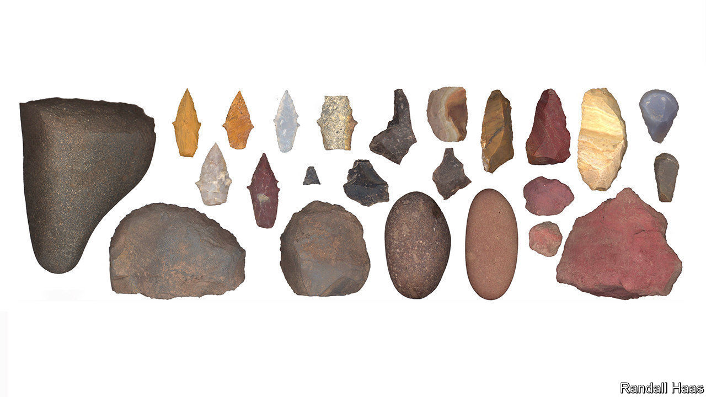

###### Human evolution

# Female stone-age hunters 

##### If you thought men hunted and women gathered, think again 

 

> Nov 5th 2020 

THIS COLLECTION of stone tools from Peru upsets the idea that, in the ancient world of hunter-gatherers, it was men who hunted and women who gathered. It comes from the 9,000-year-old grave of a woman in her late teens and includes seven spear tips, and a knife and a set of scrapers for butchering large animals. In light of its discovery, reported this week in Science Advances, Randall Haas of the University of California, Davis, and his colleagues, who found it, searched the literature on early burials in North and South America. There were 27 where the sex of the inhumed was known and hunting tools had been discovered alongside. Of these 11 were of females. Two, admittedly, were of infant girls. But the idea that only men did the hunting does now look, well, a bit old fashioned.■

