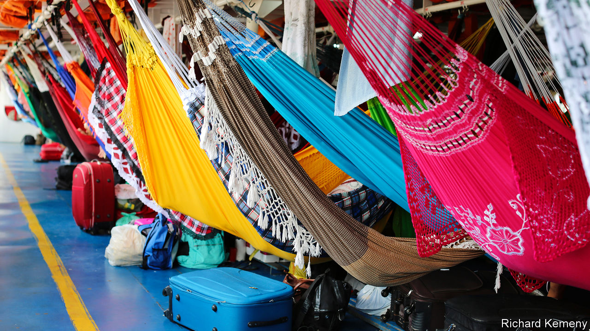

###### Bundles in the jungle

# How e-commerce works in the Amazon rainforest 

##### Amazon isn’t doing it, but Bemol is 

 

> Nov 5th 2020 

WHEN YOU behold the Lion of Judah you do not think “e-commerce”. Its lower decks have hooks for 467 hammocks where passengers sleep on the three-day voyage up the Amazon river from Manaus, a city of 2m people, to Uarini, a manioc-growing town. Its upper deck has more hammocks, a bar for sinners and a chapel for saints. Its cargo hold stinks of fish. But when the Amazon’s largest department store, Bemol, started delivering to customers in the rainforest, three-decker passenger boats were its chosen means of transport. 

Bemol was founded in 1942 by three grandsons of a Moroccan Jewish immigrant who arrived in Brazil in 1887. It sold fridges and televisions in the traditional way from its megastores in Manaus until 2018, when one of the founders’ grandsons, Denis Minev, took over. He suspected there were hundreds of thousands of customers up and down the Amazon and its tributaries that Bemol wasn’t reaching and decided to go to them.


But delivering parcels in the rainforest is difficult and expensive. (Amazon the company barely serves its namesake river.) Consumers in far-flung places either had to pay up to 30% of the product’s price for shipping and wait a month or longer for the postal service to deliver it or spend money and time on shopping trips to Manaus. Mr Minev made what sounded like an impossible promise: to deliver an order placed online within a week for not a centavo more than the “Manaus price”. 

Bemol calls its answer to those problems caboclo e-commerce. A term for Brazilians with both indigenous and European ancestry, caboclo has come to mean a mix of tradition and modernity. Mr Minev’s experience at a cooking-gas firm, also owned by his family, showed him how challenging the Amazon’s logistics could be. Rather than buy a fleet of boats, risking collisions, fuel theft and high debt, Mr Minev outsourced delivery to the brightly painted ferries that carry people and provisions around the region. 

As the Lion of Judah lay at anchor in the port of Manaus on a recent Tuesday, deckhands stuffed its hold with hundreds of cases of beer, thousands of cartons of eggs, scores of frozen chickens and three squawking ones. Alongside them were near-identical mattresses, supplied by Bemol, to be left in different towns. Contracts with boat owners are verbal, inventory is recorded with pen and paper and mix-ups happen. If merchandise goes missing—smartphones can disappear—Bemol swallows the loss. Just a few boats and their crews serve each route. “If I fight with all of them, there’s no one left to deliver our products,” says Fred Galvão, who runs logistics for Bemol. 

To encourage Amazonians to place their first online orders, Bemol installed Wi-Fi in the plaza of every town where it launched caboclo e-commerce. It set its catalogue to pop up on users’ smartphones and grants free minutes to those who place orders. Like Amazon, Bemol sends customers adverts based on the data they provide. 

It invented some tactics to suit the region. Amazonians who lack savings or credit cards use zero-interest loans starting at 150 reais ($26) to finance their purchases; a whopping 85% of Bemol’s online sales are paid for this way. Shoppers who are uneasy about using the internet can place orders and lodge complaints with an attendant’s help at chemists and floating petrol stations. Bemol allows returns, but encourages customers to accept vouchers instead. “The traditional e-commerce model without a physical presence doesn’t work in the Amazon,” says Mr Minev.

His caboclo model seems to. Its pilot operation in Autazes, 100km (60 miles) downriver from Manaus, which started in April last year, brought in 113 orders and 73,000 reais in its first month. By February this year Bemol had expanded to dozens of towns. It booked 2.6m reais in sales that month. After the pandemic struck, business boomed. Bemol’s e-commerce revenues in June reached 10.5m reais. “Amazon lost money for years,” Mr Minev says. “We’re already profitable.”

The Lion of Judah has been less lucky. At the start of the pandemic, it stayed in port for two weeks while ambulance boats brought covid-19 patients and the bodies of those who had died on the journey. The Lion resumed sailing in April but with half as many passengers. The captain, Richard Lacet, who inherited the boat from his father, has made up for lost revenue by charging more for cargo, to squawks from merchants sending chickens upriver and farmers dispatching manioc flour down it. But Bemol, which pays a flat rate for its own compartment, “is starting to change the business”, he says. E-commerce could keep the Lion afloat. ■

