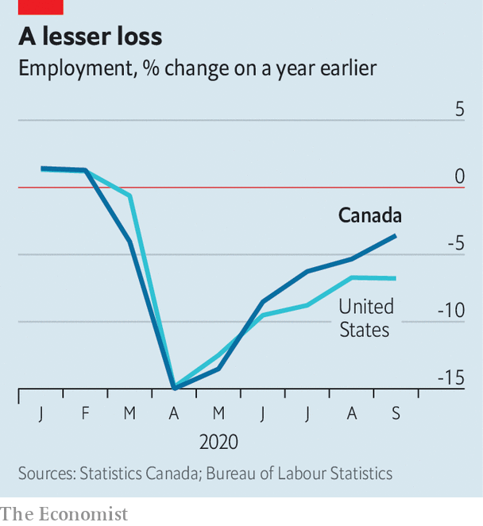
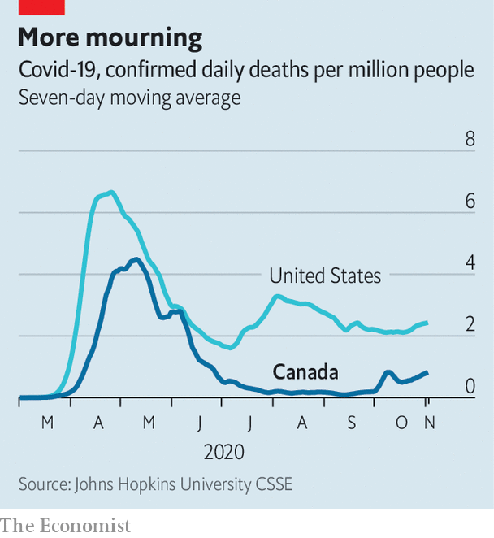

###### Northern light

# Jobs are coming back in Canada, thanks to subsidies 

##### Will a second wave of covid-19 swamp the recovery? 

 

> Nov 5th 2020 

CANADA’S ECONOMY is often subject to unfavourable comparisons with that of the United States, but recently it has been rivalling its neighbour’s. Like the United States it has recently enjoyed a big improvement in economic sentiment. In July the Bank of Canada predicted that at the end of 2020 GDP would be 6.8% smaller than a year earlier; on October 28th it revised that forecast to a 4.3% hit.

By many measures, Canada’s labour market seems to be rebounding even faster than America’s; in September Canadian employment was only 3.7% beneath its pre-pandemic peak, while in the United States jobs remained 7.1% scarcer, calculate economists at TD Bank (see chart). Yet the country has not quite overhauled Uncle Sam in the quest for a V-shaped recovery from the spring slump. That may be because, as in Europe, many of its jobs remain propped up by the government.

 


In the spring Canada had a tight lockdown and a big fall in GDP, of over 11% (compared with about 9% south of the border). But in the recovery it has benefited from several advantages. For most of the year it has been relatively successful in controlling the spread of covid-19. Unlike nearly all American states, Canadian provinces can run operating deficits. They have used their borrowing powers to boost hiring of teachers and health-care workers during the pandemic. Provincial deficits are expected to rise to C$96bn ($72bn), 4.5% of Canada’s GDP, this financial year, from C$18bn in 2019. American states, by contrast, are having to slash spending as tax revenues have fallen.


In Washington, disagreement over whether to bail out the states has impeded the passing of a second round of fiscal stimulus. But Canada has reduced for now the usual friction between province and nation. The federal government has given the provinces an extra C$21bn to reopen schools and cover extra health-care costs.

In August Doug Ford, the Conservative who governs Ontario, the most populous province, praised Justin Trudeau for doing “an incredible job as prime minister”. Overall, the 16% of GDP Canada has spent stimulating the economy is even bigger than the United States’ massive package of 14% of GDP. “I don’t like deficits. But the alternatives were much worse,” said Erin O’Toole, the recently elected leader of the opposition Conservatives.

The expansion in Canadian education and health care has helped women, who are most of the workforce in those sectors. Mothers, who were likelier than others to stop work during the pandemic, returned when schools and day-care centres fully reopened in September. Paid holidays are relatively generous. During the pandemic federal and provincial governments, which regulate different sectors, extended the amount of unpaid leave that parents and other workers could take. Many allow them as much time as they want. That stopped their employers from sacking them even when they could not work. Women have still lost more working hours than men in Canada, but the gap is smaller than in the United States, says Beata Caranci, TD Bank’s chief economist.

 


The number of jobs in e-commerce has jumped, as shopping shifts away from the high street. That has also happened in the United States, but Canada started out with fewer such jobs, and so the room for growth is bigger. Although the weak energy market has hurt oil-pumping Alberta, prices of natural resources such as gold, copper and lumber have stayed high. The housing market has been buoyed by buyers who reckon the shift to working from home is permanent and want larger dwellings. In all, “eight of 20 major industrial sectors are now operating above their year-ago levels,” writes Doug Porter, chief economist of BMO, a bank.

Growing confidence may explain why the government felt bold enough to raise its immigration target on October 30th by 17%. Next year it plans to invite more than 400,000 permanent residents, more than 1% of the population. The last time it welcomed that many immigrants was in 1913.

Despite this, most forecasts, including those of the IMF and the Bank of Canada, show that Canada will return to its pre-pandemic level of GDP only after the United States does. The disparity between the labour-market statistics and GDP may reflect the fact that unproductive jobs are being propped up by government subsidies. In September 1.7m employees, or about 8% of Canada’s pre-pandemic labour force, were benefiting from the Canada Emergency Wage Subsidy programme, which contributed an average of more than C$1,000 per employee to firms’ monthly payroll costs. About a fifth of these workers are in the troubled hospitality sector. Although the United States also has a scheme to subsidise payroll costs among small businesses, its reach is narrower and it closed to new applicants in August. Canada’s scheme is being extended, with a smaller payout, until next June. In this respect Canada looks more like Europe, where job-support schemes have obscured labour-market weakness but not falls in output.

And the virus is again on the rise. As provinces and cities reintroduce restrictions they are trying to minimise their economic impact. That may be tricky. Winnipeg, where the highest temperature on an average day in January is -11°C (11°F), is drawing up rules to allow pubs and restaurants to serve outdoors throughout the winter. The uncertain path of the virus could yet dash both economic and epidemiological hopes, as it has elsewhere. But among rich countries Canada has so far performed well on both fronts.■

Editor’s note: Some of our covid-19 coverage is free for readers of The Economist Today, our daily . For more stories and our pandemic tracker, see our 

