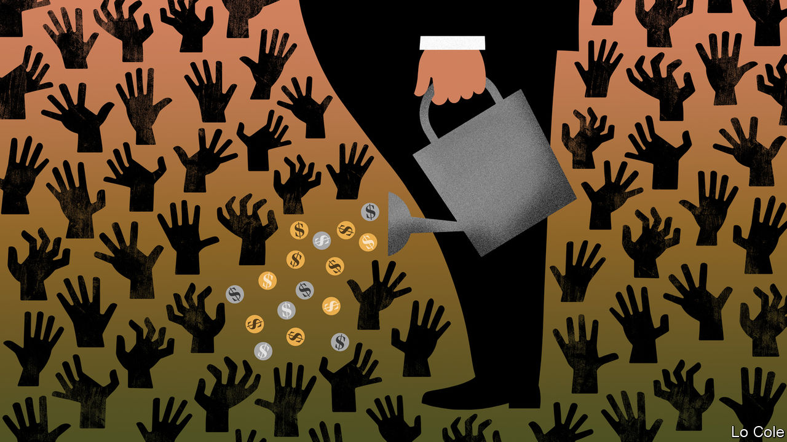

###### Bello

# The difficulty of doing good in Latin America 

##### The region has too little philanthropy 

 

> Nov 5th 2020 

AFTER THE pandemic struck Chile, ten do-gooding organisations formed Fondo Respuesta Comunitaria (the Community Response Fund) to alleviate hunger and poverty. It provides money for some 200 projects, mostly ollas comunes (soup kitchens). In Colombia the Fundación Santo Domingo is giving 100bn pesos ($26m) to pay for groceries and a domestic-abuse hotline, among other things. The Fundación Carlos Slim, backed by Mexico’s richest man, earmarked 1bn pesos ($47m) to treat covid-19 in that country.

The pandemic has given a boost to philanthropy in Latin America, but it is also a threat. Donors have less money to give or are shifting it to public health from other good causes. Almost half of NGOs in Chile may not survive, fears Sylvia Eyzaguirre of the Centro de Estudios Públicos, a think-tank. Prospects are as gloomy in Colombia, where many charities depend on events like galas and bingo nights, which cannot happen in covid times. In too many countries bureaucracy and politics add to the burdens. For the sake of its political and social health, Latin America needs more charitable activity, not less.


Philanthropy is fragile in part because it is less deeply rooted than elsewhere, notably the United States and Europe. In colonial times the Catholic church cured the sick and helped the poor. Centralising states took over such responsibilities, though not as effectively as in the rich world. “Philanthropy and [civil-society] associations were sort of a minor tributary and not part of the main story of development of those nations,” says Michael Layton of the Johnson Centre for Philanthropy at Grand Valley State University in Michigan.

They remain weak. The Latin American countries with the largest philanthropic sectors are Mexico and Colombia, according to a study published in 2018. There foundations’ assets are worth 1% of annual GDP, compared with 4.8% in the United States. Ordinary folk seem less altruistic than in other regions, though the tradition of almsgiving through the church remains strong. In a global giving index put together by the Charities Aid Foundation, the only Latin American country in the top 20 is Haiti.

The region pays a high price for low levels of generosity. The population of non-profit universities, museums, bird-watching clubs and the like is sparse. Unlike in the rich world, governments do not give them much money. Worldwide, non-profits account for 5.7% of employment; in Mexico, Colombia and Peru that is 3% or less, according to Lester Salamon of Johns Hopkins University in Maryland.

Latin America has too few groups that channel citizens’ grievances into proposals that governments might adopt, making conflict more likely. If the rich, who are undertaxed, gave away more money, high levels of inequality might rankle less.

Recently they have become more open-handed. More than half the region’s philanthropic groups have been founded since 2000, according to a study published by the Universidad del Pacífico in Peru. But the law, and increasingly politics, throw up obstacles. In many countries registering a charity is difficult. Chile has some 60 laws governing the tax treatment of donations. Donors can give tax-free money to cultural institutions but not to environmental or human-rights groups.

There is a push to change that in Chile, made more urgent by last year’s violent protests against inequality and poor public services. Left- and right-leaning think-tanks are lobbying together for a law to make giving easier.

Where authoritarians rule, life is getting harder for groups that benefit from philanthropy. Jair Bolsonaro, Brazil’s right-wing president, has made rhetorical war on defenders of the environment. Mexico’s left-wing president, Andrés Manuel López Obrador, has attacked environmental groups that oppose pet infrastructure projects, such as the Maya train across the Yucatán peninsula. This month Mexico’s Senate passed a law to strip tax-exempt status from groups that get most of their income from activities not related to their charitable goals. That would hurt groups like universities that make ends meet by, for example, operating bookshops. The bill is “a profound attack on the independence of non-profits”, says Mr Layton.

Weakening do-gooders may make life more comfortable for high-handed presidents like Messrs Bolsonaro and López Obrador. But a region traumatised by pandemic and rising poverty needs more philanthropy, not less.

