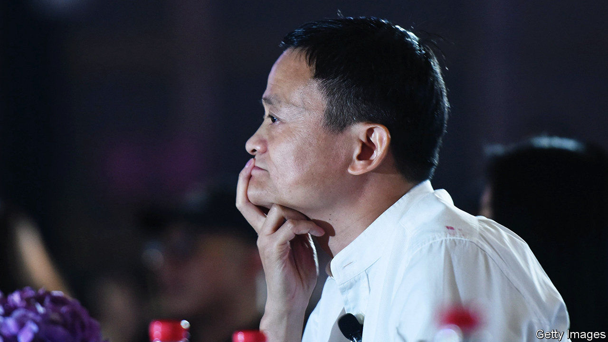
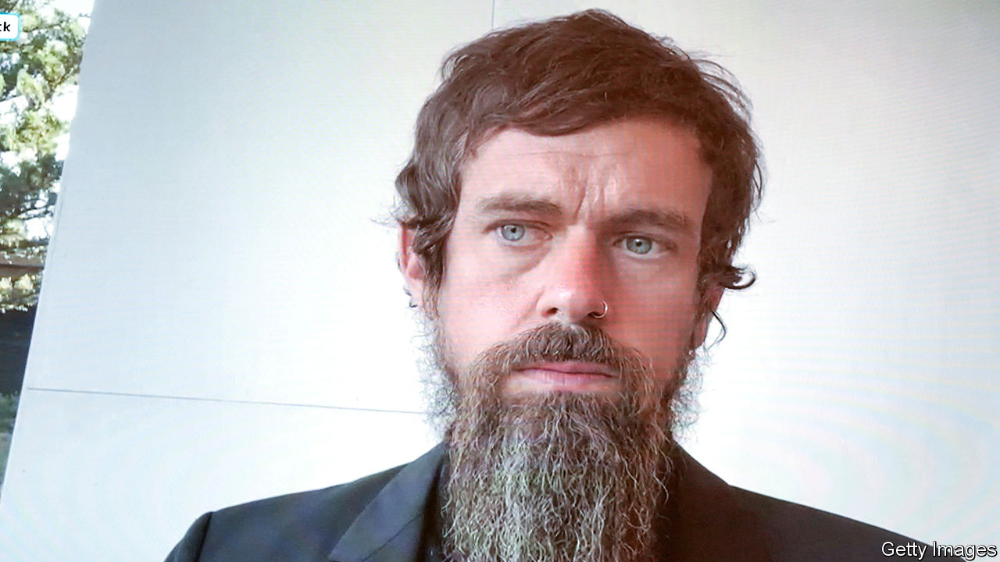

###### 

# Business this week 

#####  

 

> Nov 5th 2020 

In a stunning turn of events, Chinese regulators suspended the initial public offering in Shanghai of Ant Group, just days before the fintech firm was due to float its shares in a dual listing both there and in Hong Kong. It was expected to be the world’s most valuable IPO ever, potentially raising $34bn. Ant had been given the green light for the sale, but China’s foreign ministry said the decision had been taken “to better safeguard capital market stability and protect investor rights”. Ant’s online-lending business was said to be a concern; new rules were published forcing such lenders to back their loans with more of their own capital. The shelving of Ant’s IPO is a blow to Jack Ma, its founder. See .

Using their initiative


Uber, Lyft and other companies that work in the gig economy won a big victory in California when voters approved a measure that will allow them to avoid reclassifying their drivers as employees. The companies will not now have to comply with a state law compelling them to provide benefits like sick pay to drivers, although some have pledged to offer more protections. Uber and its allies spent $200m supporting the measure, the most expensive-ever campaign for a ballot initiative in the state.

BMW had a bumper third quarter, driven by a surge in sales in China, which were up by 31% year on year. Sales in Europe also rose, but the carmaker warned that its business remains volatile because of covid-19. Its global deliveries were still 12.5% lower in the first nine months than in the same period last year.

The euro area’s GDP expanded by 12.7% in the third quarter by comparison with the previous three months, bouncing back from recession. Year on year, however, the currency bloc’s economy shrank by 4.3%. America’s economy also pulled out of recession, growing by 7.4% in the third quarter, though year on year it was down by 2.9%.

Turkey’s annual inflation rate ticked up to 11.9% in October. The lira, which has lost around a third of its value against the dollar this year, fell to another new low.

The mayor of London reached a financial agreement with the British government that will keep the city’s transport system running for at least another six months. The revenue stream from London’s Tube and buses has dwindled during the pandemic. The government had threatened to take direct control of the network. The mayor has agreed to some cost savings, but he will not have to extend the size of the capital’s congestion-charging zone outside the centre.

More oil companies reported their earnings, spotlighting the impact that falling oil prices and reduced demand are having on the industry’s bottom line. ExxonMobil posted its third consecutive quarterly net loss, this time of $680m. It plans to cut 15% of its global workforce next year. Saudi Aramco, the world’s biggest oil company, made a net profit of $11.8bn, but that was 45% less than in the same three months last year. It still intends to pay out dividends totalling $18.8bn. Most of that will go to the Saudi government, which owns the vast bulk of Aramco’s shares.

Dorsey’s hairy moment

 


A committee of the board at Twitter that reviewed the company’s management structure “expressed its confidence” in the current arrangements, confirming that Jack Dorsey will remain chief executive. The committee was created after Elliott, an activist hedge fund, questioned Mr Dorsey’s commitment to his job. Twitter’s share price has risen sharply this year, rewarding Elliott and other investors, though it was dented recently by weak daily-user numbers.

Both Lufthansa and Air France-KLM reported another heavy quarterly loss. The German and French-Dutch airlines have received huge state bail-outs during the pandemic. Lufthansa said it would restructure its business further; Air France-KLM is to curtail its flight schedule for the rest of the year. Ryanair also made a loss as passenger numbers plummeted. Michael O’Leary, its combative boss, blamed the first lockdowns in Europe earlier this year, which he said had “achieved nothing”, and lambasted the second lockdowns, many in force this week, which he thinks will achieve “even less”.

Berlin Brandenburg Airport at last opened to passengers after a decade of delays, six missed openings and huge cost overruns. The airport’s inaugural arrival flights were operated by easyJet and Lufthansa. Even the opening had a hitch. Bad weather stopped a planned parallel landing by the aircraft.

There was a sliver of hope for the human race this week, with the reported news that Walmart has scrapped plans to use robots to check stock levels, prices and misplaced items. The retailer will instead retain flesh-and-blood workers, who have been found to be just as adept at those tasks during the pandemic.

