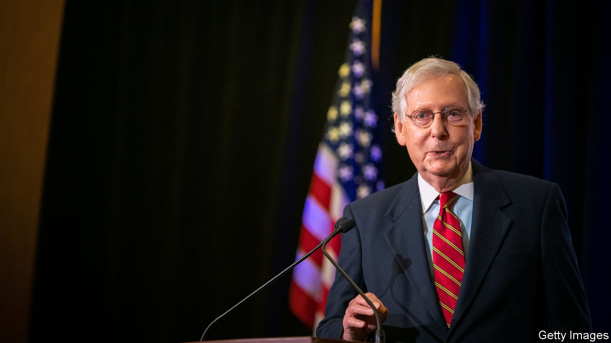

###### The House and Senate

# Democrats’ dreams for Congress go up in smoke 

##### Divided and divisive government is here to stay 

 

> Nov 5th 2020 

Editor’s note: See our  for details of the vote.

FORGET NUKING the filibuster, packing the Supreme Court and dismantling the electoral college—the prizes that bold Democrats salivated over after their expected landslide victory. Those dreams are now dead. The pre-existing Democratic majority in the House of Representatives has weakened, though it has still held. The Senate, on the other hand, looks likely to remain in Republican control, even though some results are yet to be finalised. Mitch McConnell, the majority leader who coasted to a seventh term representing Kentucky, was perfectly content to stymie Barack Obama for years. At 78, he would probably remain set in his ways if Joe Biden has indeed won a narrow presidential victory. That promises another four years of gridlock and hyper-partisan dysfunction. Forget, too, the chance of a green-infrastructure plan, a reform of health care—or much serious legislating of any sort.

Opinion polls not only overstated Mr Biden’s national standing, but also the prospects for down-ballot Democrats. In races for the House of Representatives in 2018, Democrats captured a resounding 54% of the votes cast for either major party. Nancy Pelosi, the House speaker, thought she would be surfing another blue wave. But preliminary results suggest that in 2020 that national margin actually shrank by four percentage points to near-parity. Given that Mr Trump is facing a clear loss in the popular vote, that suggests that down-ballot Republicans overperformed relative to the president all over the country.


Two years ago, Democrats were excited by their pickups in moderate, suburban districts in unexpected places like Oklahoma City, Charleston in South Carolina and Cedar Rapids, Iowa. All of those seats have now reverted to Republican control, while Democrats did not really manage to add to their territory elsewhere (excepting a pair of open seats in North Carolina). There will probably be more Republican flips, but election projectors think that the Democratic majority in the chamber will survive, even if it is eroded.

Great expectations for the Senate were similarly dampened once results came in. The two most endangered Republican incumbents—Martha McSally of Arizona and Cory Gardner of Colorado—lost as expected, as did Doug Jones, the improbable Democratic senator from Alabama. That left 47 Democratic seats, four short of a majority (or three if a Democratic vice-president broke ties). Some races are still uncalled, but the maths look likely to work for Republicans. Susan Collins of Maine won a comfortable victory and Thom Tillis of North Carolina looks likely to have got a narrow one. More long-shot opportunities for the Democrats, like capturing seats in Iowa and Montana, were decisively beaten back. And their more improbable map-expansion projects failed miserably.

At least $100m was raised to unseat Lindsey Graham, the Republican senator from South Carolina, who nonetheless won by 14 percentage points. “This is the worst return on investment in the history of American politics,” gloated Mr Graham in his victory speech. Neither did the $88m raised in Kentucky to unseat Mr McConnell look well-spent: he cruised to a 21-point victory. The ultimate composition of the Senate might not be decided until Georgia holds run-off elections in January—though these are probable Republican holds.

Most modern presidents have had unified party control of Congress at the start of their term (before voters usually wrench it back in mid-term elections). Should Mr Biden win, he is unlikely to be afforded that. This means that much of his ambitious agenda—and much of the all-consuming policy debate during the Democratic primary about which shade of health-care reform was best—will in effect become moot. Mr Biden would preside not over a realignment of American politics, but an interregnum between Trumpism and something else. Bipartisan accord might not stretch beyond infrastructure spending, if even that. A resuscitated Republican worry about debts and deficits would probably hamstring any serious spending legislation of a Biden presidency, just as happened with much of the Obama presidency.

With such a narrow result, the hope that America might be able to move beyond its high-stakes, ultra-partisan legislating seems to be extinguished. “Cry more, lib”, was the first public statement of Madison Cawthorn, a 25-year-old newly elected Republican congressman from North Carolina. A vocal supporter of the QAnon conspiracy theory, Marjorie Taylor Greene from Georgia, will soon be seated in Congress. The moderate Democrats who helped secure a large House majority in 2018 were the first to get wiped out.

America’s rickety constitutional design gives big rewards for even razor-thin margins. This encourages partisans to stay in their trenches until the next contest, and to sabotage as much as possible the ambitions of the other side. Nothing has happened this time to change that. Even if the next president is not yet confirmed, you can confidently predict how much will get done in the next Congress: very little. ■

Dig deeper:For the latest on the election, see our , read the  and then sign up for Checks and Balance, our  and  on American politics.

