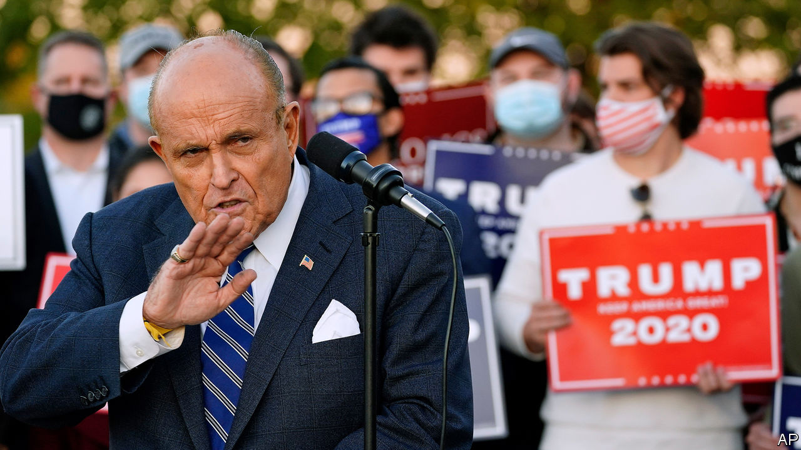

###### Courting the presidency

# Donald Trump goes to court 

##### The incumbent hopes litigation will keep him in the White House 

 

> Nov 5th 2020 

WATCHING HIS re-election odds falter in the Midwest on November 4th, Donald Trump pulled out a backup plan: salvation through litigation. “We’ll be going to the US Supreme Court,” he said in the wee hours after election day, repeating a weeks-long mantra justifying a rush to install Amy Coney Barrett into the late Ruth Bader Ginsburg’s chair. Continuing to count ballots is “a fraud on the American public”, he declared, without explanation. “We want all voting to stop.”

The scattershot legal strategy that emerged hours later carried an air of desperation and included, as promised, a quest to stop counting ballots in states where Mr Trump was in the lead and perhaps in some where he was behind. Mr Trump and his supporters have now filed suits in Georgia, Michigan, Nevada, Pennsylvania and Wisconsin. In Pennsylvania, the Trump campaign claims, rogue officials are opening “a backdoor to victory” for Joe Biden. Further suits may come in Arizona. However, the barrage of litigation is no more likely to change the president’s fortunes than his tweet announcing he would “hereby claim the state of Michigan”, where Mr Biden had already eked out a win.


Mr Trump’s lawyers and allies are particularly busy in Pennsylvania, where the president has also declared victory prematurely. The hoped-for win relies on at least five lawsuits. Four of them are rather small potatoes. The Trump campaign is appealing a judge’s one-paragraph dismissal of its complaint that campaign workers sent to observe vote-canvassing were denied sufficient access. Twin suits in state and federal courts involve mail-in voters seeking to correct errors such as a missing envelope or mismatched ballot signature; the opportunity to “cure” a ballot, according to one filing, entails a “high risk of jeopardising the integrity” of the election. Another suit contends that Pennsylvania ballots that lack proof of identification should be thrown out if not fixed by November 9th.

Such efforts aim to give Mr Trump small advantages. None of them seems destined to alter the president’s electoral prospects or get a hearing in America’s Supreme Court. The Nevada state supreme court rejected a canvassing-observation complaint on November 3rd, finding that observers for the Trump campaign had plenty of access. A judge on November 4th seemed unimpressed with one of the ballot-curing challenges. Didn’t the Pennsylvania legislature, the judge asked, intend to “franchise, not disenfranchise, voters?”

A battle with higher stakes for the Pennsylvania race is Republican Party of Pennsylvania v Boockvar, a case that has seen two visits to the Supreme Court and is now back for a third. The matter involves the Pennsylvania state supreme court’s order in September, amid the pandemic, to allow a three-day extension to the receipt deadline for mail-in ballots. Republican challengers could not persuade five justices that this move was an illegitimate usurpation of the state legislature’s will. They tried and failed again one week later, when the newly minted Justice Barrett chose not to participate in the matter.

But on October 28th, in a separate opinion involving the case’s second trip to the court, three justices told Pennsylvania’s Republican Party that it may have better luck asking a third time. Accepting the invitation, the Trump campaign has joined the suit with the hope of shredding any ballots arriving after election day.

If the presidential election comes down to Pennsylvania, stemming votes trickling in by November 9th—ballots that are helping Mr Biden erase his deficit—might be just what Mr Trump needs to hold on to a slim lead and win 20 critical electoral votes. But it may not come to that if Mr Biden finds his way to 270 votes without the Keystone State. Efforts to halt voting in Michigan, throw out a small stack of mail-in ballots in a single Georgia county or force a recount in Wisconsin, where Mr Biden has a 20,000-vote advantage, all seem quixotic.

Mr Trump won the White House four years ago with a brash, take-no-prisoners campaign. He seems intent on losing it—if the 2020 election comes to that—in much the same posture. ■

