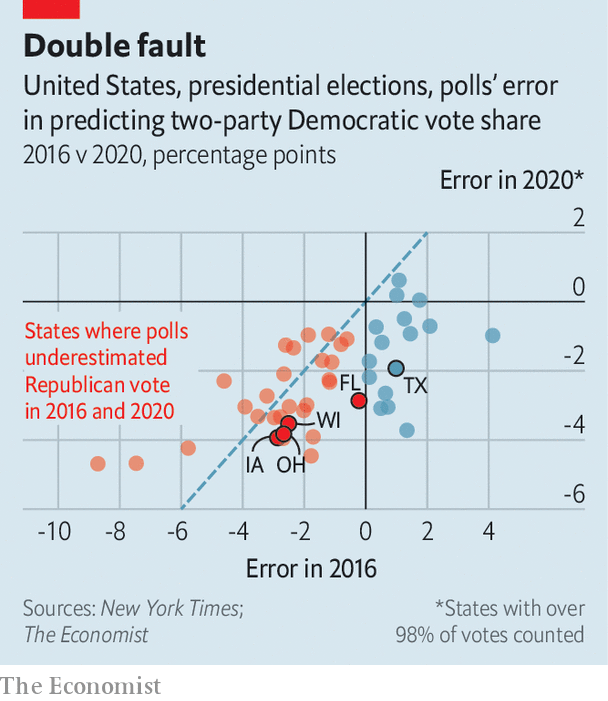

###### Polling error redux

# Polls—and our forecast model—overestimated support for Joe Biden 

##### The positions of Mr Biden and Hillary Clinton were overestimated in mostly the same states 

 

> Nov 5th 2020 

ON THE MORNING of election day, The Economist’s election-forecasting model gave Joe Biden a 19-in-20 chance of winning the presidency. Once all the votes are tallied, Mr Biden will probably be sitting behind the Resolute Desk next year. But it will be by a much closer margin than we forecast.

As we went to press, Mr Biden had amassed 253 electoral votes. He looks to be holding leads in enough states to bring his margin up to 270—the bare threshold needed to win. He could well pick up another 20 votes in Pennsylvania as mail-in ballots are tallied. That is still quite shy of the 356 we predicted.


Simply put, this is because the president did much better than the dismal showing the opinion polls expected. Mr Biden may win Wisconsin by less than one percentage point, whereas polls suggested he was ahead by eight. The model incorporated similarly large misses in Ohio, Iowa and Florida.

Depending on how the remaining states finish, Mr Biden is expected to win one of 270, 290 or 306 electoral votes. A showing at 270 would be outside our 95% confidence interval for the range of outcomes, meaning that our level of certainty was too high. The other likely outcomes would be at the bottom end—what could be expected in one out of every three or four of simulations we ran.

 


The Economist’s model had found that Mr Biden was comfortably ahead in so many places that it was hard to envisage him losing them all. But he may have come close. Our errors may reflect a general weakness of quantitative models: they try to predict the future by extrapolating from the past. Perhaps this election, held in the midst of a pandemic and a volatile economy, stretched this assumption too far.

Usually polling errors do not follow the last election’s pattern because pollsters try hard to correct their mistakes. Yet the polls still overestimated the positions of Mr Biden and Hillary Clinton in mostly the same states—and often by similar magnitudes.

One worrying possibility is that surveys again did not accurately gauge the share of working-class whites who supported Mr Trump. Before the election, polling showed that they had shifted towards Mr Biden. But preliminary election returns indicate that counties with lots of white working-class voters actually swung further towards Mr Trump. This suggests that Trump-supporting working-class whites were less likely to respond to pollsters in the first place. Should that theory prove true, it would present a very serious problem for the polling industry to solve.

