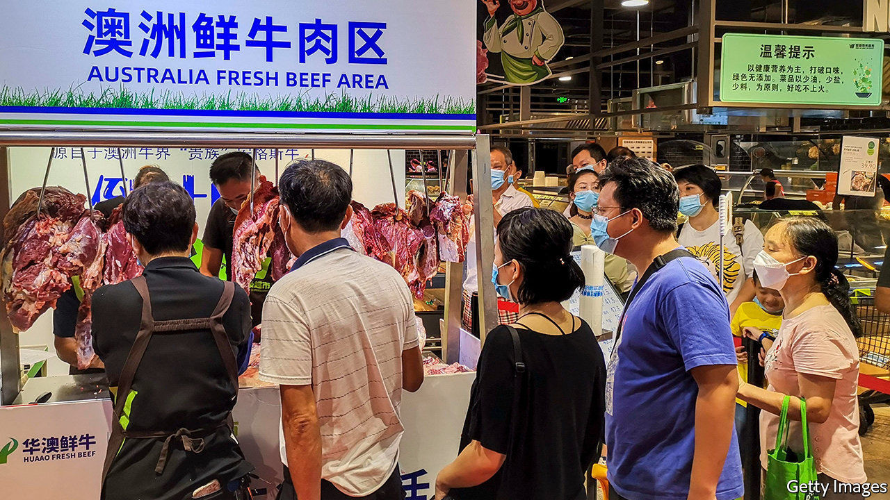
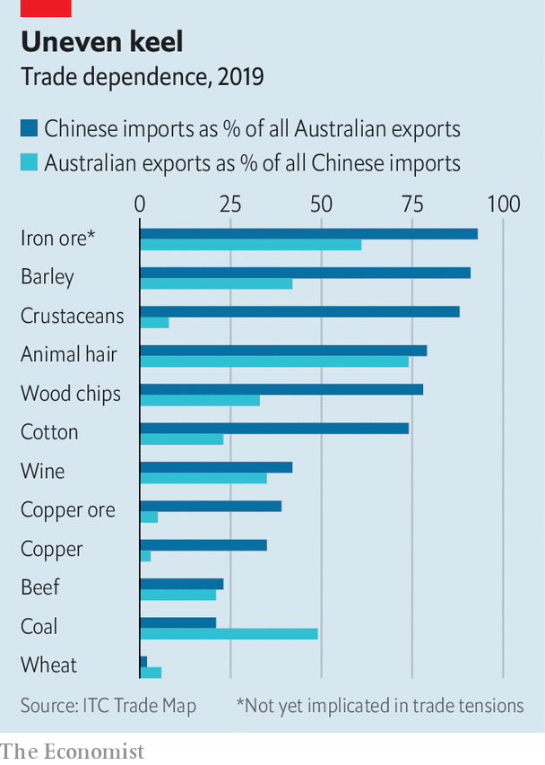

###### Down under and out

# China is curbing imports of more and more Australian goods 

##### It may have more than one motive 

 

> Nov 14th 2020 

THE ROW is already six months old and is steadily intensifying. In May China imposed an 80% tariff on imports of Australian barley and restrictions on imports of Australian beef. More recently shipments of Australian lobsters have been subject to delays. Aussie wine has been formally threatened with higher tariffs. The Chinese authorities are reportedly discouraging firms from buying Australian coal, cotton and timber. There are fears that more Australian goods will soon feel the squeeze. On November 9th Australia’s trade minister, Simon Birmingham, said that rumours of an outright, if unofficial, ban on seven big exports did not appear to be correct.

China hoovers up a third of Australia’s exports of goods. Belinda Allen of the Commonwealth Bank of Australia calculates that 7% of the total have now been affected by or threatened with restrictions. (China is also a massive consumer of Australian services such as education and tourism.)


In theory, China has distinct and unrelated reasons for each step it has taken. The tariffs on wine and barley are supposedly because those products are being exported below cost. Concerns about hygiene have been used to justify impediments to food imports, and so on. The Australian government assumes there is a bigger grievance at work, though Mr Birmingham’s Chinese counterpart won’t even speak to him, much less explain.

The spat started shortly after Australia led international calls for an inquiry into the origins of covid-19. Australia has also annoyed China by rejecting its claims in the South China Sea, legislating to prevent Chinese interference in Australian politics and cosying up to the likes of America, Japan and India—with which it is holding joint naval exercises this month.

China could also be angling for specific concessions. Its investigation into the “dumping” of barley came after Australia launched 33 anti-dumping probes of Chinese goods between 2006 and 2018. The two countries began talks on a trade deal in 2005 on the condition that Australia treat China as a market economy, making dumping claims harder to sustain—but Australia never followed through.

Restrictions on agricultural products may have another benefit for China, too. The Chinese government has pledged to buy $37bn of agricultural goods from America as part of a recent trade deal, but is badly behind schedule. Pushing Chinese importers away from Australian suppliers could help to get it back on track.

Whatever the explanation, the Australian government has been encouraging exporters to find other buyers, and has been pursuing trade deals that might help, including the reportedly imminent Regional Comprehensive Economic Partnership, which involves other 14 countries, including China. A recent poll by the Lowy Institute, a think-tank, found that 94% of Australians supported government efforts to reduce dependence on China.

 


Realistically, though, China is too big a market for Australian exporters to replace very quickly. For most of the affected products, China, in contrast, can easily find other sellers. For some goods, such as coal, it may want to succour its own producers. Iron ore is the only big Australian export of which China would struggle to find alternative suppliers (see chart)—and trade in it, oddly enough, has not been curtailed. ■

