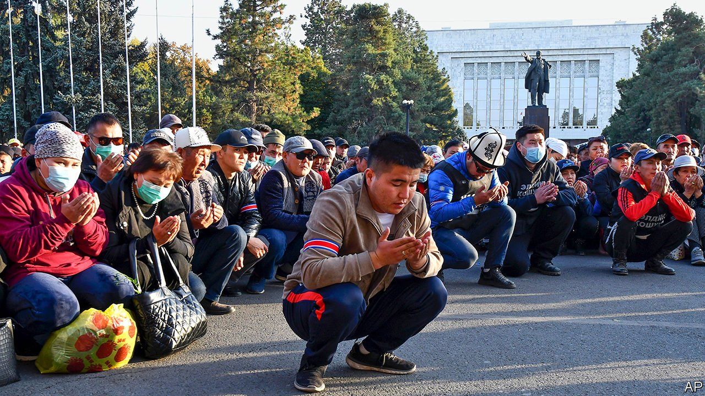

###### A crowd-sourced commander-in-chief

# Is Kyrgyzstan’s president saving or smashing the rule of law? 

##### He insists it would be impossible to become a strongman, even if he wanted to 

 

> Nov 14th 2020 

AMERICAN DIPLOMATS warned of an “attempt by organised crime groups to exert influence over politics and elections”. The acting mayor of the capital city stepped down in protest at a “wave of ochlocracy”—mob rule. MPs complained that they were being coerced into acceding to an illegitimate power grab. A candidate for prime minister was knocked unconscious when thugs attacked a political rally.

Yet the man who has benefited most from the tumult in Kyrgyzstan, Sadyr Japarov, denies that his meteoric rise, from prison to the presidency in ten days, has any sinister underpinning. It was popular protests that brought him to power, he says. Those who claim “that I’m a bandit, that I came out of prison and seized power” are simply political rivals trying to smear him, he insisted this week in an interview with The Economist over WhatsApp. Far from trying to hijack Kyrgyzstan’s shaky democracy, he intends to “establish justice, transparency, honesty and legality, and eradicate corruption at the root”, he said.


In early October crowds protesting about tainted parliamentary elections sprang Mr Japarov and several other politicians from prison. When the prime minister resigned to appease the protesters, Mr Japarov got MPs from the outgoing parliament to award him the job, though there were rows about quorums and proxy votes. He then persuaded the president to resign and the speaker of parliament to decline the role of acting president, which therefore fell to Mr Japarov instead.

Mr Japarov next convinced MPs to delay fresh elections for parliament, to allow for a presidential poll in January first—to the consternation of many officials and political parties. As acting president he would not be allowed to stand, so he plans to resign, handing the reins to an ally he has helped install as speaker of parliament. And he wants to amend the constitution to strengthen the presidency and reduce the clout of parliament.

Mr Japarov, a former MP, rose to prominence by campaigning for the nationalisation of Kumtor, a Canadian-owned gold mine. He has twice been convicted of crimes in connection with his political activism: once for leading a crowd that stormed the grounds of the White House, which houses parliament and the president’s office, and once for orchestrating the kidnapping of a local official as part of a protest, although he was not present at the time and denied any involvement. He is more comfortable speaking Kyrgyz than Russian, which sets him apart from the Russophone elite. His nationalism goes down well in a country that fears becoming an economic dependency of neighbouring China and has suffered strife between the Kyrgyz majority and the Uzbek minority.

The uprising that brought Mr Japarov to power is the third since 2005. Although the mountainous country of 6m is sometimes described as the only democracy in Central Asia, in practice it has run through a series of presidents whose behaviour gradually became more autocratic until they were turfed from office by public protests. With politics in constant turmoil and competing politicians in search of financial backing, organised crime has flourished. Journalists last year exposed a smuggling ring which laundered at least $1bn of its proceeds abroad (GDP last year was $8bn). America has labelled Kyrgyzstan a “major money-laundering country”.

Mr Japarov insists he marks a break with all that. He has ordered the arrest of two alleged crime bosses whom the previous government left be: Raimbek Matraimov, who has been accused of involvement in the smuggling ring, and Kamchybek Kolbayev, whom America has labelled a “significant foreign narcotics trafficker”. Mr Kolbayev remains in detention, but Mr Matraimov was allowed to return home after promising to pay the state $24m in a vague penalty for unspecified abuses. The opacity and arbitrariness of this step (Mr Japarov concedes it was a political decision, although he denies links to Mr Matraimov) have prompted some to question Mr Japarov’s sincerity. Keneshbek Duyshebayev, a former senior security official, dismisses his attack on organised crime as a “show”.

By the same token, when Mr Japarov speaks of the need for constitutional reforms to ensure strong, stable government, some see a naked power grab. The present constitution was intended to guard against strongman rule. Its architect, Omurbek Tekebayev, an MP, says Mr Japarov’s proposals will set Kyrgyzstan’s politics back 30 years, to their state at the time of independence from the Soviet Union in 1991. This week journalists issued a statement expressing “extreme concern” about Mr Japarov’s vilification of outlets that have criticised him—“distorted information” is his constant retort to uncomfortable questions—which presents a “risk to the free press”. Last month a mob of his supporters threatened to burn down the offices of an obstreperous radio station and website.

Yet Mr Japarov is trying to present himself as a moderate, unifying force. Tilek Toktogaziyev, the politician attacked by Mr Japarov’s supporters, has been named minister of agriculture. Mr Japarov has also won over Omurbek Babanov, a liberal opposition leader who ran for president in 2017. Mr Babanov says he won’t run in the coming election and has endorsed Mr Japarov instead. Mr Japarov promises not to pursue the politics of revenge “because I’ve been through that myself”. In early November he invited the only two former presidents who are not in exile or in prison—Sooronbay Jeyenbekov, whom Mr Japarov has just elbowed out of office, and Roza Otunbayeva, the elder stateswoman of Kyrgyz politics—to attend an event with him.

Mr Japarov is also toning down his jingoism. “I am not a nationalist,” he insists, promising to rule for Kyrgyz and minorities alike. He says he is not sure whether it is worth nationalising the Kumtor mine any more, given its dwindling reserves. He has urged protesters to end their attacks on Chinese firms. Locals must understand the value of such investments, he says, and keep the country open for business.

Mr Japarov seems likely to win the election, given the reluctance of possible rivals to run. His flair for populism is evident: he has ordered the removal of the fence around the White House, to reduce the distance between politicians and the governed. And whatever constitution the country ends up with, he insists, he could never become a strongman, thanks to the ultimate safeguard: the Kyrgyz people. “They can put up with things for a year, or two, or three, then chase out any president,” he says. “You can’t establish a dictatorship in our country.” ■

