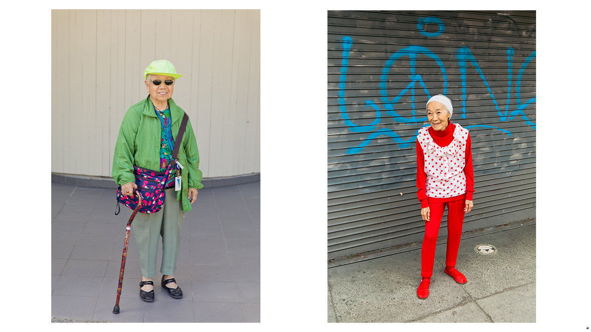

###### Fashion statements

# On the catwalk in San Francisco’s Chinatown 

##### For its elderly denizens, style is a matter of survival 

 

> Nov 14th 2020 

Chinatown Pretty. By Andria Lo and Valerie Luu.Chronicle Books; 224 pages; $24.95 and £18.99.

LEN WUEY CHEW’S look involves a layered mash-up of florals and plaids of a kind you might spot on a couturier’s catwalk. Her runway is a steep hill in San Francisco’s Chinatown, which she negotiates with a pink-and-blue cane. Her husband, Buck, favours white gloves and loud ties festooned with parrots or butterflies. In their winningly garish outfits, the nonagenarian couple embody a thrifty yet exuberant way of life.


On every bench in Portsmouth Square, Chinatown’s outdoor living room, elderly people in bright plumage chat, play cards and practise tai chi. Fuchsia scarves top crocheted vests; paisley sweaters wrap formal striped shirts. Jade accessories glint. Impishly stylish, this venerable crowd is “Chinatown Pretty”, in the words of a new book devoted to their sartorial flair.

Valerie Luu, a writer, and Andrio Lo, a photographer, spotted their first “poh poh hou leng”—“pretty grandma” in Cantonese—six years ago. A blog and a photography show in a Chinatown alley followed. Their book collects portraits from six North American Chinatowns, including Chicago, New York, Los Angeles, Oakland and Vancouver. But their heart remains in San Francisco, home of America’s oldest, densest Chinatown.

Five thousand souls, a big chunk of them elderly, are crammed into 30 city blocks. Many emigrated from China long ago, have endured war, revolution and exile and now subsist on fixed incomes in single rooms. Around a third live in poverty. Yet their neighbourhood bursts with colour. Look past the tourists and pagodas, and Chinatown resembles a bustling, open-air senior centre, the denizens of which pay close attention to their clothes. “Going out is dressing up,” Feng Luen Feng, 77, tells the authors.

The eclectic outfits are pragmatic. In the city’s foggy, unpredictable climate, it pays to wear several layers—sometimes up to seven or eight, plus a hat or two. Beyond the insulation, though, the fashions speak volumes about the community’s resourcefulness and joie de vivre. In his bright red suit, for instance, You Tian Wu has been a Chinatown fixture, sometimes seen wearing two bow ties above a Windsor knot. Dressing to the nines on a tight budget is a matter of pride. “When you’re young you don’t have to care about fashion,” says Mr Wu, 82. “But when you’re old, you have to.”

Each garment tells a story. Some were stitched in Hong Kong decades ago; others have been sewn or patched at home, or were handed up or down. One lady sports a hot pink backpack over a tailored blue skirt-suit. Another’s socks bear the slogan “My favourite salad is wine”. The styles may not be to everyone’s taste. But as surrounding neighbourhoods become ever more costly and gentrified, this frugality and grit are both a sign and a means of survival.

